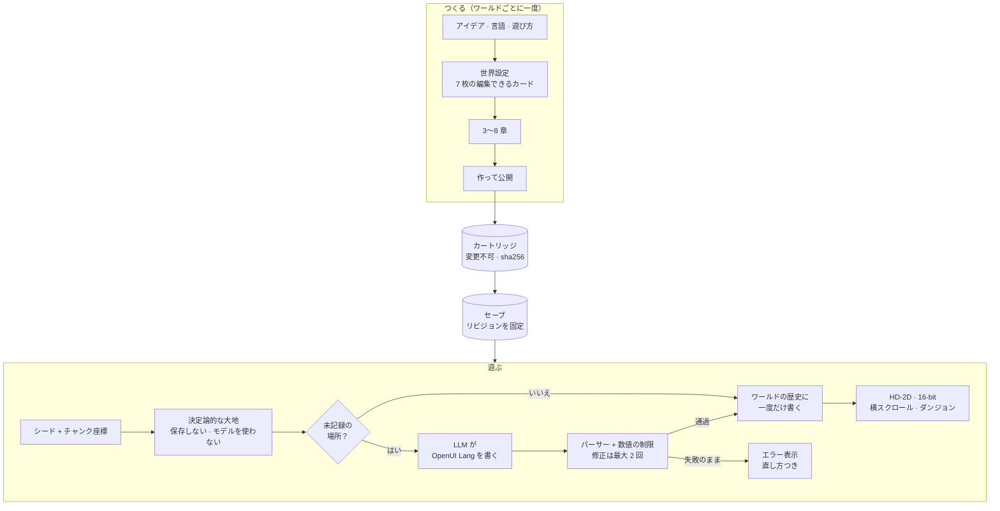

<div align="center">


<h3>歩いた先から言語モデルが書き起こしていく、果てのないオープンワールド。そのすべてが、あなたの持つファイルとして残ります。</h3>

<p><a href="README.md">English</a> · <a href="README.zh-TW.md">繁體中文</a> · <b>日本語</b></p>

<p>
<a href="LICENSE"></a>


</p>

<p>
<a href="#クイックスタート">クイックスタート</a> ·
<a href="#スクリーンショット">スクリーンショット</a> ·
<a href="#しくみ">しくみ</a> ·
<a href="#現在の状態">現在の状態</a> ·
<a href="#ロードマップ">ロードマップ</a> ·
<a href="#コントリビュート">コントリビュート</a>
</p>

</div>

---

**UNMAPPED**（《無界之地》）は、オープンソースのデスクトップゲームです。地図には端がなく、誰かがたどり着く
まで、そこには何も書かれていません。地形はシードから生成されます。プレイヤーがまだ記録されていない場所へ
初めて足を踏み入れると、大規模言語モデルがその場所を**観測**します。場所に名前を付け、住人、その土地の
しきたり、頼みごと、敵を書き起こします。書くのは小さな宣言型のゲーム DSL で、パーサーがすべての行を
検査します。場所が書かれるのは一度だけで、セーブに保存されたあとはモデルを必要としません。ワールド、
セーブ、公開したリビジョンは、どれもディスク上のふつうのファイルです。ワールドの中身は、署名付きで追記しか
できない**歴史**です。招いた友だちは小さなワールドサービスを通じてそれを共有し、あなたが観測した場所をモデルを
呼ばずに歩けます。1 台の端末だけにあるワールド同士は、今も P2P の WebRTC でひとつの**大陸**になれます。

接続先は OpenAI 互換のエンドポイントなら何でもかまいません。ローカルの llama.cpp や Ollama、Apple の
オンデバイスモデル、vLLM、クラウド API に対応しています。English・繁體中文・日本語で遊べます。ただし、
エンドツーエンドで検証済みなのは現時点ではクラウド経由の経路だけです。検証済みの項目は
[状態表](#現在の状態)にまとめています。

> *Esse est percipi*（存在するとは知覚されることである）。既知の外にある土地は実在しますが、観測者が
> 歩いてくるまでは名前も、人も、物語もありません。

## 特長

- **モデルを待たずに歩ける、果てのない大地。** 地面は 32 × 32 マスのチャンクで、「シード + チャンク座標」
  から計算されます。モデルが生成することも、ディスクに保存されることもありません。モデルにつながって
  いなくても、いつでも歩けます。
- **観測は一度だけ、その後は固定。** 新しい場所はモデルが下書きし、検証を通ってからワールドの歴史に書き込まれます。
  住人と話してもモデルは呼ばれません。会話と選択肢は、観測の時点で書き終わっているからです。
- **モデルが書くのはコードではなく DSL。** モデルは Scene・Dialogue・Item・Chapter などの小さなゲーム方言で
  [OpenUI Lang](https://github.com/thesysdev) のプログラムを書き、`@openuidev/lang-core` がそれを解析します。
  解析に失敗するとエラーをモデルに返して修正させます（最大 2 回）。数値はすべてエンジンの上下限に
  収められます。それでも解析できなければ画面にエラーを表示し、既製のシーンで代用することはありません。
- **4 ステップでゲームをつくる。** アイデアから始めると、モデルが 7 枚の世界設定カード（前提、雰囲気、
  日常のルール、登場しないもの、名前の付け方、話し方、見た目）と 3〜8 章のストーリーを書きます。あとは
  作って遊ぶだけです。カードと章はどれも手で編集でき、1 枚・1 章だけを書き直すこともできます。章は
  ロック、挿入、並べ替えもできます。下書きは自動保存され、アプリを再起動しても残ります。
- **ひとつの大地に、ふたつの見た目。** HD-2D のジオラマ（three.js によるティルトシフト、ブルーム、影を
  落とす立ち絵スプライト）と、フラットな 16-bit のキャンバスです。<kbd>V</kbd> で切り替えられます。大地には
  昼、夕暮れ、夜の光があります。
- **章と場所は地図の上に。** 物語の扉は大地に立っています。すべての人に会い、すべての宝箱を開け、すべての
  敵を倒すと章がクリアになります。判定するのはモデルではなくホストです。横スクロールのステージやグリッド型の
  ダンジョンには、大地のあちこちにある入口から入ります。
- **戦闘はなくてもいい。** ワールドをつくるとき、「探索」（戦闘なし）、「冒険・銃」、「冒険・剣」から
  選べます。敵はリアルタイムで追ってきます。戦闘の計算式はバージョン付きの物理ルールなので、ワールドは
  つくられたときのルールのまま遊べます。
- **共有ワールド。** ワールドは署名付きで追記しかできない歴史で、オフラインを優先します。ワールドサービスで
  共有すると、招いた友だちは、あなたがオフラインのときでも、あなたが観測した場所をモデルを呼ばずに歩けます。
  ふたりが同時にまだ書かれていない場所に着くと、ひとりが書き、もうひとりは同じ文章が届くのをそのまま見ます。
  だれも訪れない場所は霧に還って伝説になり、住人はメンバーが実際にしたことを噂として語ります。メンバーは
  贈り物や道しるべを残し、互いの歩く姿やエモートを見られます。サービスは署名済みの記録を並べ、検査し、
  中継するだけで、モデルを呼ぶことはありません。
- **1 台の端末だけにあるワールドの大陸。** そうしたワールドには扉番号があります。番号を共有すると、ワールド
  同士が y-webrtc でひとつの大陸になります。誰かのワールドを預かるゲームサーバーは存在しません。訪問者は名前、
  向き、歩く姿つきで表示されます。ピアから届くデータはすべて、書き込まれる前に検証されます。
- **モデルの呼び出しは 1 回に 1 経路。** ローカルモデル、自分のキー、または UNMAPPED 生成ゲートウェイの
  アカウントの無料枠のどれかです。「設定 → モデル」に次の呼び出しの行き先が表示され、失敗しても別の経路に
  切り替わることはありません。
- **画像はライセンスを覚えている。** 「設定 → 画像」で描き手を選びます。どの画像にもライセンスが記録され、
  商用モードでは販売できないプロバイダーや新しい画像を拒みます。
- **サーバーがなくなってもワールドは残る。** `.world` ファイルには、ワールドの歴史のすべてと必要なパックが
  入っています。だれでもオフラインで検証し、別のワールドサービスで立ち上げ直せます。持ち主がワールドをそこへ
  移し、メンバーはあとを追います。
- **スマートフォンからも参加できる。** スマートフォンサイズのブラウザーページが招待でワールドに参加し、大地を
  描き、タッチで歩き、オフラインでもメモを残せます。これは実証用で、モバイルアプリではありません。
- **データはあなたのもの。** 公開したコンテンツは、sha256 ハッシュ付きで変更できないカートリッジになります。
  セーブはそのうちのひとつのリビジョンに固定されます。`.cartridge` でコンテンツを、`.spire-backup` で進行状況を、
  `.world` で共有ワールドを別のマシンへ移せます。持ち運べるデータはランダムな AES-GCM データキーで暗号化され、そのキーはパスキーの
  PRF か OS のキーチェーンで保護されます。
- **Mod はプロンプトとツールだけで、コードは入らない。** `mod.yml` では、プロンプトのセクション、決まった
  `GameEffect` の語彙に対応する宣言型ツール、スキルを追加できます。土台は、DeepSeek Harness を手本に
  [Cordis](https://github.com/cordiverse/cordis) の上に組んだハーネスです。
- **サンドボックスの中の AI ワールド。** モデルが JavaScript を書けるのはここだけです。モデルがつくった小さな
  インタラクティブワールドは、新しいオリジンと nonce 付き CSP を持つ `sandbox="allow-scripts"` の iframe の
  中でだけ動きます。
- **正直な数字。** モデルの呼び出しはすべてローカルの使用量台帳に記録されます。記録するのはトークン数、
  キャッシュされたトークン数、ミリ秒で、プロンプトやキーは記録しません。HUD にはワールドごとの累計が出ます。
  ダミーのデータは一切表示しません。足りないものがあれば、画面がそのことと直し方を伝えます。
- **オンチェーンの来歴はオプション。** ワールド、リミックス、セーブ、プレイヤーは Sepolia 上で ENSv2 の名前を持てます。名前はゲームの中にもあります（プレイヤーカード、章のクリア、名前での大陸参加）。共有
  ワールドのサービスは、拍ごとの指紋をチェーンに記録することもできます（Sepolia にデプロイ済み）。
  コンテンツ自体がチェーンに載ることはなく、チェーンを設定しなくてもすべての画面が動きます。

## スクリーンショット

<table>
  <tr>
    <td width="50%"></td>
    <td width="50%"></td>
  </tr>
  <tr>
    <td><sub><b>大陸。</b>ほかのプレイヤーのワールドが WebRTC でつながり、名前・向き・歩く姿つきで表示されます。</sub></td>
    <td><sub><b>戦闘。</b>敵がリアルタイムで追ってきます。左のカードは次の章を示しています。</sub></td>
  </tr>
  <tr>
    <td></td>
    <td></td>
  </tr>
  <tr>
    <td><sub><b>16-bit 表示。</b>同じ大地のフラット版。<kbd>V</kbd> で切り替えます。</sub></td>
    <td><sub><b>夜。</b>昼、夕暮れ、夜の光がジオラマとスプライトを照らします。</sub></td>
  </tr>
  <tr>
    <td></td>
    <td></td>
  </tr>
  <tr>
    <td><sub><b>つくる・ワールド。</b>カードは手で直すことも、その 1 枚だけモデルに書き直させることもできます。</sub></td>
    <td><sub><b>つくる・ストーリー。</b>章は書かれたそばから表示されます。キャンセルすると処理中のリクエストが止まります。</sub></td>
  </tr>
  <tr>
    <td></td>
    <td></td>
  </tr>
  <tr>
    <td><sub><b>場所。</b>横スクロールやダンジョンには、大地のあちこちにある入口から入ります。</sub></td>
    <td><sub><b>AI ワールド。</b>小さなゲームをひとことで説明して遊び、別のひとことでつくり変えます。</sub></td>
  </tr>
  <tr>
    <td></td>
    <td></td>
  </tr>
  <tr>
    <td><sub><b>いっしょに観測。</b>ひとりが新しい場所を書き、もうひとりは同じ文章が届くのを読みます。ふたりとも同じ記録を受け取ります。章カードの <code>world-loading</code> エラーは、このフェーズで見つけて直したバグです。</sub></td>
    <td><sub><b>扉。</b>ワールドを共有し、だれが入れるかを決め、1 回限りの招待をつくり、メンバーを共同の持ち主にします。</sub></td>
  </tr>
</table>

<p align="center">
  <br>
  <sub><b>スマートフォン。</b>ブラウザー実証が招待で共有ワールドに参加して大地を描き、スティックで歩きます。</sub>
</p>

<p align="center">
  <br>
  <sub>住人とモンスター：役割ごと・種類ごとに 1 枚ずつ、画像モデルがビルド時に一度だけ描いたスプライトです。来歴は <code>src/assets/generated/actors.json</code> にあります。</sub>
</p>

## クイックスタート

**必要なもの。** Apple Silicon の macOS（現時点で検証済みの唯一のプラットフォーム）、[Bun](https://bun.sh)、
Node.js、Xcode Command Line Tools です（Bun 1.3.6 と Node.js 22.14 で確認しています）。macOS では、
`bun run dev` が Apple のオンデバイスモデルにつなぐ Swift ブリッジもビルドします。

```bash
git clone https://github.com/p2p-solidarity/unmapped.git
cd unmapped
bun install        # Electron のバイナリも取得されます
bun run dev        # main + preload + renderer（HMR 対応）
```

起動したら **タイトル → 設定 → モデル** を開き、文章を書かせるモデルを選びます。

### モデルを選ぶ

| プロバイダー | 既定のエンドポイント | キー | エンドツーエンド検証 |
| --- | --- | --- | --- |
| OpenAI | `https://api.openai.com/v1` · `gpt-5.4-mini` | 設定 → モデル、または `.env` の `OPENAI_API_KEY` | ✅ つくる、観測、章、場所 |
| llama.cpp | `http://127.0.0.1:8080/v1` | 不要 | 未検証 |
| Ollama | `http://127.0.0.1:11434/v1` · `qwen3.5:4b` | 不要 | 未検証（検出のみ確認） |
| Apple Foundation Models | アプリ内（Swift ブリッジ経由、サーバーなし） | 不要 | 会話・ツール・キャンセル・「世界をつくる」✅、作成後のプレイ（観測・章）は未検証（[apple-in-app](docs/e2e/milestone-apple-in-app/result.md) · [apple-create](docs/e2e/milestone-apple-create/result.md)） |
| vLLM + [`thesysdev/OUI-1`](https://huggingface.co/thesysdev) | `http://127.0.0.1:8000/v1` | 不要 | 未検証 |
| OpenUI Gateway | `https://api.thesys.dev/v1/embed` | `THESYS_API_KEY` | 未検証 |
| 無料枠（UNMAPPED 生成ゲートウェイ） | `UNMAPPED_GATEWAY_URL`（開発版にはなし） | 設定 → アカウント、または `.env` の `UNMAPPED_GATEWAY_KEY` | 経路・計量・キャンセル・画像 ✅（テスト用の上流のみで検証、[p4-quota](docs/e2e/milestone-rev6-p4-quota/result.md)） |
| OpenAI 互換の任意のサーバー | 任意の URL | 任意 | — |

呼び出しはどれも 1 つの経路だけを通ります。経路はメインプロセスが決め、「設定 → モデル」に「次の呼び出し：…」と
表示されます。ローカルモデルはこのコンピュータで動きます。OpenAI と OpenUI Gateway はあなたのキー（保存したもの、
なければ `.env`）を使い、カスタムのエンドポイントはそのために保存したキーを使います。自分のキーがなく、
ゲートウェイが設定されているときだけ、呼び出しはアカウントの**無料枠**を使います。失敗した呼び出しを別の経路で
やり直すことはありません。やり直すと、だれが払い、どのモデルがワールドを書くのかが変わってしまうからです。

「設定 → モデル」で入力したキーは OS のキーチェーンで暗号化され、読めるのは Electron のメインプロセスだけ
です。レンダラーに渡ることはありません。`.env` のキーもフォールバックとしてメインプロセスが読みます。形式は
[`.env.example`](.env.example) を参照してください。

<details>
<summary><b>llama.cpp でローカルモデルを動かす</b>（メモリ 16 GB の Apple Silicon Mac におすすめ）</summary>

```bash
brew install llama.cpp
scripts/download-model.sh qwen   # Qwen3.5-4B Q4_K_M、2.74 GB、Apache-2.0 → ~/models
llama-server -m ~/models/Qwen3.5-4B-Q4_K_M.gguf --port 8080 -c 16384 --jinja -ngl 99
```

`scripts/download-model.sh gemma` にすると Gemma 4 E4B（4.98 GB、Gemma ライセンス）をダウンロードします。
`MODEL_DIR` を設定すると保存先を変えられます。

</details>

### 操作

| 場面 | キー |
| --- | --- |
| 大地 | <kbd>W</kbd><kbd>A</kbd><kbd>S</kbd><kbd>D</kbd> またはクリックで移動 · <kbd>Shift</kbd> ダッシュ · <kbd>E</kbd> 調べる · <kbd>N</kbd> メモ · <kbd>V</kbd> 表示切替 · <kbd>F12</kbd> コンソール |
| 銃のあるワールド | <kbd>Space</kbd> / <kbd>F</kbd> 射撃 · 敵をクリックで射撃 |
| 横スクロール | <kbd>A</kbd><kbd>D</kbd> 移動 · <kbd>Space</kbd> ジャンプ · <kbd>E</kbd> 調べる |
| ダンジョン（一人称） | <kbd>W</kbd><kbd>A</kbd><kbd>S</kbd><kbd>D</kbd> 移動 · 左クリック 射撃 · <kbd>R</kbd> ターン終了 · <kbd>F</kbd> ライト · <kbd>E</kbd> 調べる |
| 共有ワールド（オンライン） | <kbd>T</kbd> エモート（パッドは <kbd>LB</kbd>）· <kbd>1</kbd>〜<kbd>6</kbd> で直接選ぶ |
| スマートフォン（ブラウザー実証） | スティック：歩く · Y：このワールドとメモ |

いまいる場所で使えるキーは、常に HUD に表示されます。

## しくみ



**モデルはお客さんで、真実は DSL。** プロンプトは毎回、Cordis ハーネス上で順番の決まったセクションから
組み立てられます。ペルソナ、世界のルール、DSL の仕様、Mod の伝承、伝承のホットスポットを含むワールドの
スナップショット、例、出力形式です。モデルの返答は、その方言のスキーマに照らして解析されます。エラーは
`OpenUIError[]` として返され、モデルは失敗した文だけを直します。モデルが `x=9000` のような値を書いても、
範囲内に収められます。そのまま信用されることはありません。

シーンはこのような見た目です。手書きのデモカートリッジ
[`cartridges-examples/demo-onsen-letters`](cartridges-examples/demo-onsen-letters/scenes/onsen_street.oui)
からの抜粋です。コンポーネントはすべて位置引数を取ります。

```text
root = Scene("湯屋街", "onsen_town", [contract, floor, sky, ambient, lanterns, stone_path, well, chiyo, koharu, letter_one, exit, letters])
floor = Floor(23, 23, "wood")
sky = Sky("#1c1520", "#2a1f28", 0.06)
lanterns = Light("point", "#ffd0a8", 1.7, 11, 11)
stone_path = Patch(10, 3, 3, 18, "stone")
well = Prop("well", 15, 13)
chiyo = NPC("chiyo", "千代", 12, 9, "merchant", "calm", "#b0426a", "tall", "ribbon", "fan")
koharu = NPC("koharu", "小春", 7, 13, "child", "joyful", "#f2b84b")
letter_one = Treasure("letter_one", 4, 17, ["褪色的信"])
exit = Exit(11, 3, "湯屋閣樓")
letters = Quest("letters", "向街上的人打聽，誰寄了那三封沒有署名的信。")
```

### エンジンが決して破らないルール

1. **歩くときにモデルを待たない。** 地形はシードだけで決まります。モデルがなくても大地は歩けます。その場合、
   各地は正直に「未記録」のまま残ります。
2. **やりとりの瞬間にモデルを呼ばない。** 会話と選択肢は観測のときに書かれ、選択は決定論的なアクションで
   処理されます。
3. **モデルは提案するだけ。** モデルの出力は、パーサーとルールの検査を通ってはじめて歴史になります。
4. **コンテンツは変更不可、進行状況はリビジョンに固定。** プレイ中にカートリッジへ書き込むことはありません。
   セーブはカートリッジの id、バージョン、ハッシュを正確に記録します。
5. **物理ルールにはバージョンがある。** ワールドの見た目や戦い方（地面、野生生物、戦闘の計算式）を変える
   ときは、`PHYSICS_VERSION` を上げます。物理バージョンの違うワールドが、同じ大陸にまとまることはありません。
6. **ダミーデータは使わない。** データを表示する画面は、必ず `idle | loading | ready | error` のどれかです。
   サンプルのワールド、決まり文句の NPC のセリフ、架空の仲間は表示しません。
7. **チェーンは完全に切れる。** 切っても、すべての画面がそのまま動きます。

エンジニアリング上の取り決め（モジュールの export、状態の持ち主、セキュリティのルール）はすべて
[`CLAUDE.md`](CLAUDE.md) にあります。

## ワールドはファイル

データはすべて Electron の userData フォルダーにあります。macOS では
`~/Library/Application Support/Unwritten Land/` です。改名前のプロダクト ID ですが、既存のセーブと
キーチェーンの項目をそのまま使えるように残しています。

```text
cartridges/<id>/<version>/        変更できない公開コンテンツ：manifest、ルール、シーン、世界設定、ストーリー、画像とそのライセンス（ハッシュ付き）
instances/<id>/saves/<save>/      リビジョンに固定された進行状況：save.json、因果。ワールドにあるセーブには
                                  world.json（固定先）と progress.json（頼みごと、章、場所）も入る。
                                  古いセーブは伝承、メモ、観測済みのチャンクをここに持ち、移行後は凍結される
histories/<worldId>/              ワールドの共有の歴史：log.jsonl（追記のみ）、送信待ち、拒否、link.json（サービスとその鍵）
blobs/<sha256>                    カートリッジと AI ワールドのパック。読むたびにハッシュで確かめる
identity/device.key               この端末の Ed25519 鍵。OS のキーチェーンで暗号化され、作り直されることはない
provider-keys/<provider>.key      保存したキー。hosted.key はゲートウェイのアカウントのトークン
images.json                       画像を描くプロバイダー（id のみ）
workspaces/create.<draft>/        「つくる」の下書き（自動保存）。looks/ にスケッチごとのライセンス記録
mods/<name>/                      インストール済みの Mod：mod.yml + prompt/*.md + skills/
usage.jsonl                       モデル呼び出し 1 回につき 1 行：用途、モデル、トークン数、ミリ秒、結果
```

| ファイル | 中身 | 復元できる条件 |
| --- | --- | --- |
| `.cartridge` | コンテンツのみ（公開済みのリビジョン 1 つ） | どのマシンでも可。両側でハッシュが一致します |
| `.spire-backup` | 1 回分のプレイとそのセーブ（大地、伝承、メモ）。ワールドにあるセーブなら、その固定先、進行状況、歴史も | まったく同じカートリッジのリビジョンがあるマシン。食い違った歴史は横に残し、混ぜません。一度も共有していないワールドを別の端末で復元すると、その端末のワールドになります |
| `.world` | 共有ワールド 1 つ：署名付きの歴史とパック。あなた自身の進行状況は含まない | どの端末でもワールドサービスでも可。先にオフラインで検証します（`bun run verify-world`） |

オプションの 2 つのサーバーは、userData の外にそれぞれのフォルダーを持ちます。ワールドサービスの `--data`
（`service-key.json` と、ワールドごとの `log.jsonl`、blob、スナップショット）と、ゲートウェイの `--data`（その鍵、
アカウント、追記のみの `ledger.jsonl`、運営者の `upstreams.json` と `costs.json`）です。

## いっしょに遊ぶ：共有ワールド

ワールドの大地は、署名付きで追記しかできない歴史です。観測した場所、メモ、章、贈り物、拍のひとつひとつが記録
1 件で、書いた端末が署名します。端末はそれぞれ自分の Ed25519 鍵を持っています。新しいワールドはあなたの端末
だけにあり、オフラインで遊べます。共有するには、**設定 → 共有ワールド** にワールドサービスを追加し、家で
<kbd>E</kbd>（**扉を開ける**）を押して、扉の**共有**の欄で **… で共有** を選びます。サービスは記録を並べ、
アプリと同じ方法で 1 件ずつ検査し、中継し、あなたがいないあいだも預かります。モデルを呼ぶことはなく、モデルの
キーも持ちません。`bun run service` で自分で立てられます（[開発](#開発)を参照）。

- **招待。** **招待**の欄で**招待をつくる**を押すと、使える回数と日数の決まったリンク（`unmapped://join?…`）が
  できます。友だちは **ワールド → ワールドに参加** に貼り付け、**ワールドを見る**、**参加して遊ぶ** の順に選び
  ます。使い切った招待、期限切れの招待、取り消した招待は拒否されます。
- **だれが入れるか。** **非公開**、**仲間**（既定：あなたと招いたメンバー）、**公開**（ワールドの id を知っていれば
  だれでも訪れて、メモ・道しるべ・贈り物を残せます。場所を書けるのはメンバーだけ）。**メンバー**の欄では、
  持ち主がメンバーを**外す**ことができ、外された人はそのワールドを読むことも書くこともできなくなります。書いた
  ものは残ります。**共同の持ち主にする**と、別の端末に持ち主の権限がすべて渡り、端末を 1 台なくしてもワールドは
  続きます。
- **観測は一度、みんなのもの。** だれかが観測した場所は、モデルを呼ばずに歴史から描かれます。ふたりが同じまだ
  書かれていない場所に入ると、サービスはひとりにだけ書かせます。もうひとりは同じ文章が届くのを見て、ふたりとも
  同じ記録を受け取ります。
- **異聞。** サービスに届かないあいだにふたりが同じ場所を書くと、先にサービスに届いたほうが残り、もう一方は
  異聞として歴史に残って読めます。
- **拍：霧、伝説、季節。** 拍は 6 時間ごとに刻まれ、季節は 7 日ごとに変わります。町のまわりより外にあって、
  28 日静かなまま、だれにも手入れされなかった場所は霧に還ります。古い姿は伝説として歴史に残り、その場所は
  あらためて観測できます。家、章、場所が霧に還ることはありません。1 台の端末だけにあるワールドは、開いたときに
  拍を刻みます。
- **噂。** 拍は、メンバーが章をクリアしたといった実際の出来事を選び、住人がそれを語り継ぎます（「噂では…」）。
  噂が触れてよいのは引用した出来事だけで、ほかのことに触れた噂はアプリもサービスも拒否します。拍ごとの噂は、
  端末が自分のモデルで書きます（呼び出しは多くて 1 回）。書くかどうかは
  **設定 → 共有ワールド → バックグラウンドで噂を書く** で決まり、既定では自分が持ち主のワールドでだけ書き、
  無料枠は決して使いません。
- **贈り物、プレゼンス、エモート。** 最初に来た人への贈り物を置けます。ふたりが同時に受け取ろうとすると、
  受け取れるのはひとりだけで、もうひとりには「先に誰かが受け取りました。」と表示されます。オンラインのメンバーは
  互いの歩く姿が見え、<kbd>T</kbd> で**エモート**を開けます。プレゼンスが保存されることはありません。
- **古いセーブもそのまま。** このビルドが古いセーブを初めて開くと、セーブの大地、伝承、メモ、場所、章、行いを
  ワールドの歴史に書き込みます。元のファイルを変えることも消すこともなく、もう一度実行しても何も増えません。
  収まらないものはこの端末に残し、一覧で示します。古いビルドも同じフォルダーを開けて、このビルドはあとから
  その書いた分を取り込みます。
- **サーバーがなくなってもワールドは残る。** **ワールド → ワールドファイル** で `.world` ファイルを書き出し、
  オフラインで確かめてから取り込めます。ワールドのサービスがなくなったら、そのファイルを別のワールドサービスに
  取り込み（`bun run service -- import`）、持ち主が**別のサービスへ移す**を選びます。メンバーは引っ越しリンクで
  追いかけます。新しい物理バージョンでつくられたワールドやファイルは拒否されます。

## いっしょに遊ぶ：大陸

大陸は以前からの遊び方で、1 台の端末だけにあるワールドのために残しています。ワールドサービスで共有した
ワールドは大陸に参加できません（`continent-world-attached`）。そうしたワールドにはそれぞれ変わらない
**扉番号**があり、それがそのワールドの開く大陸のコードにもなります。ゲーム内で仲間に扉を開くか、
**ワールド → 大陸** でワールドを選んで友だちの扉番号か、友だちのセーブの ENS 名を入力してください（セーブの名前には
扉番号が記録されています）。ワールドはそれぞれ自分の原点、シード、
セーブを持ったままです。参加するとアンカーが割り当てられ、各地はいちばん近いアンカーの領地になります。

- **やりとりされるもの：** 各ワールドの概要、観測済みのチャンク、メモ、リアルタイムの位置（awareness のみで、
  保存はしません）。訪問者があなたの大地に残したメモは扉で待ち、あなたが**残す**を選ぶと、あなたが署名した
  メモとしてワールドの歴史に加わります。
- **やりとりされないもの：** カートリッジ本体、ルール、ストーリー、頼みごと、敵。
- **信頼：** ピアの hello が大陸コード、プロトコル、物理バージョンと一致するまで、何も交換しません。その後も
  データは届くたびに検査されます。ピアが書き込めるのは自分のワールドとチャンクだけです。メモは誰の土地にも
  残せますが、既存のチャンクやメモを上書きすることは決してできません。
- **シグナリング：** 既定では公開の y-webrtc サーバーを使います。自分で立てることもできます
  （`PORT=4444 node node_modules/y-webrtc/bin/server.js`）。**設定 → シグナリングサーバー** に追加すれば、
  保存する前にそこで接続をテストできます。

## アカウント、無料枠、画像

ローカルモデルや自分のキーで遊ぶなら、どれも必要ありません。ゲートウェイが設定されていなければ、
**設定 → アカウント** と **設定 → プラン** がそのことを伝え（`gateway-not-configured`）、「設定 → モデル」に
無料枠は出てきません。

- **生成ゲートウェイ**（`bun run gateway`）は、使用量を計る OpenAI 互換のエンドポイントです。ワールドサービスとは
  別のもので、呼び出しがどのワールドのためのものかを知ることはありません。アカウントはデバイスの鍵の集まりです。
  **このデバイスでサインイン** は、ゲートウェイのチャレンジにこのデバイスの鍵で署名します。2 台目のデバイスは
  **ペアリングコードを取得** を選び、すでにアカウントに入っているデバイスで **このコードを照会** すると、
  **このデバイスを承認** の前に新しいデバイスのフィンガープリントが表示されます。外されたデバイスは次の呼び出しで
  サインアウトされます。運営者がつくったトークンを `.env` の `UNMAPPED_GATEWAY_KEY` に入れてもサインインできます。
- **無料枠。** 呼び出しはまずクレジットを確保し、使ったトークンに応じて精算します。キャンセルした呼び出しは確保を
  戻します。アプリは枠を割合、クレジット、このコンピュータの呼び出し回数とトークン数で示し、金額には換算しません。
  使い切ると呼び出しは拒否され（`quota-exhausted`）、自分のキー、ローカルモデル、プラン、毎月のリセットという
  選択肢を示します。**設定 → プラン** には、ゲートウェイの課金プロバイダー（Stripe）のプランが並びます。課金
  プロバイダーのないゲートウェイは何も売りません（`billing-not-configured`）。
- **画像。** **設定 → 画像** で描き手を選びます。OpenAI、指定したサーバー上の Qwen-Image-2512 か
  Qwen-Image-2.1（`QWEN_IMAGE_BASE_URL`）、または画像用のキーがないときのゲートウェイです。どの画像にも
  ライセンスの記録が付き、公開したリビジョンは画像のライセンスを `assets/licences.json` に並べます。
  **商用モード**（`UNMAPPED_COMMERCIAL=1`、またはゲートウェイが商用と伝えた場合）では、商用利用を認めない
  ライセンスのプロバイダーを拒み、ライセンスが非商用か不明な新しい画像の公開も拒みます。親から変えずに
  引き継いだ画像は一覧に出るだけで、拒否はされません。

## スマートフォンで：ブラウザー実証

`bun run browser:dev` は、5190 番ポートでスマートフォンサイズのページを出します。共有ワールドのいちばん小さな
クライアントで、モバイルアプリではありません。**ワールドに参加する** に招待を貼り付けると、ページは自分の
デバイス鍵（取り出せない WebCrypto の Ed25519 鍵）で参加し、歴史全体を検査し、ワールドのカートリッジパックを
ハッシュで取り寄せて、16-bit の見た目で大地を描きます。画面上のスティックは、キーボードやパッドと同じ
アクション表で大地を歩きます。**ワールド**（<kbd>Y</kbd>）でワールドの場所、メモ、道しるべが開き、メモは
立っているマスに残ります。すべてブラウザーの IndexedDB に保存されるので、ネットワークもページのサーバーも
ないときでも再読み込みして歩けます。オフラインで書いたメモは、サービスが応答したら送られます。ページには
モデル、「つくる」、会話、章、場所、書き出し、チェーンはありません。ワールドサービスがこのページにパックを渡す
には `--browser-origin <ページのオリジン>` が必要です。組み込みのカートリッジから始めたワールドはまだパックを
公開しないため、スマートフォンでは描けません（`browser-pack-none`）。

## Mod

Mod は、YAML のマニフェスト、Markdown のプロンプトセクション、任意のスキルが入ったフォルダーです。JavaScript は
一切含みません。ツールは決まった効果の語彙に対するテンプレートで、モデルが渡した引数も、その結果できる効果も、
ハーネスが検証します。以下はサンプル Mod からの抜粋です。

```yaml
name: onsen-festival
version: 0.1.0
description: Every floor carries a hot-spring town undercurrent, and the lanterns can be lit.
prompt:
  - { name: onsen-lore, order: 420, file: prompt/lore.md }
tools:
  - name: light_lanterns
    description: Light the festival lanterns when the player has actually done something that would light them.
    parameters:
      color: { type: string, description: "Lantern colour as #rrggbb", required: true }
    effect: { kind: mutate_world, skyColor: "{{color}}", fogDensity: 0.012, biome: onsen_town }
skills: [skills]
```

全体は [`mods-examples/onsen-festival`](mods-examples/onsen-festival)、設計メモは
[`docs/harness.md`](docs/harness.md) にあります。

## オプション：オンチェーンの来歴

遊ぶだけなら、どれも必要ありません。何も設定しなければ、台帳が未設定であることを各画面がはっきり伝えます。

- **ワールド・セーブ・プレイヤーの ENSv2 名（Sepolia）。** すべて `unmapped.eth` の下の一本のツリーに付きます。
  ワールドは `<label>.unmapped.eth`、リミックスは親の名前の下、セーブは `<save>.<cartridge>.unmapped.eth`、
  プレイヤーは `<you>.players.unmapped.eth` で、セーブとプレイヤーの名前はプレイヤー自身のパスキーのアカウントが
  保有します。名前はメニューの中だけでなくゲームの中にあります。**作って遊ぶ** の直後にワールドへ名前を付けられ
  （ラベルは自分で選ぶので「霧之港」は `misty-harbor.unmapped.eth` にできます）、そのままマーケットに出せます。
  プレイヤーカードにはこの旅の名前が出て、章をクリアするとパスキーの署名一回で旅を記録するか、名前を新しい
  進行状況へ進めるよう提案されます。友だちはあなたのセーブの名前を入力するだけであなたの大陸に来られます。
  **ワールド → カートリッジ** ではリビジョンへの命名、向け直し、マーケットへの出品ができ、**ENS 名で開く** で
  名前から正確なリビジョン、あるいはセーブのチェックポイントにたどり着けます。レコードは id、バージョン、
  コンテンツハッシュだけ（セーブはその sha256、固定したバージョン、進行状況の一行、扉番号）で、別の端末で復元
  したバックアップはハッシュから自分の名前を見つけます。
- **来歴台帳。** [`contracts/src/UnwrittenLedger.sol`](contracts/src/UnwrittenLedger.sol) は、誰がどのハッシュを
  公開し、それが何のリミックスなのかと、プレイヤーの短いメモを記録します。コンテンツはチェーンに載りません。
- **共有ワールドの軽いチェーン（Sepolia）。** 持ち主は、扉の**公開チェーンへの記録**の欄で**拍を記録する**を
  選べます。するとワールドサービスが拍ごとの指紋（ワールドの id、記録の番号、ハッシュ）を
  [`WorldProvenance`](contracts/src/provenance/WorldProvenance.sol) に書き込み、その費用を払います。ウォレットは
  だれにも要らず、アプリはチェーンを読んで自分の写しと照らし合わせるだけです。コントラクトは Sepolia の
  [`0xF625…Ef02`](https://sepolia.etherscan.io/address/0xF625ec3c228e3BCE34977C0b7e97BD591291Ef02) にデプロイ済みです。`UNMAPPED_PROVENANCE_*`（`.env.example` を参照）を設定すると扉が照合します。
  `bun run provenance --dry-run` は実際のサービスの拍でシミュレートします。
- **系譜マーケット（実験的・Sepolia）。** 名前の付いたカートリッジは発行できます。トークンは親ワールドの
  トークン建てで Uniswap の Continuous Clearing Auction により販売され、v4 フックが 1% のロイヤリティを系譜の
  上へ分配します（ワールド・親・祖父母に 50／30／20）。受け取るのはその時点で ENS 名を持っている人です。
  最初のワールド `aether-land.unmapped.eth` はオークション、精算、取引まで済んでいます。**ワールド →
  マーケット** では、パスキーで入札・精算・購入・ロイヤリティの支払いができます。ウォレットも ETH も要らず、
  アプリに鍵もありません。パスキーが小さなアカウントコントラクトを持ち、ガスステーション（Cloudflare Worker、
  `src/relay`）がマーケット自身の操作に限ってガス代を払います。ワールドの名前の持ち主はアプリから出品できます
  （**ワールド → カートリッジ**、または作った直後）。リミックスは親が出品してからで、親のトークン建てです。
  読み取り専用のオークションページ: https://unmapped-auction.gimmychang.workers.dev。詳しくは
  [`docs/demo/lineage-market.md`](docs/demo/lineage-market.md)、
  [`docs/plans/lineage-market.md`](docs/plans/lineage-market.md) と
  [`contracts/README.md`](contracts/README.md) を参照してください。

チェーン用のキー（`UNWRITTEN_*`）を読むのはメインプロセスだけです。デプロイや発行のスクリプトは必ず人が手で
実行します。アプリはマーケット用の鍵を持たず、プレイヤーがパスキーで署名した操作を
`UNWRITTEN_LINEAGE_RELAY` のガスステーションに渡すだけです。

## 現在の状態

UNMAPPED はバージョン `0.1.0`、動作はする初期段階の研究版です。実際のアプリで動かして確かめた機能だけを
「検証済み」としています。実行のたびに、再生できる記録を [`docs/e2e/`](docs/e2e) に残しています。中身は
`run.json`（実際の操作手順）、`result.md`（計測した数値）、スクリーンショットです。

| 項目 | 状態 | 根拠 |
| --- | --- | --- |
| つくる：4 ステップ、ストリーミング、カード単位の書き直し、章の編集・ロック・並べ替え、再起動後の保持 | ✅ 検証済み | [create-four-step](docs/e2e/milestone-create-four-step/result.md) · [rev6-create](docs/e2e/milestone-rev6-create/result.md) |
| HD-2D と 16-bit の大地、昼・夕暮れ・夜 | ✅ 検証済み | [e2e-first](docs/e2e/milestone-e2e-first/result.md) · [land-lighting](docs/e2e/milestone-land-lighting/result.md) |
| 観測、メモ、伝承のセーブへの書き込み | ✅ 検証済み | [rev6-land](docs/e2e/milestone-rev6-land/result.md) |
| リアルタイム戦闘、倒れて復帰 | ✅ 検証済み。HD-2D の敵は静止時のみ確認し、移動中は未確認 | [integration](docs/e2e/milestone-integration/result.md) |
| 場所：横スクロールとダンジョン、出て入口に戻る | ✅ 検証済み | [play-loop](docs/e2e/milestone-play-loop/result.md) · [rename-unmapped](docs/e2e/milestone-rename-unmapped/result.md) |
| 2 つのアプリプロセス間の大陸 | ✅ 検証済み（ローカルのシグナリング） | [rev6-land](docs/e2e/milestone-rev6-land/result.md) · [visitor-position](docs/e2e/milestone-rev6-followup-visitor-position/result.md) · [signaling](docs/e2e/milestone-rev6-followup-signaling/result.md) |
| `.cartridge` の書き出しと読み込み、`.spire-backup` の復元 | ✅ 検証済み。ハッシュが一致 | [rev6-land](docs/e2e/milestone-rev6-land/result.md) |
| クラウドモデル（OpenAI `gpt-5.4-mini`）と使用量台帳 | ✅ 検証済み | [model-switch](docs/e2e/milestone-model-switch/result.md) · [rev6-create](docs/e2e/milestone-rev6-create/result.md) |
| ローカルモデルでの生成（llama.cpp、Ollama、Apple） | ⏳ Apple はアプリ内で「世界をつくる」を最後まで実行できる、4K のコンテキストにはまだ観測と章が収まらない、llama.cpp と Ollama の生成は未検証 | [model-switch](docs/e2e/milestone-model-switch/result.md) · [apple-in-app](docs/e2e/milestone-apple-in-app/result.md) · [apple-create](docs/e2e/milestone-apple-create/result.md) |
| AI ワールド（サンドボックスのインタラクティブワールド） | ✅ 検証済み | [acceptance](docs/experiments/interactive-works-acceptance.md) |
| Sepolia 上の ENSv2 カートリッジ名（以前の `ens:setup` の親、削除済み） | ✅ 検証済み | [ensv2-cartridge-names](docs/e2e/milestone-ensv2-cartridge-names/result.md) |
| 名前ツリーの ENS 名：リミックスのカートリッジ、プレイヤーのセーブ、更新、復元したバックアップのハッシュ照合 | ✅ Sepolia で検証済み | [lineage-names](docs/e2e/milestone-lineage-names/result.md) |
| ガスステーション：アプリに鍵なし | ✅ 検証済み（アプリの流れはローカル実行で、デプロイした Worker も実際にテスト USDC の送信を 1 件実行） | [lineage-relay](docs/e2e/milestone-lineage-relay/result.md) |
| ゲームの中の ENS: 作った直後の命名（中国語名は自分でラベルを選ぶ）、アプリからの出品、プレイヤーカードの名前、章のクリア後に旅の名前を記録・更新（扉番号つき）、リミックスボタンから作ったリミックスを親の名前の下で命名し親のトークン建てで出品、友だちがセーブの名前で大陸に参加 | ✅ Sepolia で検証済み（Touch ID は仮想認証器で代用、ガスステーションはこのビルドをローカルで実行）。章のカードの更新ボタンは押せていない（同じ更新はセーブ画面から） | [ens-in-game](docs/e2e/milestone-ens-in-game/result.md) |
| プレイヤー名（`<you>.players.unmapped.eth`）: パスキーで取得、`0x…` の代わりに表示、大陸で見える。章カードの記録と更新 | ✅ デプロイ済みガスステーション経由で Sepolia で検証済み | [ens-players](docs/e2e/milestone-ens-players/result.md) |
| 系譜マーケット: アプリからパスキーで入札・精算・購入・ロイヤリティ | ✅ Sepolia で検証済み（Touch ID は仮想認証器で代用）。3 世代はドライランのみ | [lineage-demo](docs/e2e/milestone-lineage-demo/result.md) · [lineage-market](docs/e2e/milestone-lineage-market/result.md) |
| 共有ワールド：友だちが招待で参加し、あなたが観測した場所をモデル呼び出し 0 回で歩く。再起動後、相手の場所を呼び出しなしで見る | ✅ 検証済み（ローカルのワールドサービス） | [p3-offline-visit](docs/e2e/milestone-rev6-p3-offline-visit/result.md) |
| 古いセーブのワールド歴史への移行：種類ごとの数が一致、元のファイルは不変、再実行で 0 件追加、モデル呼び出しなし。フェーズ 2 のビルドも同じフォルダーを開け、このビルドがその書いた分を取り込む | ✅ 検証済み。移行にかかる時間は未計測 | [p3-migrate](docs/e2e/milestone-rev6-p3-migrate/result.md) · [p3-older-build](docs/e2e/milestone-rev6-p3-older-build/result.md) |
| 移行したワールドの共有：参加した人が古い場所、メモ、異界（作品パックを取得・検証してサンドボックスで開く）を呼び出し 0 回で見る | ✅ 検証済み | [p3-migrated-share](docs/e2e/milestone-rev6-p3-migrated-share/result.md) |
| ふたりが同じ未記録の場所に着く：ひとりが書き、もうひとりが同じストリームを見る。モデル呼び出し 1 回、両方に同じ記録 | ✅ 検証済み。ストリームのパネルが開いているあいだ、見ている側は歩けない（仕様） | [p3-together](docs/e2e/milestone-rev6-p3-together/result.md) |
| 異聞：同じ場所をオフラインで書いた 2 つのうち、ひとつが残り、もうひとつは保存される | ✅ 検証済み | [p3-variant](docs/e2e/milestone-rev6-p3-variant/result.md) |
| 拍：霧、伝説、季節。ワールドサービス上と 1 台の端末だけにあるワールドの両方で。サービスと 2 つのアプリで指紋が一致。霧に還った場所の再観測 | ✅ 検証済み（テスト用の時計で 92 日）。修正後、町のまわりに「霧に消えかけています」は出なくなった | [p3-fog](docs/e2e/milestone-rev6-p3-fog/result.md) · [p3-local-beat](docs/e2e/milestone-rev6-p3-local-beat/result.md) |
| 実際の出来事に結びついた噂。引用のない噂や名前の誤った噂はサービスとアプリが拒否 | ✅ 検証済み。「噂では…」は持ち主の端末でのみ確認 | [p3-rumors](docs/e2e/milestone-rev6-p3-rumors/result.md) |
| 扉：非公開・仲間・公開、1 回限りの招待（使い切り・期限切れ・取り消しは拒否）、メンバーを外す | ✅ 検証済み。修正後はメインプロセスも署名の前に外されたメンバーの書き込みを拒み、送信待ちだった記録は拒否として表示される | [p3-door](docs/e2e/milestone-rev6-p3-door/result.md) |
| 贈り物：ふたりが同時に受け取ろうとすると、ひとりだけが受け取り、もうひとりの持ち物は変わらず「先に誰かが受け取りました。」と表示 | ✅ 検証済み（贈り物のパネルを開いた状態）。パネルを閉じているときの通知は未確認 | [p3-gift-race](docs/e2e/milestone-rev6-p3-gift-race/result.md) |
| 2 台のマシンでのプレゼンスとエモート（両方の見た目で） | ✅ 検証済み。60 Hz で 1 フレームの移動は最大 0.13 マス。16-bit の見た目では名前を名札に表示（実行後に修正） | [p3-presence](docs/e2e/milestone-rev6-p3-presence/result.md) |
| ワールドにあるセーブのバックアップ：復元、食い違った歴史は横に残す、別の端末ではその端末のワールドになる | ✅ 検証済み。その新しいワールドでの観測はモデルありでは未実行 | [p3-backup](docs/e2e/milestone-rev6-p3-backup/result.md) |
| 新しい物理バージョンはワールドサービス、バックアップの取り込み、`.world` の取り込みで拒否 | ✅ 検証済み | [p3-physics](docs/e2e/milestone-rev6-p3-physics/result.md) · [p4-import-physics](docs/e2e/milestone-rev6-p4-import-physics/result.md) |
| 1 台の端末だけにあるワールドの大陸：訪問者のメモを持ち主が残す、共有したワールドは拒否 | ✅ 検証済み（ローカルのシグナリング） | [p3-continent](docs/e2e/milestone-rev6-p3-continent/result.md) |
| `.world` ファイル：書き出し、オフライン検証、ミラー、共同の持ち主が新しいサービスへ移し、メンバーが追いかける。新しい端末が呼び出し 0 回で異界に入る | ✅ 検証済み（ローカルのサービス 3 つ）。ミラーへの送信拒否はアプリではなくプローブで確認 | [p4-rehost](docs/e2e/milestone-rev6-p4-rehost/result.md) |
| 別の端末で `.world` を取り込む：新しいワールドとして引き取り、そのリビジョンと物理バージョンに固定 | ✅ 検証済み | [p4-import-physics](docs/e2e/milestone-rev6-p4-import-physics/result.md) |
| ゲートウェイのアカウント：デバイス鍵でサインイン、コードでペアリング、デバイスを外す、`.env` の運営者のトークン | ✅ 検証済み（テスト用の上流。本物のモデルなし） | [p4-account](docs/e2e/milestone-rev6-p4-account/result.md) |
| 1 回に 1 経路と無料枠：使い切り、付与、キャンセルで確保を戻す。ローカルと `.env` の経路はゲートウェイに記録を残さない | ✅ 検証済み（テスト用の上流）。ほかの人のストリームを見るときの費用と、無料枠での噂のスイッチは未実行 | [p4-quota](docs/e2e/milestone-rev6-p4-quota/result.md) |
| ゲートウェイや課金がないとき：アカウント、プラン、モデルがそう伝え、「つくる」はローカルモデルを使おうとする | ✅ 検証済み | [p4-billing-off](docs/e2e/milestone-rev6-p4-billing-off/result.md) |
| ゲートウェイ経由の画像。どれにもライセンスの記録 | ✅ 検証済み（テスト用の画像モデル）。AI ワールドの素材と参照画像は未実行 | [p4-images-hosted](docs/e2e/milestone-rev6-p4-images-hosted/result.md) |
| 商用モード：非商用のプロバイダーは選べない、ライセンス不明の新しい画像は公開を止める、商用モードのゲートウェイは非商用モデルがあると起動しない | ✅ 検証済み。公開は画面ではなくアプリの公開呼び出しで実行 | [p4-licence](docs/e2e/milestone-rev6-p4-licence/result.md) |
| 軽いチェーン：実際のサービスの拍の指紋を Sepolia に記録し、扉で照合 | ✅ 実チェーンで検証：コントラクトをデプロイし、サービスがストリームを開いて 3 つの拍を記録、扉に「The chain matches your copy at entry 6」と表示。書き換えた写しは（メインの読み取りで）不一致と判定 | [p4-chain](docs/e2e/milestone-rev6-p4-chain/result.md) · [p4-chain-live](docs/e2e/milestone-rev6-p4-chain-live/result.md) |
| スマートフォンサイズのブラウザー実証：招待で参加、大地、タッチで歩く、オフラインと再読み込み後のメモ、デスクトップのプレイヤーを見る | ✅ 検証済み（ヘッドレスブラウザー 375 × 812、開発版のページ）。実機では未実行。組み込みのカートリッジから始めたワールドはまだ描けない（パックなし） | [p4-mobile-proof](docs/e2e/milestone-rev6-p4-mobile-proof/result.md) |
| サーバーなし：アカウントを求める画面がない。歩く、メモ、ワールドサービスがないときの扉、`.world` の書き出し・オフライン検証・2 台目の端末での取り込み | ✅ 検証済み。その後、アプリ内の Apple オンデバイスモデルが「世界をつくる」の世界カードを書けた。ただし 4K のコンテキストでは観測が拒否される（`model-context-too-small`）。llama.cpp と Ollama は未インストール | [p4-no-servers](docs/e2e/milestone-rev6-p4-no-servers/result.md) · [integrated-journey](docs/e2e/milestone-rev6-integrated-journey/result.md) |
| 1 つのワールドで全部を通す：世界をつくる → 遊ぶ → 共有 → 2 人で 1 つの場所が書かれるのを見る → 共同オーナー → スマホが参加して歩く → `.world` で別の端末へ → Apple オンデバイス → 終了して続きから | ✅ 1 回の実行で検証。6 つのクライアントでレンダラーのエラー 0、サービスと全端末で同じ 21 件の履歴、有料呼び出し 12 回 | [integrated-journey](docs/e2e/milestone-rev6-integrated-journey/result.md) |
| Stripe の決済（テストモードと本番）、自分の GPU エンドポイントでの Qwen-Image | ⏳ 未実行。どれも人の作業が必要 | — |
| 仲間キャラクター | 🚧 ルールにはあるが、大地ではまだ描画も追従もしない | — |
| Windows / Linux | ❔ 未テスト。パッケージングは macOS のみ | — |

段階ごとの成果と計測値は、[`docs/architecture/afm3-dsl-architecture.html`](docs/architecture/afm3-dsl-architecture.html)
の 03 ページにあります。

## ロードマップ

現在の方針は **Revision 6** です（[エンジニアリングノート](docs/rev6-engineering.html) · 計画：
[フェーズ 2](docs/plans/rev6-phase2.md)、[フェーズ 3](docs/plans/rev6-phase3.md)、[フェーズ 4](docs/plans/rev6-phase4.md)）。
フェーズ 3 と 4 で、共有される歴史、忘却、拍と噂、アカウントとライセンス、`.world` ファイル、スマートフォンでの
実証ができました。実際に動かしたものは[状態表](#現在の状態)にあります。方針は次のとおりです。

- **共有される歴史。** 観測された内容はワールドのもので、みんなで共有します。最初に来た人が書いた版が残り、
  あとから来た人はそれを同期するだけで、生成し直しはしません。
- **痕跡が土台、同じ時間にいることが頂点。** ワールドは誰かがオンラインでいることを前提にしません。同じ
  同期のしくみが、同時にいればリアルタイムに、離れていればあとから追いつく形で動きます。
- **忘却。** 長いあいだ誰も訪れない場所は霧に戻り、ふたたび観測されるのを待ちます。歴史は消えず、古い姿は
  伝説になります。
- **戦いより世話を。** 基本の遊び方は探索で、戦闘は選んだときだけです。安全な家と町はかならずあります。
- **2D エンジンへの一本化。** 場所は `engine2d` に移り、AI ワールドは大地の中の「異界」になります。
- **ワールドの拍と噂。** 定期的な統合、季節の移り変わり、手入れがあります。噂は、ワールドの歴史で実際に
  起きたことだけを語ります。
- **モバイルを見すえた設計。** アセットはハッシュで必要なときに取得し、オフラインを優先し、入力はアクション表で
  扱います。

これから：

- **人が行う作業。** みんなのためのゲートウェイとワールドサービスの運用（ホスト、TLS、バックアップ）、Stripe の
  設定。
- **モバイル。** 本格的なモバイルクライアントをつくるかはまだ決めていません。ブラウザー実証がいちばん小さな
  クライアントです。
- **その先。** ワールドごとのスプライトシート、動画と音楽、フォーク、いっしょに戦うこと。

## 開発

| コマンド | 内容 |
| --- | --- |
| `bun run dev` | Electron + Vite（HMR 対応） |
| `bun run check` | 型チェック、Biome、600 行の上限、Vitest。変更を完了とするにはすべて通す必要があります |
| `bun run build` / `bun run dist` | 本番ビルド／electron-builder による macOS の `.dmg` |
| `bun run demo:cartridges` | `cartridges-examples/` のデモカートリッジをビルド |
| `bun run contracts:build` | Solidity の成果物を再コンパイル（リポジトリにコミット済み） |
| `bun run lineage:market --dry-run` | Sepolia 上でデプロイ → 3 世代 → オークション → スワップ → ロイヤリティをシミュレート |
| `bun run lineage:demo status\|launch\|seed-bids\|settle\|players` | マーケットの運営ツール（launch、seed-bids と一度きりの `players` ディレクトリは Sepolia のガスを使います） |
| `bun run web:deploy` | 読み取り専用のオークションページを Cloudflare にデプロイ |
| `bun run relay:key` / `relay:dev` / `relay:deploy` | ガスステーション：鍵を作る、ローカルで動かす、Cloudflare にデプロイ |
| `bun run service -- --port 8787 --data <dir>` | ワールドサービス。`import <file.world>` でミラーとして公開、`export <worldId>` でファイルを書き出し、`--browser-origin <origin>` でページにパックを渡す。`UNMAPPED_SERVICE_TEST=1` でテストから時計を進められる |
| `bun run gateway -- --port 8788 --data <dir>` | 生成ゲートウェイ。`grant <accountId> <credits>`、`token <accountId>`、`revoke <tokenId>`、`set-key <name>`（キーは stdin から）が運営者のコマンド |
| `bun run world:probe -- --service <ws url> <scenario>` | 使い捨ての鍵で動作中のワールドサービスを攻撃：`physics`、`protocol`、`frames`、`door`、`rumors`、`all` |
| `bun run verify-world -- <file.world> [--json]` | `.world` ファイルをオフラインで検証。終了コード 0 はすべての検査に通ったこと |
| `bun run provenance --dry-run [--from <service data dir>]` | サービスの拍を使って軽いチェーンを Sepolia 上でシミュレート。何も送信しない |
| `bun run browser:dev` / `browser:build` | スマートフォンサイズのブラウザー実証（5190 番ポート）／`out/browser` へのビルド |

**エンドツーエンドの実行** では、Chrome DevTools Protocol で実際のアプリを操作します。userData は毎回
使い捨てのものを使います。

```bash
mkdir -p "$TMPDIR/ud"
AETHER_TEST_USER_DATA="$TMPDIR/ud" bun run dev --remoteDebuggingPort 9333   # バックグラウンドで実行
bun scripts/cdp-drive.ts "$(cat docs/e2e/<run>/run.json)"
```

共有ワールドの実行では、使い捨ての `--data` フォルダーでワールドサービスをテストモードで起動し、別の userData と
デバッグポートで 2 つ目のアプリも動かします。ゲートウェイの実行ではローカルの上流を使うので、お金はかかりません。

<details>
<summary><b>プロジェクト構成</b></summary>

```text
src/
├── shared/      共通の契約：Result、ワールドの語彙、チャンク、物理、大陸、LLM 設定、IPC、
│                ワールドの歴史とそのプロトコル、.world の形式
├── dsl/         OpenUI Lang のゲーム方言：スキーマ、プロンプト、解析、修正、GBNF 文法、数値の上下限
├── harness/     Cordis のプロンプトセクション、ツール、スキル、GameEffect の接点、Mod の読み込み
├── main/        Electron のメインプロセス：カートリッジ、インスタンス、ワークスペース、鍵の保管、推論、使用量、AI ワールド、チェーン、
│                ワールドの歴史、デバイス鍵、blob、画像、ゲートウェイのアカウントと課金、.world ファイル
├── preload/     contextBridge → window.seed
├── service/     ワールドサービス（Bun）：歴史の並べ替えと検査、拍、書き込みの予約、blob、ミラー
├── gateway/     生成ゲートウェイ（Bun）：デバイス鍵のアカウント、枠の台帳、上流、課金
├── browser/     スマートフォンサイズのブラウザー実証：独自の window.seed、WebCrypto の鍵、IndexedDB、sw.js
└── renderer/
    ├── app/        画面と HUD：タイトル、つくる、プレイ、大地、コンソール
    ├── engine2d/   大地：移動、当たり判定、ターゲット、物語の扉（16-bit キャンバス）
    ├── hd2d/       three.js の HD-2D レンダラーとタイトル背景
    ├── engine/     場所用の R3F シーン、戦闘ループ、パレット
    ├── narrative/  観測・章・場所の生成：プロンプト → チャット → 解析 → 修正
    ├── history/    この端末でのワールドの歴史：fold、そこから描く大地、メインプロセスへの書き込み
    ├── mobile/     ブラウザー実証が載せるスマートフォンの殻：大地の表示、タッチパッド、メモ
    ├── net/        大陸：y-webrtc のルーム、ゲート、シグナリング。ワールドサービス。プレゼンス
    ├── identity/   パスキー PRF、キーチェーンのフォールバック、AES-GCM、ENS 名の照会
    ├── works/      AI ワールドのサンドボックスプレイヤー
    ├── i18n/       en · zh-TW · ja の文字列テーブル
    └── ui/         UI の基本部品とデザイントークン
contracts/       UnwrittenLedger と系譜マーケット（Solidity）
native/          Apple Foundation Models につなぐ Swift ブリッジ
docs/            アーキテクチャ、計画、調査、E2E の記録
```

</details>

<details>
<summary><b>一部の識別子に「Unwritten」や「Aether」が残っているのはなぜ？</b></summary>

プロジェクトは改名しました。プレイヤーに見える名前は、いまはすべて UNMAPPED／《無界之地》です。ただし、
変えるとデータ移行が必要になる識別子は旧名のまま残しています。`productName`／`appId`（userData フォルダーと、
保存したキーを包むキーチェーン項目を決めます）、`unwritten.*`／`aether.*` のストレージキー、`UNWRITTEN_*` の
環境変数、固定済みの ENS テキストキー、組み込みカートリッジの id `aether-land` です。

</details>

## コントリビュート

Issue もプルリクエストも歓迎します。PR を出す前に、次を確認してください。

1. **[`CLAUDE.md`](CLAUDE.md) を読む。** そこにあるルールは、どれも以前のコードがバグを起こしたことから
   生まれたものです。要点は次のとおりです。ファイルは 600 行以内、ダミーデータは使わない、エラーは値として
   返す（`Result<T>`）、色はトークンからだけ使う、プレイヤーに見える文字列は en・zh-TW・ja の 3 言語すべてを
   用意する。
2. **`bun run check` を実行して**、すべて通ることを確認する。
3. **実際のアプリで確かめる。** エンドツーエンドの実行が主なテストです。変更したフローについて、ほかの人が
   再生できる `docs/e2e/milestone-<flow>/` の記録（`run.json`、`result.md`、スクリーンショット）を追加して
   ください。
4. **失敗はそのまま報告する。** 赤いチェックも失敗した手順も、大事な情報です。

## セキュリティ

Mod とピアがあるため、レンダラーは常に信頼できないものとして扱います。`contextIsolation` と `sandbox` は常に
有効で、`nodeIntegration` は常に無効です。IPC で届くデータはすべてメインプロセスが zod で検証し、API キー、
チェーンのキー、デバイス鍵、ゲートウェイのアカウントのトークンがメインプロセスの外に出ることはありません。
ワールドの歴史の記録は、署名や保存の前にすべてメインプロセスが検査します。ワールドサービスはモデルを呼ばず、
モデルのキーも持ちません。モデルが生成した AI ワールドは、新しい `ulwork://`
オリジン上の `allow-scripts` だけを許可した iframe の中でのみ動きます。そのフレームには `allow-same-origin`、
`window.seed`、ファイルパス、秘密情報のどれも渡さず、フレームから届くメッセージはすべて検査します。

脆弱性を見つけた場合は、公開の Issue ではなく
[GitHub Security Advisories](https://github.com/p2p-solidarity/unmapped/security/advisories/new) から非公開で
報告してください。

## 謝辞

- [OpenUI](https://github.com/thesysdev)（`@openuidev/lang-core`）。そのパーサーがすべての正解の基準です
- [Cordis](https://github.com/cordiverse/cordis) と [DeepSeek Harness](https://github.com/deepseek-ai/deepseek-harness)。プロンプト、ツール、Mod を支えるプラグインモデルです
- [three.js](https://threejs.org)、[React Three Fiber](https://github.com/pmndrs/react-three-fiber)、[Rapier](https://rapier.rs)、[Yjs](https://github.com/yjs/yjs) + [y-webrtc](https://github.com/yjs/y-webrtc)、[viem](https://viem.sh)、[zod](https://zod.dev)、[electron-vite](https://electron-vite.org)
- ローカル推論：[llama.cpp](https://github.com/ggml-org/llama.cpp)、[Ollama](https://ollama.com)、[Qwen](https://huggingface.co/Qwen)
- Pixel-boy／Pixel Archipel による [Ninja Adventure](https://pixel-boy.itch.io/ninja-adventure-asset-pack)（CC0）。タイルとキャラクターに使っています
- エッセイ [Large Lore Models](https://aw.network/posts/large-lore-models) と [Moving Castles: Zero](https://movingcastles.world/posts/zero)。「伝承は積み重なっていくもの」「モデルはつなぎ止めておくもの」という考え方のもとになりました

## ライセンス

コードは [Apache License 2.0](LICENSE) で提供しています。サードパーティのアセットはそれぞれのライセンスに
従います。Ninja Adventure のアートは CC0（[詳細](docs/licenses/ninja-adventure-cc0.md)）で、ダウンロードする
モデルの重みには各配布元のライセンスが適用されます。
