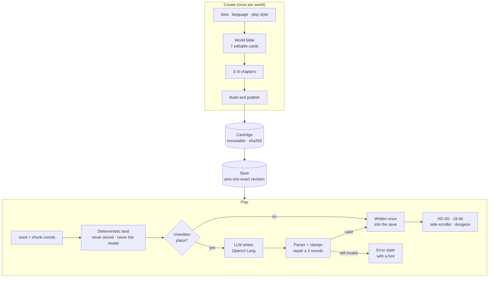

<div align="center">


<h3>An endless open world that a language model writes as you explore it, saved to files you own.</h3>

<p><b>English</b> · <a href="README.zh-TW.md">繁體中文</a> · <a href="README.ja.md">日本語</a></p>

<p>
<a href="LICENSE"></a>


</p>

<p>
<a href="#quick-start">Quick start</a> ·
<a href="#screenshots">Screenshots</a> ·
<a href="#how-it-works">How it works</a> ·
<a href="#status">Status</a> ·
<a href="#roadmap">Roadmap</a> ·
<a href="#contributing">Contributing</a>
</p>

</div>

---

**UNMAPPED** (《無界之地》) is an open-source desktop game. Its map has no edge, and nothing on it
is written until someone gets there. The terrain streams from a seed. The first time a player walks
into an unwritten place, a large language model **witnesses** it: it names the place and writes its
residents, a local custom, errands and foes. It writes them in a small declarative game DSL, and a
parser checks every line. The place is written once, saved, and never needs the model again. Worlds,
saves and published revisions are plain files on your disk. Friends' worlds join into one shared
**continent** over peer-to-peer WebRTC.

UNMAPPED talks to any OpenAI-compatible endpoint: a local llama.cpp or Ollama server, Apple's
on-device model, vLLM, or a cloud API. You can play in English, 繁體中文 or 日本語. Only the cloud
path has been verified end to end so far; the [status table](#status) lists what has.

> *Esse est percipi*: to be is to be perceived. The land beyond the known is real, but it has no
> name, no people and no story until a witness walks there.

## Highlights

- **An endless land that never waits for the model.** The ground is 32 × 32-tile chunks computed
  from `seed + chunk coordinates`. The model never generates it and it is never stored, so walking
  always works, even with no model connected.
- **Witnessed once, then static.** A new place is drafted by the model, validated and written into
  the save. Talking to a resident never calls the model, because the dialogue and choices were
  written when the place was witnessed.
- **The model writes a DSL, not code.** The model writes [OpenUI Lang](https://github.com/thesysdev)
  programs in small game dialects such as Scene, Dialogue, Item and Chapter, and
  `@openuidev/lang-core` parses them. If parsing fails, the errors go back to the model for at most
  two repair rounds, and every number is clamped to engine limits. If the output still doesn't
  parse, the screen shows an error. It never falls back to a stock scene.
- **Create a game in four steps.** Start from an idea. The model then writes seven world-bible cards
  (premise, tone, daily rules, what never appears, naming, voice, look) and 3–8 chapters, and you
  build and play. Every card and chapter can be edited by hand or rewritten on its own. Chapters can
  also be locked, inserted or reordered. Drafts autosave and survive a restart.
- **Two looks, one land.** An HD-2D diorama (three.js with tilt-shift, bloom and shadow-casting
  sprites) and a flat 16-bit canvas. Press <kbd>V</kbd> to switch between them. The land has day,
  dusk and night lighting.
- **Chapters and places on the map.** Story gates stand on the land. The host, not the model, clears
  a chapter once every person is met, every treasure opened and every foe felled. Side-scrollers and
  grid dungeons open from entrances out on the land.
- **Combat is optional.** Choose *Explore* (no fighting), *Adventure · gun* or *Adventure · blade*
  when you create a world. Foes chase and strike in real time. The combat formulas are versioned
  physics, so a world keeps the rules it was made with.
- **Multiplayer continents.** Every world has a door number (門牌). Share it and your worlds merge
  into one continent over y-webrtc, with no game server holding anyone's world. Visitors appear with
  their name, facing and walk. A note left on a friend's land goes into *their* notes. Every entry
  from a peer is validated before it lands.
- **You own your data.** Published content is an immutable, sha256-hashed cartridge, and each save
  pins one exact revision. `.cartridge` files carry content and `.spire-backup` files carry
  progress between machines. Portable data is encrypted with a random AES-GCM Data Key, which is
  wrapped by a passkey PRF or the OS keychain.
- **Mods are prompts and tools, never code.** A `mod.yml` adds prompt sections, declarative tools
  that map onto a fixed `GameEffect` vocabulary, and skills. It runs on a
  [Cordis](https://github.com/cordiverse/cordis) harness modelled on DeepSeek Harness.
- **AI Worlds, sandboxed.** This is the only place a model writes JavaScript. It builds small
  interactive worlds that run in a `sandbox="allow-scripts"` iframe on a fresh origin with a nonce
  CSP.
- **Honest numbers.** Every model call goes to a local usage ledger: tokens, cached tokens and
  milliseconds, never prompts or keys. The HUD shows the totals for each world. The app never shows
  placeholder data. When something is missing, the screen says so and tells you how to fix it.
- **Optional on-chain provenance.** Published cartridges can hold ENSv2 names on Sepolia. Content
  never goes on chain, and every screen works without a chain configured.

## Screenshots

<table>
  <tr>
    <td width="50%"></td>
    <td width="50%"></td>
  </tr>
  <tr>
    <td><sub><b>Continent.</b> Another player's world joined over WebRTC; they're drawn with their name, facing and walk.</sub></td>
    <td><sub><b>Combat.</b> Foes chase and hit in real time. The card on the left tracks the next chapter.</sub></td>
  </tr>
  <tr>
    <td></td>
    <td></td>
  </tr>
  <tr>
    <td><sub><b>16-bit look.</b> The same land in the flat look; press <kbd>V</kbd> to switch.</sub></td>
    <td><sub><b>Night.</b> Day, dusk and night light the diorama and the sprites.</sub></td>
  </tr>
  <tr>
    <td></td>
    <td></td>
  </tr>
  <tr>
    <td><sub><b>Create · world.</b> Edit any bible card by hand, or ask the model to rewrite just that one.</sub></td>
    <td><sub><b>Create · story.</b> Chapters stream in as they're written. Cancel aborts the request in flight.</sub></td>
  </tr>
  <tr>
    <td></td>
    <td></td>
  </tr>
  <tr>
    <td><sub><b>Places.</b> Side-scrollers and dungeons open from entrances out on the land.</sub></td>
    <td><sub><b>AI Worlds.</b> Describe a small game in one sentence, play it, then change it with another.</sub></td>
  </tr>
</table>

<p align="center">
  <br>
  <sub>Residents and monsters: one image-model sprite per role and kind, drawn once at build time. Provenance is in <code>src/assets/generated/actors.json</code>.</sub>
</p>

## Quick start

**Requirements.** macOS on Apple Silicon (the only platform verified so far), [Bun](https://bun.sh),
Node.js and the Xcode Command Line Tools (tested with Bun 1.3.6 and Node.js 22.14). On macOS,
`bun run dev` also compiles the Swift bridge to Apple's on-device model.

```bash
git clone https://github.com/p2p-solidarity/unmapped.git
cd unmapped
bun install        # also fetches the Electron binary
bun run dev        # main + preload + renderer with HMR
```

Next, open **Title → Settings → Model** and choose where the words come from.

### Choose a model

| Provider | Default endpoint | Key | Verified end to end |
| --- | --- | --- | --- |
| OpenAI | `https://api.openai.com/v1` · `gpt-5.4-mini` | Settings → Model, or `OPENAI_API_KEY` in `.env` | ✅ Create, witnessing, chapters, places |
| llama.cpp | `http://127.0.0.1:8080/v1` | none | not yet |
| Ollama | `http://127.0.0.1:11434/v1` · `qwen3.5:4b` | none | not yet (detection only) |
| Apple Foundation Models | inside the app (its Swift bridge; no server) | none | chat, tools, cancel and Create ✅; play after Create (witnessing, chapters) not yet ([apple-in-app](docs/e2e/milestone-apple-in-app/result.md) · [apple-create](docs/e2e/milestone-apple-create/result.md)) |
| vLLM serving [`thesysdev/OUI-1`](https://huggingface.co/thesysdev) | `http://127.0.0.1:8000/v1` | none | not yet |
| OpenUI Gateway | `https://api.thesys.dev/v1/embed` | `THESYS_API_KEY` | not yet |
| Any OpenAI-compatible server | your URL | optional | — |

A key entered in Settings → Model is encrypted with the OS keychain and read only by the Electron main
process. It never reaches the renderer. `.env` keys are read in main as a fallback; see
[`.env.example`](.env.example).

<details>
<summary><b>Run a local model with llama.cpp</b> (recommended on a 16 GB Apple Silicon Mac)</summary>

```bash
brew install llama.cpp
scripts/download-model.sh qwen   # Qwen3.5-4B Q4_K_M, 2.74 GB, Apache-2.0 → ~/models
llama-server -m ~/models/Qwen3.5-4B-Q4_K_M.gguf --port 8080 -c 16384 --jinja -ngl 99
```

`scripts/download-model.sh gemma` fetches Gemma 4 E4B instead (4.98 GB, Gemma licence). Set
`MODEL_DIR` to store models elsewhere.

</details>

### Controls

| Where | Keys |
| --- | --- |
| Open land | <kbd>W</kbd><kbd>A</kbd><kbd>S</kbd><kbd>D</kbd> or click to move · <kbd>Shift</kbd> sprint · <kbd>E</kbd> interact · <kbd>N</kbd> notes · <kbd>V</kbd> switch look · <kbd>F12</kbd> console |
| Worlds with guns | <kbd>Space</kbd> / <kbd>F</kbd> fire · click a foe to shoot |
| Side-scroller | <kbd>A</kbd><kbd>D</kbd> move · <kbd>Space</kbd> jump · <kbd>E</kbd> interact |
| Dungeon (first person) | <kbd>W</kbd><kbd>A</kbd><kbd>S</kbd><kbd>D</kbd> move · left click fire · <kbd>R</kbd> end turn · <kbd>F</kbd> flashlight · <kbd>E</kbd> interact |

The HUD always shows the keys for the place you're in.

## How it works



**The model is a guest, and the DSL is the truth.** Every prompt is assembled from ordered sections
on a Cordis harness: persona, world rules, the DSL spec, mod lore, the world snapshot with its lore
hot spots, examples and the output format. The reply is parsed against the dialect's schema. Errors
come back as `OpenUIError[]`, and the model patches only the statements that failed. A
hallucinated `x=9000` is clamped, never trusted.

This is what a scene looks like. The excerpt is from the hand-written demo cartridge in
[`cartridges-examples/demo-onsen-letters`](cartridges-examples/demo-onsen-letters/scenes/onsen_street.oui);
components take positional arguments:

```text
root = Scene("湯屋街", "onsen_town", [contract, floor, sky, ambient, lanterns, stone_path, well, chiyo, koharu, letter_one, exit, letters])
floor = Floor(23, 23, "wood")
sky = Sky("#1c1520", "#2a1f28", 0.06)
lanterns = Light("point", "#ffd0a8", 1.7, 11, 11)
stone_path = Patch(10, 3, 3, 18, "stone")
well = Prop("well", 15, 13)
chiyo = NPC("chiyo", "千代", 12, 9, "merchant", "calm", "#b0426a", "tall", "ribbon", "fan")
koharu = NPC("koharu", "小春", 7, 13, "child", "joyful", "#f2b84b")
letter_one = Treasure("letter_one", 4, 17, ["褪色的信"])
exit = Exit(11, 3, "湯屋閣樓")
letters = Quest("letters", "向街上的人打聽，誰寄了那三封沒有署名的信。")
```

### The rules the engine never breaks

1. **Walking never waits for the model.** Terrain is a pure function of the seed. With no model, the
   land is still walkable, but places stay honestly *unwritten*.
2. **Interacting never calls the model.** Dialogue and choices are written when a place is
   witnessed, and choices resolve through deterministic actions.
3. **The model only proposes.** Its output has to pass the parser and the rule checks before it
   becomes history.
4. **Content is immutable and progress is pinned.** Play never writes to a cartridge. A save names
   its cartridge id, version and hash exactly.
5. **Physics is versioned.** Anything that changes how a world looks or fights (ground, wildlife,
   combat formulas) bumps `PHYSICS_VERSION`. Worlds on different physics never merge into one
   continent.
6. **No fake data.** Every data-driven view is `idle | loading | ready | error`. The app never
   shows a sample world, a stock NPC line or a made-up peer.
7. **The chain can be switched off entirely**, and every screen still works.

The full engineering contract, with module exports, state ownership and security rules, is in
[`CLAUDE.md`](CLAUDE.md).

## Your worlds are files

Everything lives in Electron's userData folder. On macOS that is
`~/Library/Application Support/Unwritten Land/`, the pre-rename product id, kept so existing saves
and keychain entries stay valid.

```text
cartridges/<id>/<version>/        immutable published content: manifest, rules, scenes, bible, story (hashed)
instances/<id>/saves/<save>/      progress pinned to one exact revision: save.json, karma, lore, notes, witnessed chunks
workspaces/create.<draft>/        Create drafts (autosaved)
mods/<name>/                      installed mods: mod.yml + prompt/*.md + skills/
usage.jsonl                       one line per model call: purpose, model, tokens, ms, outcome
```

| File | Contains | Restores into |
| --- | --- | --- |
| `.cartridge` | content only: one published revision | any machine; same hash on both sides |
| `.spire-backup` | one run and its active save: land, lore, notes | a machine that has the exact cartridge revision |

## Play together: continents

Every world has a stable **door number** (門牌), which is also the code of the continent it opens.
Choose **Join a continent** on the title screen, or open your door in game and share the number.
Each world keeps its own origin, seed and save. Joining gives it an anchor, and territory belongs to
the nearest anchor.

- **What crosses:** each world's descriptor, witnessed chunks, notes, and live positions (awareness
  only, never saved).
- **What never crosses:** cartridge bytes, rules, story, errands and foes.
- **Trust:** nothing is exchanged until a peer's hello matches the continent code, protocol and
  physics version. After that, every entry is checked on arrival. A peer may write only its own
  world and chunks, may leave notes on anyone's land, and can never overwrite a chunk or a note.
- **Signaling:** public y-webrtc servers by default. You can run your own
  (`PORT=4444 node node_modules/y-webrtc/bin/server.js`) and add it under
  **Settings → Signaling servers**, where it can be tested before you save.

## Mods

A mod is a folder with a YAML manifest, markdown prompt sections and optional skills. It contains no
JavaScript. Its tools are templates over a fixed effect vocabulary, and the harness validates both
the model's arguments and the resulting effect. Abridged from the example mod:

```yaml
name: onsen-festival
version: 0.1.0
description: Every floor carries a hot-spring town undercurrent, and the lanterns can be lit.
prompt:
  - { name: onsen-lore, order: 420, file: prompt/lore.md }
tools:
  - name: light_lanterns
    description: Light the festival lanterns when the player has actually done something that would light them.
    parameters:
      color: { type: string, description: "Lantern colour as #rrggbb", required: true }
    effect: { kind: mutate_world, skyColor: "{{color}}", fogDensity: 0.012, biome: onsen_town }
skills: [skills]
```

Full example: [`mods-examples/onsen-festival`](mods-examples/onsen-festival). Design notes are in
[`docs/harness.md`](docs/harness.md).

## Optional: on-chain provenance

None of this is needed to play. With nothing configured, every screen says plainly that no ledger
is set up.

- **ENSv2 names for cartridges and saves (Sepolia).** Everything hangs in one tree under
  `unmapped.eth`: a cartridge revision is `<cartridge>.unmapped.eth`, a remix sits under its parent's
  name, and a save is `<save>.<cartridge>.unmapped.eth`, held by the player's own passkey account.
  In **Worlds → Cartridges** a player names a revision (or points their name at a newer one), and
  **Open by ENS name** follows a name back to the exact revision, or to a save's checkpoint. In
  **Worlds → Saves → ENS name for this save** they record their run and move it forward as they play.
  The records hold only the id, version and content hash (for a save: its sha256, the pinned version
  and one line of progress); a backup restored on another machine finds its name by hash.
- **Provenance ledger.** [`contracts/src/UnwrittenLedger.sol`](contracts/src/UnwrittenLedger.sol)
  records who published which hash and what it was remixed from, plus short player notes. Content
  never goes on chain.
- **Lineage market (experimental, Sepolia).** A named cartridge can be launched: its token is sold
  through a Uniswap Continuous Clearing Auction priced in its parent's token, and a v4 hook then pays
  a 1% royalty up the family line (50 / 30 / 20 to the world, its parent and its grandparent), to
  whoever holds the ENS name. The first world, `aether-land.unmapped.eth`, has been auctioned,
  settled and traded. In **Worlds → Market** a player bids, settles, buys and pays out royalties with
  a passkey. There is no wallet and no ETH, and no key in the app: the passkey owns a small account
  contract, and a gas station (a Cloudflare Worker, `src/relay`) pays for exactly the market's own
  actions. Launching a world is still an operator command (`bun run lineage:demo launch`). A read-only auction page runs at
  https://unmapped-auction.gimmychang.workers.dev. See [`docs/demo/lineage-market.md`](docs/demo/lineage-market.md),
  [`docs/plans/lineage-market.md`](docs/plans/lineage-market.md) and
  [`contracts/README.md`](contracts/README.md).

Chain keys (`UNWRITTEN_*`) are read only by the main process. Deploy and launch scripts are run by a
person. The app holds no key for the market: it asks the gas station at `UNWRITTEN_LINEAGE_RELAY` to
carry an action the player signed with their passkey.

## Status

UNMAPPED is at version `0.1.0`: an early, working research build. A feature is listed as verified
only after it has been run in the real app. Each run leaves a replayable record under
[`docs/e2e/`](docs/e2e): the exact `run.json` actions, a `result.md` with measured numbers, and
screenshots.

| Area | State | Evidence |
| --- | --- | --- |
| Create: four steps, streaming, per-card rewrite, chapter edit/lock/move, restart | ✅ verified | [create-four-step](docs/e2e/milestone-create-four-step/result.md) · [rev6-create](docs/e2e/milestone-rev6-create/result.md) |
| Open land in HD-2D and 16-bit, day/dusk/night | ✅ verified | [e2e-first](docs/e2e/milestone-e2e-first/result.md) · [land-lighting](docs/e2e/milestone-land-lighting/result.md) |
| Witnessing, notes, lore in the save | ✅ verified | [rev6-land](docs/e2e/milestone-rev6-land/result.md) |
| Real-time combat and defeat/revive | ✅ verified; HD-2D foes checked at rest, not while moving | [integration](docs/e2e/milestone-integration/result.md) |
| Places: side-scroller and dungeon, leave and return | ✅ verified | [play-loop](docs/e2e/milestone-play-loop/result.md) · [rename-unmapped](docs/e2e/milestone-rename-unmapped/result.md) |
| Continents across two app processes | ✅ verified with local signaling | [rev6-land](docs/e2e/milestone-rev6-land/result.md) · [visitor-position](docs/e2e/milestone-rev6-followup-visitor-position/result.md) · [signaling](docs/e2e/milestone-rev6-followup-signaling/result.md) |
| `.cartridge` export/import, `.spire-backup` restore | ✅ verified, identical hashes | [rev6-land](docs/e2e/milestone-rev6-land/result.md) |
| Cloud model (OpenAI `gpt-5.4-mini`), usage ledger | ✅ verified | [model-switch](docs/e2e/milestone-model-switch/result.md) · [rev6-create](docs/e2e/milestone-rev6-create/result.md) |
| Local model generation (llama.cpp, Ollama, Apple) | ⏳ Apple runs Create end to end inside the app; its 4K context does not yet fit witnessing or chapters; llama.cpp and Ollama generation not yet | [model-switch](docs/e2e/milestone-model-switch/result.md) · [apple-in-app](docs/e2e/milestone-apple-in-app/result.md) · [apple-create](docs/e2e/milestone-apple-create/result.md) |
| AI Worlds (sandboxed interactive worlds) | ✅ verified | [acceptance](docs/experiments/interactive-works-acceptance.md) |
| ENSv2 cartridge names on Sepolia (the older `ens:setup` parent) | ✅ verified | [ensv2-cartridge-names](docs/e2e/milestone-ensv2-cartridge-names/result.md) |
| ENS names in the lineage tree: a remix cartridge, a player's save, its update, a restored backup found by hash | ✅ verified on Sepolia | [lineage-names](docs/e2e/milestone-lineage-names/result.md) |
| Gas station: no key in the app | ✅ verified (the app flows against the station run locally; the deployed Worker sent a live faucet transaction) | [lineage-relay](docs/e2e/milestone-lineage-relay/result.md) |
| Lineage market: bid, settle, buy and royalties from the app with a passkey | ✅ verified on Sepolia (a virtual authenticator stood in for Touch ID); three generations in the dry run only | [lineage-demo](docs/e2e/milestone-lineage-demo/result.md) · [lineage-market](docs/e2e/milestone-lineage-market/result.md) |
| Companions | 🚧 in the rules, not yet drawn or followed on the land | — |
| Windows / Linux | ❔ untested; packaging targets macOS only | — |

Stage-by-stage delivery with measured numbers is on Page 03 of
[`docs/architecture/afm3-dsl-architecture.html`](docs/architecture/afm3-dsl-architecture.html).

## Roadmap

The current direction is **Revision 6** ([engineering notes](docs/rev6-engineering.html) ·
[phase 2 plan](docs/plans/rev6-phase2.md)):

- **Shared history.** What gets witnessed belongs to the world and is shared. The first visitor's
  version is the one that stays. Later visitors sync it instead of regenerating it.
- **Traces first, co-presence at the peak.** A world never depends on anyone being online. The same
  sync runs live when players are together and catches up later when they aren't.
- **Forgetting.** Places nobody visits for a long time return to the fog, waiting to be witnessed
  again. History is never deleted; the old version becomes legend.
- **Care before combat.** Exploration is the default and fighting is opt-in. There is always a safe
  home and town.
- **One 2D engine.** Places move onto `engine2d`, and AI Worlds become otherworld places inside the
  land.
- **World beats and rumours.** Periodic merges, seasons and tending. Rumours retell only things that
  really happened in the world's history.
- **Mobile-ready architecture.** Hash-addressed assets fetched on demand, offline-first play, and
  input as an action table.

## Development

| Command | What it does |
| --- | --- |
| `bun run dev` | Electron + Vite with HMR |
| `bun run check` | typecheck, Biome, the 600-line limit and Vitest; must be green before a change is done |
| `bun run build` / `bun run dist` | production build / macOS `.dmg` via electron-builder |
| `bun run demo:cartridges` | build the demo cartridges in `cartridges-examples/` |
| `bun run contracts:build` | recompile the Solidity artifacts (committed) |
| `bun run lineage:market --dry-run` | simulate deploy → three generations → auctions → swaps → royalties on Sepolia |
| `bun run lineage:demo status\|launch\|seed-bids\|settle` | live market operator tools (launch and seed bids spend Sepolia gas) |
| `bun run web:deploy` | deploy the read-only auction page to Cloudflare |
| `bun run relay:key` / `relay:dev` / `relay:deploy` | the gas station: make its key, run it locally, ship it to Cloudflare |

**End-to-end runs** drive the real app over the Chrome DevTools Protocol, always on a throwaway
userData:

```bash
mkdir -p "$TMPDIR/ud"
AETHER_TEST_USER_DATA="$TMPDIR/ud" bun run dev --remoteDebuggingPort 9333   # in the background
bun scripts/cdp-drive.ts "$(cat docs/e2e/<run>/run.json)"
```

<details>
<summary><b>Project layout</b></summary>

```text
src/
├── shared/      contracts: Result, world vocabulary, chunks, physics, continent, LLM config, IPC
├── dsl/         OpenUI Lang game dialects: schemas, prompts, parse, repair, GBNF grammar, limits
├── harness/     Cordis prompt sections, tools, skills, GameEffect seam, mod loader
├── main/        Electron main: cartridges, instances, workspaces, vault, inference, usage, works, chain
├── preload/     contextBridge → window.seed
└── renderer/
    ├── app/        screens and HUD: title, create, play, land, console
    ├── engine2d/   open land: movement, collision, targets, story gates (16-bit canvas)
    ├── hd2d/       three.js HD-2D diorama renderer and the title backdrop
    ├── engine/     R3F scenes for places, combat loop, palettes
    ├── narrative/  witness / chapter / place generation: prompt → chat → parse → repair
    ├── net/        continents: y-webrtc rooms, gate, signaling
    ├── identity/   passkey PRF, keychain fallback, AES-GCM, ENS resolve
    ├── works/      AI Worlds sandboxed player
    ├── i18n/       en · zh-TW · ja string tables
    └── ui/         primitives + design tokens
contracts/       UnwrittenLedger + lineage market (Solidity)
native/          Swift bridge to Apple Foundation Models
docs/            architecture, plans, research, E2E records
```

</details>

<details>
<summary><b>Why do some identifiers still say "Unwritten" or "Aether"?</b></summary>

The project was renamed. Every player-visible name is now UNMAPPED / 《無界之地》. A few
identifiers keep the old name because changing them would need a migration: `productName` / `appId`
(they decide the userData folder and the keychain entry that wraps saved keys), `unwritten.*` /
`aether.*` storage keys, `UNWRITTEN_*` env vars, the frozen ENS text keys, and the built-in
cartridge id `aether-land`.

</details>

## Contributing

Issues and pull requests are welcome. Before you open a PR:

1. **Read [`CLAUDE.md`](CLAUDE.md).** Each engineering rule there exists because an earlier version
   of the code caused a bug. In short: files stay ≤ 600 lines, the app never shows fake data,
   errors are values (`Result<T>`), colours come from tokens, and every player-visible string exists
   in en, zh-TW and ja.
2. **Run `bun run check`** and get it green.
3. **Verify in the real app.** End-to-end runs are the main test. For a flow you changed, add a
   `docs/e2e/milestone-<flow>/` record (`run.json`, `result.md`, screenshots) that someone else can
   replay.
4. **Report failures verbatim.** A red check or a failed step is information.

## Security

The renderer is treated as untrusted, because mods and peers exist. `contextIsolation`, `sandbox`
and no `nodeIntegration` are always on. Every IPC payload is validated with zod in main, and API keys
and chain keys never leave the main process. Generated AI Worlds run only in an
`allow-scripts`-only iframe on a fresh `ulwork://` origin. The frame never receives
`allow-same-origin`, `window.seed`, file paths or secrets, and every message it sends is checked.

If you find a vulnerability, please report it privately through
[GitHub Security Advisories](https://github.com/p2p-solidarity/unmapped/security/advisories/new)
instead of opening a public issue.

## Acknowledgements

- [OpenUI](https://github.com/thesysdev) (`@openuidev/lang-core`), whose parser is the source of truth
- [Cordis](https://github.com/cordiverse/cordis) and [DeepSeek Harness](https://github.com/deepseek-ai/deepseek-harness), for the plugin model behind prompts, tools and mods
- [three.js](https://threejs.org), [React Three Fiber](https://github.com/pmndrs/react-three-fiber), [Rapier](https://rapier.rs), [Yjs](https://github.com/yjs/yjs) + [y-webrtc](https://github.com/yjs/y-webrtc), [viem](https://viem.sh), [zod](https://zod.dev), [electron-vite](https://electron-vite.org)
- [llama.cpp](https://github.com/ggml-org/llama.cpp), [Ollama](https://ollama.com) and [Qwen](https://huggingface.co/Qwen), for local inference
- [Ninja Adventure](https://pixel-boy.itch.io/ninja-adventure-asset-pack) by Pixel-boy / Pixel Archipel (CC0), used for tiles and characters
- The essays [Large Lore Models](https://aw.network/posts/large-lore-models) and [Moving Castles: Zero](https://movingcastles.world/posts/zero), which shaped the ideas of lore that accumulates and a model that stays anchored

## License

The code is licensed under the [Apache License 2.0](LICENSE). Third-party assets keep their own
licenses: the Ninja Adventure art is CC0 ([details](docs/licenses/ninja-adventure-cc0.md)), and
model weights you download are covered by their publishers' licenses.
