<div align="center">

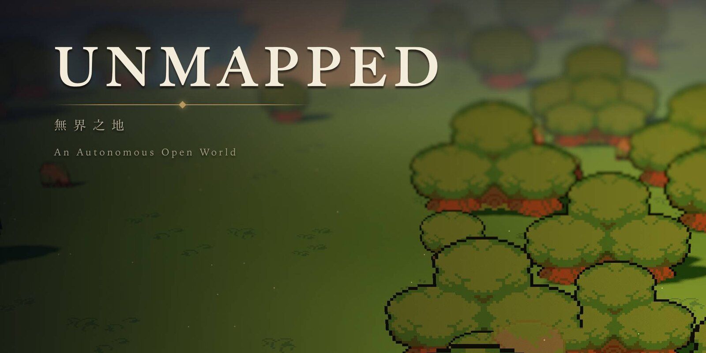

<h3>An endless open world that a language model writes as you explore it, saved to files you own.</h3>

<p><b>English</b> · <a href="README.zh-TW.md">繁體中文</a> · <a href="README.ja.md">日本語</a></p>

<p>
<a href="LICENSE"></a>


</p>

<p>
<a href="#quick-start">Quick start</a> ·
<a href="#screenshots">Screenshots</a> ·
<a href="#how-it-works">How it works</a> ·
<a href="#status">Status</a> ·
<a href="#roadmap">Roadmap</a> ·
<a href="#contributing">Contributing</a>
</p>

</div>

---

**UNMAPPED** (《無界之地》) is an open-source desktop game. Its map has no edge, and nothing on it
is written until someone gets there. The terrain streams from a seed. The first time a player walks
into an unwritten place, a large language model **witnesses** it: it names the place and writes its
residents, a local custom, errands and foes. It writes them in a small declarative game DSL, and a
parser checks every line. The place is written once, saved, and never needs the model again. Worlds,
saves and published revisions are plain files on your disk. What a world holds is a signed,
append-only **history**: friends you invite share it through a small world service and walk what
you witnessed without calling a model. Worlds kept on one device can still meet as a **continent**
over peer-to-peer WebRTC.

UNMAPPED talks to any OpenAI-compatible endpoint: a local llama.cpp or Ollama server, Apple's
on-device model, vLLM, or a cloud API. You can play in English, 繁體中文 or 日本語. Only the cloud
path has been verified end to end so far; the [status table](#status) lists what has.

> *Esse est percipi*: to be is to be perceived. The land beyond the known is real, but it has no
> name, no people and no story until a witness walks there.

## Highlights

- **An endless land that never waits for the model.** The ground is 32 × 32-tile chunks computed
  from `seed + chunk coordinates`. The model never generates it and it is never stored, so walking
  always works, even with no model connected.
- **Witnessed once, then static.** A new place is drafted by the model, validated and written into
  the world's history. Talking to a resident never calls the model, because the dialogue and choices were
  written when the place was witnessed.
- **The model writes a DSL, not code.** The model writes [OpenUI Lang](https://github.com/thesysdev)
  programs in small game dialects such as Scene, Dialogue, Item and Chapter, and
  `@openuidev/lang-core` parses them. If parsing fails, the errors go back to the model for at most
  two repair rounds, and every number is clamped to engine limits. If the output still doesn't
  parse, the screen shows an error. It never falls back to a stock scene.
- **Create a game in four steps.** Start from an idea. The model then writes seven world-bible cards
  (premise, tone, daily rules, what never appears, naming, voice, look) and 3–8 chapters, and you
  build and play. Every card and chapter can be edited by hand or rewritten on its own. Chapters can
  also be locked, inserted or reordered. Drafts autosave and survive a restart.
- **Two looks, one land.** An HD-2D diorama (three.js with tilt-shift, bloom and shadow-casting
  sprites) and a flat 16-bit canvas. Press <kbd>V</kbd> to switch between them. The land has day,
  dusk and night lighting.
- **Chapters and places on the map.** Story gates stand on the land. The host, not the model, clears
  a chapter once every person is met, every treasure opened and every foe felled. Side-scrollers and
  grid dungeons open from entrances out on the land.
- **Combat is optional.** Choose *Explore* (no fighting), *Adventure · gun* or *Adventure · blade*
  when you create a world. Foes chase and strike in real time. The combat formulas are versioned
  physics, so a world keeps the rules it was made with.
- **Shared worlds.** A world is a signed, append-only history that works offline first. Share it on
  a world service and the friends you invite walk what you witnessed with no model call, even while
  you are offline. When two people reach an unwritten place together, one writes it and the other
  watches the same text arrive. Places nobody visits fade into fog and become legends, and residents
  pass on rumours of things members really did. Members leave gifts and signposts, and see each
  other walk and emote. The service only orders, checks and relays signed entries; it never calls a
  model.
- **Continents for worlds kept on one device.** Such a world has a door number (門牌). Share it and
  your worlds merge into one continent over y-webrtc, with no game server holding anyone's world.
  Visitors appear with their name, facing and walk. Every entry from a peer is validated before it
  lands.
- **One route per model call.** A local model, your own key, or the free allowance of an account on
  the UNMAPPED generation gateway. Settings → Model shows where the next call goes, and a failed call
  never falls through to another route.
- **Pictures keep their licence.** Settings → Images picks who draws. Every picture records its
  licence, and commercial mode refuses providers and new pictures that may not be sold.
- **Worlds outlive their servers.** A `.world` file holds a world's whole history and packs. Anyone
  can verify it offline and bring it up on another world service; an owner moves the world there and
  members follow.
- **A phone can join.** A phone-sized browser page joins a world by invite, draws its land, walks it
  by touch and leaves notes offline. It is a proof, not a mobile app.
- **You own your data.** Published content is an immutable, sha256-hashed cartridge, and each save
  pins one exact revision. `.cartridge` files carry content, `.spire-backup` files carry progress
  and `.world` files carry a shared world between machines. Portable data is encrypted with a random AES-GCM Data Key, which is
  wrapped by a passkey PRF or the OS keychain.
- **Mods are prompts and tools, never code.** A `mod.yml` adds prompt sections, declarative tools
  that map onto a fixed `GameEffect` vocabulary, and skills. It runs on a
  [Cordis](https://github.com/cordiverse/cordis) harness modelled on DeepSeek Harness.
- **AI Worlds, sandboxed.** This is the only place a model writes JavaScript. It builds small
  interactive worlds that run in a `sandbox="allow-scripts"` iframe on a fresh origin with a nonce
  CSP.
- **Honest numbers.** Every model call goes to a local usage ledger: tokens, cached tokens and
  milliseconds, never prompts or keys. The HUD shows the totals for each world. The app never shows
  placeholder data. When something is missing, the screen says so and tells you how to fix it.
- **Optional on-chain provenance.** Worlds, remixes, saves and players can hold ENSv2 names on
  Sepolia, and the names are in the game: the player card, chapter clears, joining a continent by
  name. A shared world's service can also record a fingerprint of each beat on a chain (deployed on
  Sepolia). Content never goes on chain, and every screen works without a chain
  configured.

## Screenshots

<table>
  <tr>
    <td width="50%">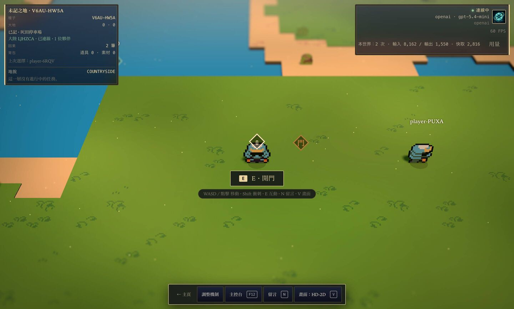</td>
    <td width="50%">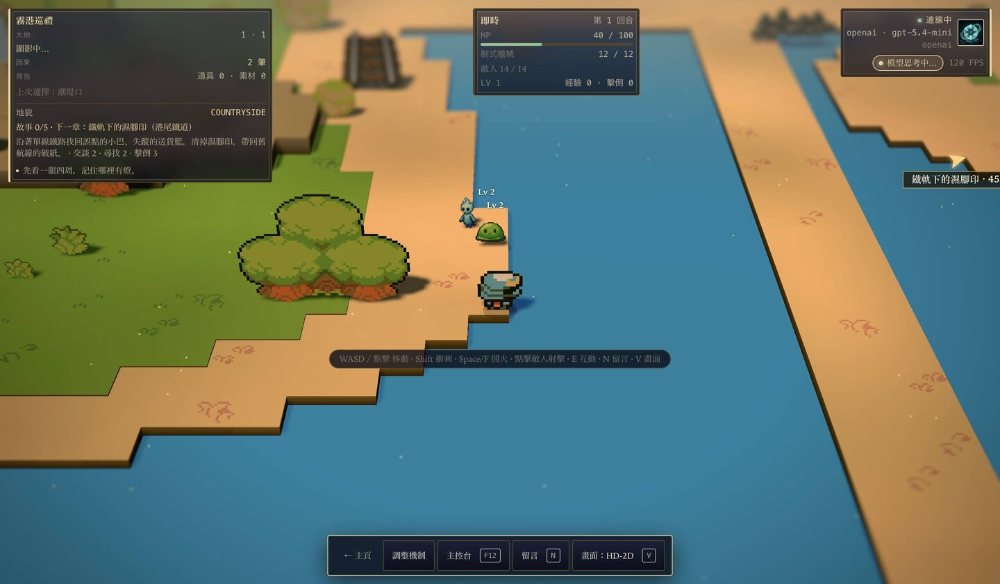</td>
  </tr>
  <tr>
    <td><sub><b>Continent.</b> Another player's world joined over WebRTC; they're drawn with their name, facing and walk.</sub></td>
    <td><sub><b>Combat.</b> Foes chase and hit in real time. The card on the left tracks the next chapter.</sub></td>
  </tr>
  <tr>
    <td>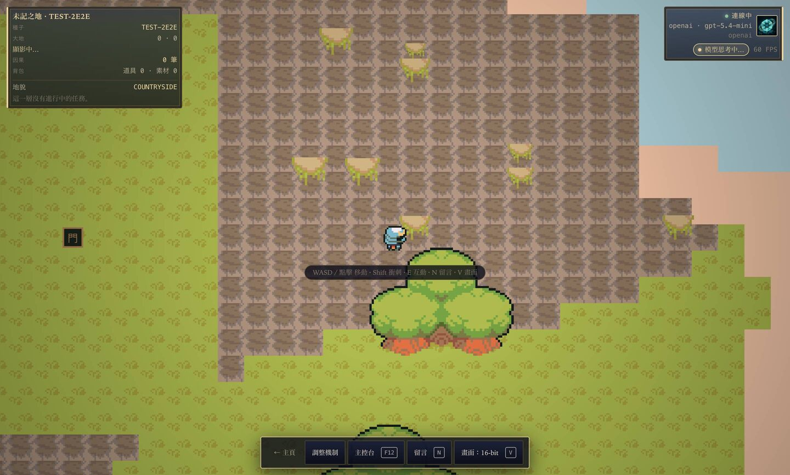</td>
    <td>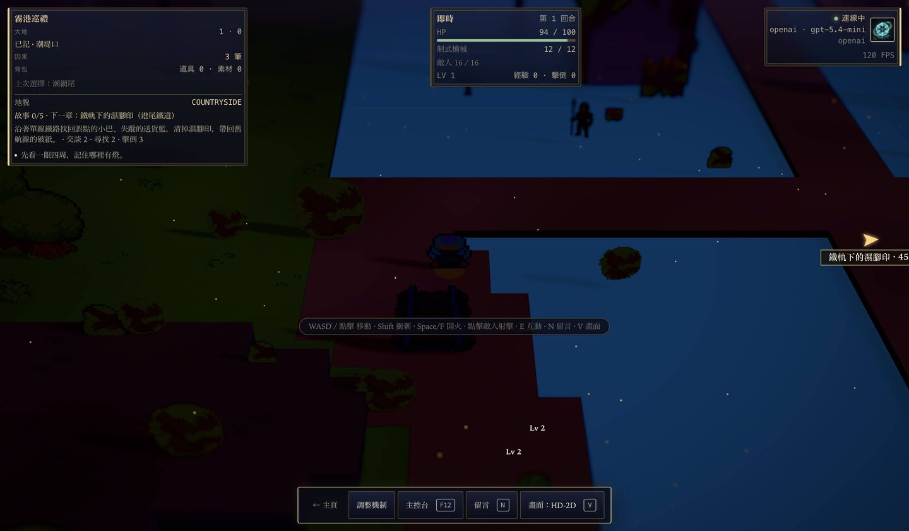</td>
  </tr>
  <tr>
    <td><sub><b>16-bit look.</b> The same land in the flat look; press <kbd>V</kbd> to switch.</sub></td>
    <td><sub><b>Night.</b> Day, dusk and night light the diorama and the sprites.</sub></td>
  </tr>
  <tr>
    <td>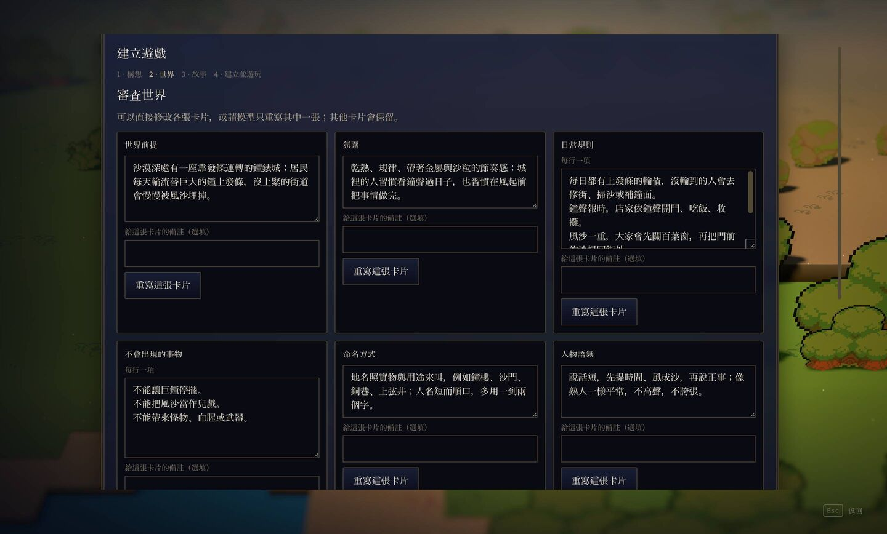</td>
    <td>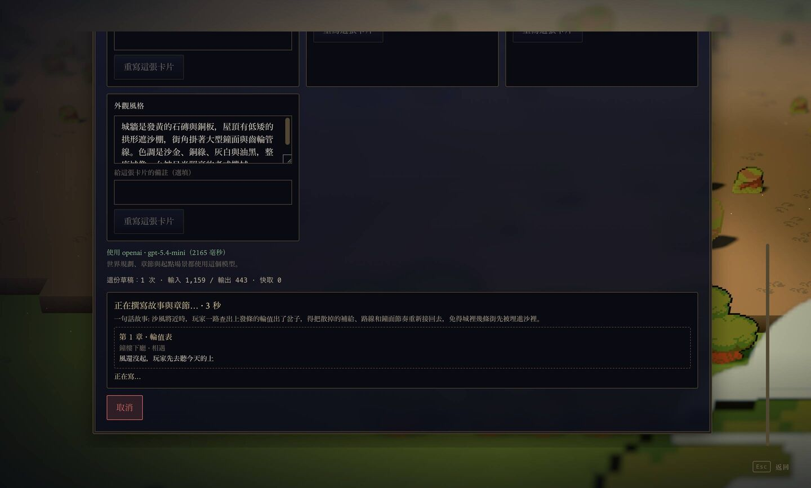</td>
  </tr>
  <tr>
    <td><sub><b>Create · world.</b> Edit any bible card by hand, or ask the model to rewrite just that one.</sub></td>
    <td><sub><b>Create · story.</b> Chapters stream in as they're written. Cancel aborts the request in flight.</sub></td>
  </tr>
  <tr>
    <td>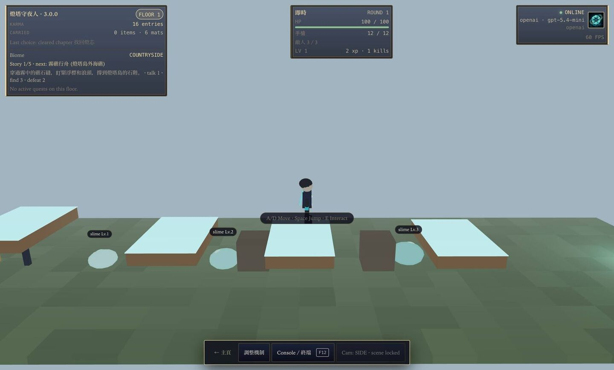</td>
    <td>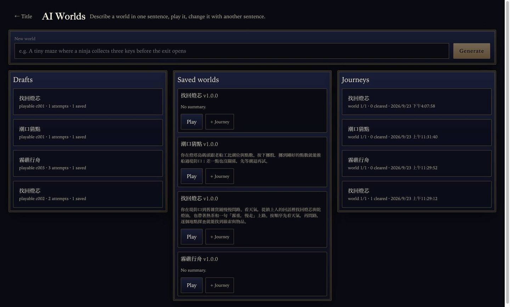</td>
  </tr>
  <tr>
    <td><sub><b>Places.</b> Side-scrollers and dungeons open from entrances out on the land.</sub></td>
    <td><sub><b>AI Worlds.</b> Describe a small game in one sentence, play it, then change it with another.</sub></td>
  </tr>
  <tr>
    <td>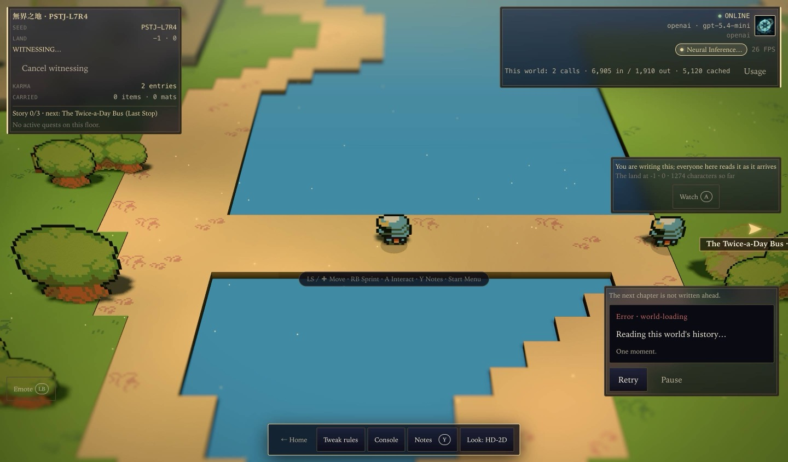</td>
    <td>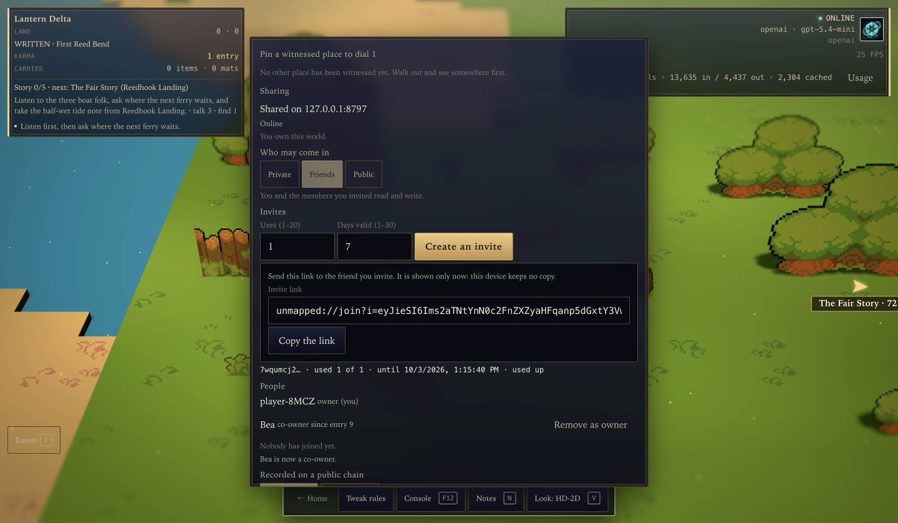</td>
  </tr>
  <tr>
    <td><sub><b>Together.</b> One player writes a new place; the other reads the same text as it arrives, and both get the same entry. The chapter card's <code>world-loading</code> error is a bug this phase found and fixed.</sub></td>
    <td><sub><b>The door.</b> Share a world, choose who may come in, make one-time invites, and make a member a co-owner.</sub></td>
  </tr>
</table>

<p align="center">
  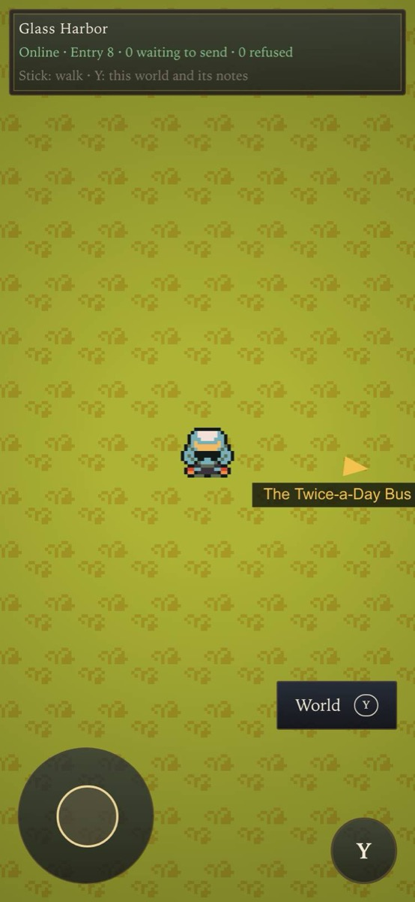<br>
  <sub><b>Phone.</b> The browser proof joined a shared world by invite and draws its land; the stick walks it.</sub>
</p>

<p align="center">
  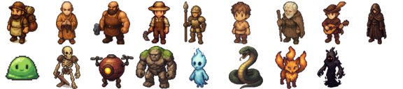<br>
  <sub>Residents and monsters: one image-model sprite per role and kind, drawn once at build time. Provenance is in <code>src/assets/generated/actors.json</code>.</sub>
</p>

## Quick start

**Requirements.** macOS on Apple Silicon (the only platform verified so far), [Bun](https://bun.sh),
Node.js and the Xcode Command Line Tools (tested with Bun 1.3.6 and Node.js 22.14). On macOS,
`bun run dev` also compiles the Swift bridge to Apple's on-device model.

```bash
git clone https://github.com/p2p-solidarity/unmapped.git
cd unmapped
bun install        # also fetches the Electron binary
bun run dev        # main + preload + renderer with HMR
```

Next, open **Title → Settings → Model** and choose where the words come from.

### Choose a model

| Provider | Default endpoint | Key | Verified end to end |
| --- | --- | --- | --- |
| OpenAI | `https://api.openai.com/v1` · `gpt-5.4-mini` | Settings → Model, or `OPENAI_API_KEY` in `.env` | ✅ Create, witnessing, chapters, places |
| llama.cpp | `http://127.0.0.1:8080/v1` | none | not yet |
| Ollama | `http://127.0.0.1:11434/v1` · `qwen3.5:4b` | none | not yet (detection only) |
| Apple Foundation Models | inside the app (its Swift bridge; no server) | none | chat, tools, cancel and Create ✅; play after Create (witnessing, chapters) not yet ([apple-in-app](docs/e2e/milestone-apple-in-app/result.md) · [apple-create](docs/e2e/milestone-apple-create/result.md)) |
| vLLM serving [`thesysdev/OUI-1`](https://huggingface.co/thesysdev) | `http://127.0.0.1:8000/v1` | none | not yet |
| OpenUI Gateway | `https://api.thesys.dev/v1/embed` | `THESYS_API_KEY` | not yet |
| Free allowance (the UNMAPPED generation gateway) | `UNMAPPED_GATEWAY_URL` (dev builds have none) | Settings → Account, or `UNMAPPED_GATEWAY_KEY` in `.env` | routing, metering, cancel and pictures ✅ against a test upstream only ([p4-quota](docs/e2e/milestone-rev6-p4-quota/result.md)) |
| Any OpenAI-compatible server | your URL | optional | — |

Each call takes exactly one route, decided in the main process and shown in Settings → Model as
"Next call: …". A local model runs on this computer. OpenAI and OpenUI Gateway use your key (the
saved one, else `.env`), and a custom endpoint uses its saved key. Only with no key of your own and
a gateway configured does a call spend the **Free allowance** of your account. A call that fails is
never retried on another route, because that would change who pays and which model writes the world.

A key entered in Settings → Model is encrypted with the OS keychain and read only by the Electron main
process. It never reaches the renderer. `.env` keys are read in main as a fallback; see
[`.env.example`](.env.example).

<details>
<summary><b>Run a local model with llama.cpp</b> (recommended on a 16 GB Apple Silicon Mac)</summary>

```bash
brew install llama.cpp
scripts/download-model.sh qwen   # Qwen3.5-4B Q4_K_M, 2.74 GB, Apache-2.0 → ~/models
llama-server -m ~/models/Qwen3.5-4B-Q4_K_M.gguf --port 8080 -c 16384 --jinja -ngl 99
```

`scripts/download-model.sh gemma` fetches Gemma 4 E4B instead (4.98 GB, Gemma licence). Set
`MODEL_DIR` to store models elsewhere.

</details>

### Controls

| Where | Keys |
| --- | --- |
| Open land | <kbd>W</kbd><kbd>A</kbd><kbd>S</kbd><kbd>D</kbd> or click to move · <kbd>Shift</kbd> sprint · <kbd>E</kbd> interact · <kbd>N</kbd> notes · <kbd>V</kbd> switch look · <kbd>F12</kbd> console |
| Worlds with guns | <kbd>Space</kbd> / <kbd>F</kbd> fire · click a foe to shoot |
| Side-scroller | <kbd>A</kbd><kbd>D</kbd> move · <kbd>Space</kbd> jump · <kbd>E</kbd> interact |
| Dungeon (first person) | <kbd>W</kbd><kbd>A</kbd><kbd>S</kbd><kbd>D</kbd> move · left click fire · <kbd>R</kbd> end turn · <kbd>F</kbd> flashlight · <kbd>E</kbd> interact |
| Shared world, online | <kbd>T</kbd> Emote (pad <kbd>LB</kbd>) · <kbd>1</kbd>–<kbd>6</kbd> pick one |
| Phone (browser proof) | Stick: walk · Y: this world and its notes |

The HUD always shows the keys for the place you're in.

## How it works

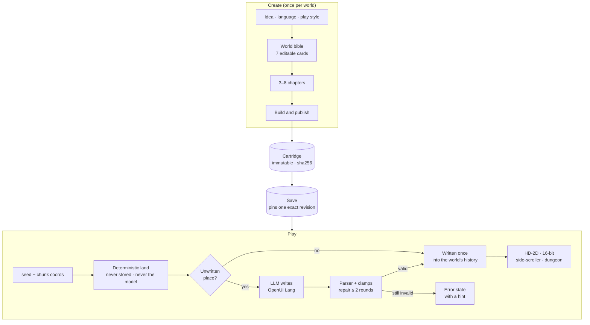

**The model is a guest, and the DSL is the truth.** Every prompt is assembled from ordered sections
on a Cordis harness: persona, world rules, the DSL spec, mod lore, the world snapshot with its lore
hot spots, examples and the output format. The reply is parsed against the dialect's schema. Errors
come back as `OpenUIError[]`, and the model patches only the statements that failed. A
hallucinated `x=9000` is clamped, never trusted.

This is what a scene looks like. The excerpt is from the hand-written demo cartridge in
[`cartridges-examples/demo-onsen-letters`](cartridges-examples/demo-onsen-letters/scenes/onsen_street.oui);
components take positional arguments:

```text
root = Scene("湯屋街", "onsen_town", [contract, floor, sky, ambient, lanterns, stone_path, well, chiyo, koharu, letter_one, exit, letters])
floor = Floor(23, 23, "wood")
sky = Sky("#1c1520", "#2a1f28", 0.06)
lanterns = Light("point", "#ffd0a8", 1.7, 11, 11)
stone_path = Patch(10, 3, 3, 18, "stone")
well = Prop("well", 15, 13)
chiyo = NPC("chiyo", "千代", 12, 9, "merchant", "calm", "#b0426a", "tall", "ribbon", "fan")
koharu = NPC("koharu", "小春", 7, 13, "child", "joyful", "#f2b84b")
letter_one = Treasure("letter_one", 4, 17, ["褪色的信"])
exit = Exit(11, 3, "湯屋閣樓")
letters = Quest("letters", "向街上的人打聽，誰寄了那三封沒有署名的信。")
```

### The rules the engine never breaks

1. **Walking never waits for the model.** Terrain is a pure function of the seed. With no model, the
   land is still walkable, but places stay honestly *unwritten*.
2. **Interacting never calls the model.** Dialogue and choices are written when a place is
   witnessed, and choices resolve through deterministic actions.
3. **The model only proposes.** Its output has to pass the parser and the rule checks before it
   becomes history.
4. **Content is immutable and progress is pinned.** Play never writes to a cartridge. A save names
   its cartridge id, version and hash exactly.
5. **Physics is versioned.** Anything that changes how a world looks or fights (ground, wildlife,
   combat formulas) bumps `PHYSICS_VERSION`. Worlds on different physics never merge into one
   continent.
6. **No fake data.** Every data-driven view is `idle | loading | ready | error`. The app never
   shows a sample world, a stock NPC line or a made-up peer.
7. **The chain can be switched off entirely**, and every screen still works.

The full engineering contract, with module exports, state ownership and security rules, is in
[`CLAUDE.md`](CLAUDE.md).

## Your worlds are files

Everything lives in Electron's userData folder. On macOS that is
`~/Library/Application Support/Unwritten Land/`, the pre-rename product id, kept so existing saves
and keychain entries stay valid.

```text
cartridges/<id>/<version>/        immutable published content: manifest, rules, scenes, bible, story, pictures and their licences (hashed)
instances/<id>/saves/<save>/      progress pinned to one exact revision: save.json, karma; in a world also
                                  world.json (its pin) and progress.json (errands, chapters, places);
                                  older saves keep lore, notes and witnessed chunks here, frozen once migrated
histories/<worldId>/              a world's shared history: log.jsonl (append-only), outbox, refused, link.json (service + its key)
blobs/<sha256>                    cartridge and AI-world packs, checked against their hash on every read
identity/device.key               this device's Ed25519 key, encrypted with the OS keychain; never regenerated
provider-keys/<provider>.key      saved keys; hosted.key is the gateway account token
images.json                       which provider draws pictures (an id only)
workspaces/create.<draft>/        Create drafts (autosaved), with each sketch's licence record in looks/
mods/<name>/                      installed mods: mod.yml + prompt/*.md + skills/
usage.jsonl                       one line per model call: purpose, model, tokens, ms, outcome
```

| File | Contains | Restores into |
| --- | --- | --- |
| `.cartridge` | content only: one published revision | any machine; same hash on both sides |
| `.spire-backup` | one run and its active save: land, lore, notes; for a save in a world also its pin, progress and history | a machine that has the exact cartridge revision; a history that has diverged is kept beside, never merged; on another device a never-shared world becomes that device's own |
| `.world` | one shared world: its signed history and packs, none of your own progress | any device or world service, after an offline check (`bun run verify-world`) |

The two optional servers keep their own folders, outside userData: a world service's `--data`
(`service-key.json`, and per world `log.jsonl`, blobs and a snapshot) and a gateway's `--data`
(its key, accounts, the append-only `ledger.jsonl`, and the operator's `upstreams.json` and
`costs.json`).

## Play together: shared worlds

A world's land is a signed, append-only history. Each witnessed place, note, chapter, gift and beat
is one entry, signed by the device that wrote it; every device has its own Ed25519 key. A new world
lives on your device alone and plays offline. To share it, add a world service under
**Settings → Shared worlds**, then at home press <kbd>E</kbd> (**Open the door**) and choose
**Share on …** in the door's **Sharing** section. The service orders the entries, checks each one
the same way the app does, relays them, and keeps them while you are away. It never calls a model
and holds no model key. You can run one with `bun run service` (see [Development](#development)).

- **Invites.** Under **Invites**, **Create an invite** makes a link (`unmapped://join?…`) with a set
  number of uses and days. A friend pastes it in **Worlds → Join a world**, chooses
  **Look at the world**, then **Join and play**. An invite that is used up, expired or revoked is
  refused.
- **Who may come in.** **Private**, **Friends** (the default: you and the members you invited) or
  **Public** (anyone with the world's id may visit and leave notes, signposts and gifts; only members
  write places). Under **People**, an owner can **Remove** a member, who then can neither read nor
  write; what they wrote stays. **Make co-owner** gives another device every right an owner has, so
  the world outlives the loss of one device.
- **Witnessed once, for everyone.** A place someone has witnessed is drawn from the history with no
  model call. When two people walk into the same unwritten place, the service lets one of them write
  it; the other watches the same text arrive, and both get the same entry.
- **Variants (異聞).** When two people write the same place while the service is out of reach, the
  one that reaches it first stands, and the other stays in the history as a variant you can read.
- **Beats: fog, legends and seasons.** A beat runs every 6 hours. The season turns every 7 days. A
  place beyond the town ring that nobody has tended for 28 quiet days fades into fog; its old telling
  stays in the history as a legend (傳說), and the place can be witnessed anew. Home, chapters and
  places never fog. A world kept on one device beats when it opens.
- **Rumours.** A beat picks real events, such as a member clearing a chapter, and residents pass
  them on ("They say…"). A rumour may name only the event it cites; the app and the service both
  refuse one that names anything else. A device writes a beat's rumours with its own model, one call
  at most, when **Settings → Shared worlds → Write rumors in the background** allows it: by default
  only for worlds you own, and never on the free allowance.
- **Gifts, presence and emotes.** Leave a gift for whoever gets there first. If two people take it
  at once, one gets it and the other is told "Someone took it first." Online members see each other
  walk, and <kbd>T</kbd> opens **Emote**. Presence is never saved.
- **Old saves come along.** The first time this build opens an older save, it writes the save's
  land, lore, notes, places, chapters and deeds into a world history. It never changes or deletes the
  source files, running it again adds nothing, and whatever does not fit stays on this device and is
  listed. An older build can still open the same folder, and this build then catches up what it wrote.
- **Worlds outlive their servers.** **Worlds → World files** exports a `.world` file and imports one
  after an offline check. If a world's service is gone, import its file into another world service
  (`bun run service -- import`), then an owner chooses **Move to another service**; members follow
  with the move link. A world or file made with newer physics is refused.

## Play together: continents

Continents are the older way to play together, kept for worlds that live only on one device. A
world shared on a world service cannot join one (`continent-world-attached`). Every such world has a
stable **door number** (門牌), which is also the code of the continent it opens. Open your door to
friends in game, or pick a world and enter a friend's door number, or the ENS name of their save, in
**Worlds → Continent** (a save's name carries its door number). Each
world keeps its own origin, seed and save. Joining gives it an anchor, and territory belongs to the
nearest anchor.

- **What crosses:** each world's descriptor, witnessed chunks, notes, and live positions (awareness
  only, never saved). A note a visitor leaves on your land waits at your door until you choose
  **Keep it**; then it becomes a note in your world's history, signed by you.
- **What never crosses:** cartridge bytes, rules, story, errands and foes.
- **Trust:** nothing is exchanged until a peer's hello matches the continent code, protocol and
  physics version. After that, every entry is checked on arrival. A peer may write only its own
  world and chunks, may leave notes on anyone's land, and can never overwrite a chunk or a note.
- **Signaling:** public y-webrtc servers by default. You can run your own
  (`PORT=4444 node node_modules/y-webrtc/bin/server.js`) and add it under
  **Settings → Signaling servers**, where it can be tested before you save.

## Accounts, the allowance and pictures

None of this is needed to play with a local model or your own key. With no gateway configured,
**Settings → Account** and **Settings → Plan** say so (`gateway-not-configured`), and Settings →
Model offers no Free allowance.

- **The generation gateway** (`bun run gateway`) is a metered, OpenAI-compatible endpoint. It is
  separate from the world service and never learns which world a call is for. An account is a set of
  device keys: **Sign in with this device** signs the gateway's challenge with this device's key. A
  second device chooses **Get a pairing code**; on a device already in the account,
  **Look up this code** shows the new device's fingerprint before **Approve this device**. A removed
  device is signed out on its next call. A token the operator made can also sign a device in from
  `UNMAPPED_GATEWAY_KEY` in `.env`.
- **The allowance.** A call reserves credits, then settles on the tokens it used; a cancelled call
  releases its hold. The app shows the allowance as a share, credits, and this computer's calls and
  tokens, never as money. When it runs out, a call is refused (`quota-exhausted`) with its ways out:
  your own key, a local model, a plan, or the monthly reset. **Settings → Plan** lists the plans of
  the gateway's billing provider (Stripe); a gateway without one sells nothing
  (`billing-not-configured`).
- **Pictures.** **Settings → Images** chooses who draws: OpenAI, Qwen-Image-2512 or Qwen-Image-2.1 on
  a server you name (`QWEN_IMAGE_BASE_URL`), or the gateway when you have no image key. Every picture
  keeps a licence record, and a published revision lists its pictures' licences in
  `assets/licences.json`. **Commercial mode** (`UNMAPPED_COMMERCIAL=1`, or a gateway that says so)
  refuses a provider whose licence does not allow commercial use, and refuses to publish a new
  picture whose licence is non-commercial or unknown. A picture inherited unchanged is listed, not
  refused.

## On a phone: the browser proof

`bun run browser:dev` serves a phone-sized page on port 5190. It is the smallest client of a shared
world, not a mobile app. Paste an invite under **Join a world**: the page joins with its own device
key (a WebCrypto Ed25519 key that cannot be read out), checks the whole history, fetches the world's
cartridge pack by hash and draws the land in the 16-bit look. The on-screen stick walks it through
the same action map as keys and pads. **World** (<kbd>Y</kbd>) opens the world's places, notes and
signposts, and a note is left on the tile you stand on. Everything is kept in the browser's
IndexedDB, so the page reloads and walks with no network and no page server, and notes written
offline go out when the service answers. The page has no model, Create, talking, chapters, places,
export or chain. The world service needs `--browser-origin <page origin>` to serve it packs. A
world started from the built-in cartridge gets its pack when its owner shares it (or next opens a
world shared before), so the phone draws it too.

## Mods

A mod is a folder with a YAML manifest, markdown prompt sections and optional skills. It contains no
JavaScript. Its tools are templates over a fixed effect vocabulary, and the harness validates both
the model's arguments and the resulting effect. Abridged from the example mod:

```yaml
name: onsen-festival
version: 0.1.0
description: Every floor carries a hot-spring town undercurrent, and the lanterns can be lit.
prompt:
  - { name: onsen-lore, order: 420, file: prompt/lore.md }
tools:
  - name: light_lanterns
    description: Light the festival lanterns when the player has actually done something that would light them.
    parameters:
      color: { type: string, description: "Lantern colour as #rrggbb", required: true }
    effect: { kind: mutate_world, skyColor: "{{color}}", fogDensity: 0.012, biome: onsen_town }
skills: [skills]
```

Full example: [`mods-examples/onsen-festival`](mods-examples/onsen-festival). Design notes are in
[`docs/harness.md`](docs/harness.md).

## Optional: on-chain provenance

None of this is needed to play. With nothing configured, every screen says plainly that no ledger
is set up.

- **ENSv2 names for worlds, saves and players (Sepolia).** Everything hangs in one tree under
  `unmapped.eth`: a world is `<label>.unmapped.eth`, a remix sits under its parent's name, a save is
  `<save>.<cartridge>.unmapped.eth`, and a player is `<you>.players.unmapped.eth`; saves and players
  are held by the player's own passkey account. The names are in the game, not only in menus:
  right after **Build and play** a world can be named (you pick the label, so a world called 霧之港
  can be `misty-harbor.unmapped.eth`) and put on the market; the player card shows the run's name;
  clearing a chapter offers to record the run, or move its name to the new checkpoint, with one
  passkey signature; and a friend can walk onto your continent by typing your save's name. In
  **Worlds → Cartridges** a player names, repoints or launches a revision, and **Open by ENS name**
  follows a name back to the exact revision, or to a save's checkpoint. The records hold only the
  id, version and content hash (for a save: its sha256, the pinned version, one line of progress and
  its door number); a backup restored on another machine finds its name by hash.
- **Provenance ledger.** [`contracts/src/UnwrittenLedger.sol`](contracts/src/UnwrittenLedger.sol)
  records who published which hash and what it was remixed from, plus short player notes. Content
  never goes on chain.
- **Light chain for shared worlds (Sepolia).** An owner can choose **Record beats** in the
  door's **Recorded on a public chain** section. The world service then writes each beat's
  fingerprint (the world's id, the entry number and hashes) to
  [`WorldProvenance`](contracts/src/provenance/WorldProvenance.sol) and pays for it; nobody needs a
  wallet, and the app only reads the chain and compares it with its own copy. The contract is
  deployed on Sepolia at [`0xF625…Ef02`](https://sepolia.etherscan.io/address/0xF625ec3c228e3BCE34977C0b7e97BD591291Ef02); set `UNMAPPED_PROVENANCE_*` (see `.env.example`) for the door to
  compare. `bun run provenance --dry-run` simulates it against a real service's beats.
- **Lineage market (experimental, Sepolia).** A named cartridge can be launched: its token is sold
  through a Uniswap Continuous Clearing Auction priced in its parent's token, and a v4 hook then pays
  a 1% royalty up the family line (50 / 30 / 20 to the world, its parent and its grandparent), to
  whoever holds the ENS name. The first world, `aether-land.unmapped.eth`, has been auctioned,
  settled and traded. In **Worlds → Market** a player bids, settles, buys and pays out royalties with
  a passkey. There is no wallet and no ETH, and no key in the app: the passkey owns a small account
  contract, and a gas station (a Cloudflare Worker, `src/relay`) pays for exactly the market's own
  actions. A world's name holder launches it from the app (**Worlds → Cartridges**, or right after
  building it); a remix only after its parent, priced in the parent's token. A read-only auction page runs at
  https://unmapped-auction.gimmychang.workers.dev. See [`docs/demo/lineage-market.md`](docs/demo/lineage-market.md),
  [`docs/plans/lineage-market.md`](docs/plans/lineage-market.md) and
  [`contracts/README.md`](contracts/README.md).

Chain keys (`UNWRITTEN_*`) are read only by the main process. Deploy and launch scripts are run by a
person. The app holds no key for the market: it asks the gas station at `UNWRITTEN_LINEAGE_RELAY` to
carry an action the player signed with their passkey.

## Status

UNMAPPED is at version `0.1.0`: an early, working research build. A feature is listed as verified
only after it has been run in the real app. Each run leaves a replayable record under
[`docs/e2e/`](docs/e2e): the exact `run.json` actions, a `result.md` with measured numbers, and
screenshots.

| Area | State | Evidence |
| --- | --- | --- |
| Create: four steps, streaming, per-card rewrite, chapter edit/lock/move, restart | ✅ verified | [create-four-step](docs/e2e/milestone-create-four-step/result.md) · [rev6-create](docs/e2e/milestone-rev6-create/result.md) |
| Open land in HD-2D and 16-bit, day/dusk/night | ✅ verified | [e2e-first](docs/e2e/milestone-e2e-first/result.md) · [land-lighting](docs/e2e/milestone-land-lighting/result.md) |
| Witnessing, notes, lore in the save | ✅ verified | [rev6-land](docs/e2e/milestone-rev6-land/result.md) |
| Real-time combat and defeat/revive | ✅ verified; HD-2D foes checked at rest, not while moving | [integration](docs/e2e/milestone-integration/result.md) |
| Places: side-scroller and dungeon, leave and return | ✅ verified | [play-loop](docs/e2e/milestone-play-loop/result.md) · [rename-unmapped](docs/e2e/milestone-rename-unmapped/result.md) |
| Continents across two app processes | ✅ verified with local signaling | [rev6-land](docs/e2e/milestone-rev6-land/result.md) · [visitor-position](docs/e2e/milestone-rev6-followup-visitor-position/result.md) · [signaling](docs/e2e/milestone-rev6-followup-signaling/result.md) |
| `.cartridge` export/import, `.spire-backup` restore | ✅ verified, identical hashes | [rev6-land](docs/e2e/milestone-rev6-land/result.md) |
| Cloud model (OpenAI `gpt-5.4-mini`), usage ledger | ✅ verified | [model-switch](docs/e2e/milestone-model-switch/result.md) · [rev6-create](docs/e2e/milestone-rev6-create/result.md) |
| Local model generation (llama.cpp, Ollama, Apple) | ⏳ Apple runs Create end to end inside the app; its 4K context does not yet fit witnessing or chapters; llama.cpp and Ollama generation not yet | [model-switch](docs/e2e/milestone-model-switch/result.md) · [apple-in-app](docs/e2e/milestone-apple-in-app/result.md) · [apple-create](docs/e2e/milestone-apple-create/result.md) |
| AI Worlds (sandboxed interactive worlds) | ✅ verified | [acceptance](docs/experiments/interactive-works-acceptance.md) |
| ENSv2 cartridge names on Sepolia (the older `ens:setup` parent, since removed) | ✅ verified | [ensv2-cartridge-names](docs/e2e/milestone-ensv2-cartridge-names/result.md) |
| ENS names in the lineage tree: a remix cartridge, a player's save, its update, a restored backup found by hash | ✅ verified on Sepolia | [lineage-names](docs/e2e/milestone-lineage-names/result.md) |
| Gas station: no key in the app | ✅ verified (the app flows against the station run locally; the deployed Worker sent a live faucet transaction) | [lineage-relay](docs/e2e/milestone-lineage-relay/result.md) |
| ENS in the game: naming right after Create (a chosen label for a Chinese name), launching from the app, the name on the player card, recording and moving a run's name after chapters (with its door), a remix from the Remix button named under its parent and launched in its token, a friend joining a continent by a save's name | ✅ verified on Sepolia (a virtual authenticator stood in for Touch ID; the station ran locally from this build); the chapter card's update button was not clicked (the same update went through Saves) | [ens-in-game](docs/e2e/milestone-ens-in-game/result.md) |
| Player names (`<you>.players.unmapped.eth`): claimed with a passkey, shown in place of `0x…` and on a continent; the chapter card's record and update | ✅ verified on Sepolia through the deployed gas station | [ens-players](docs/e2e/milestone-ens-players/result.md) |
| Lineage market: bid, settle, buy and royalties from the app with a passkey | ✅ verified on Sepolia (a virtual authenticator stood in for Touch ID); three generations in the dry run only | [lineage-demo](docs/e2e/milestone-lineage-demo/result.md) · [lineage-market](docs/e2e/milestone-lineage-market/result.md) |
| Shared world: a friend joins by invite and walks what you witnessed with 0 model calls; you see their place after a restart, with no call | ✅ verified with a local world service | [p3-offline-visit](docs/e2e/milestone-rev6-p3-offline-visit/result.md) |
| Old saves migrate into a world history: counts match, source files unchanged, a rerun adds 0, no model call; the phase-2 build still opens the folder and this build catches up what it wrote | ✅ verified; migration time not measured | [p3-migrate](docs/e2e/milestone-rev6-p3-migrate/result.md) · [p3-older-build](docs/e2e/milestone-rev6-p3-older-build/result.md) |
| A migrated world, shared: the joiner sees its old places, notes and an otherworld (work pack fetched, verified, sandboxed) with 0 calls | ✅ verified | [p3-migrated-share](docs/e2e/milestone-rev6-p3-migrated-share/result.md) |
| Two people at one unwritten place: one writes, the other watches the same stream; 1 model call, the same entry on both | ✅ verified; the watcher stops walking while the stream panel is open (by design) | [p3-together](docs/e2e/milestone-rev6-p3-together/result.md) |
| Variants (異聞): two offline tellings of one place, one stands and one is kept | ✅ verified | [p3-variant](docs/e2e/milestone-rev6-p3-variant/result.md) |
| Beats: fog, legends (傳說) and seasons, on a world service and on a world kept on one device; the same fingerprints on the service and both apps; a re-witness of a fogged place | ✅ verified with a test clock (92 days); after a fix the town ring no longer says "fading into mist" | [p3-fog](docs/e2e/milestone-rev6-p3-fog/result.md) · [p3-local-beat](docs/e2e/milestone-rev6-p3-local-beat/result.md) |
| Rumours bound to real events; uncited or wrong names refused by the service and by the app | ✅ verified; "They say…" read on the owner's device only | [p3-rumors](docs/e2e/milestone-rev6-p3-rumors/result.md) |
| The door: private, friends and public; one-time invites (used, expired, revoked refused); removing a member | ✅ verified; after a fix main also refuses a removed member's writes before signing, and entries already waiting are listed as refused | [p3-door](docs/e2e/milestone-rev6-p3-door/result.md) |
| Gifts: two people take one gift, one gets it, the other's bag is unchanged and says "Someone took it first." | ✅ verified with the gift panel open; the toast with the panel closed not seen | [p3-gift-race](docs/e2e/milestone-rev6-p3-gift-race/result.md) |
| Presence and emotes in both looks on two machines | ✅ verified; largest step 0.13 tiles per frame at 60 Hz; in the 16-bit look names sit on a plate (fixed after the run) | [p3-presence](docs/e2e/milestone-rev6-p3-presence/result.md) |
| Backups of a save in a world: restore, a diverged history kept beside, adoption on another device | ✅ verified; witnessing on the adopted world not run with a model | [p3-backup](docs/e2e/milestone-rev6-p3-backup/result.md) |
| Newer physics refused by a world service, a backup import and a `.world` import | ✅ verified | [p3-physics](docs/e2e/milestone-rev6-p3-physics/result.md) · [p4-import-physics](docs/e2e/milestone-rev6-p4-import-physics/result.md) |
| Continents for worlds kept on one device: a visitor's note kept by the owner, a shared world refused | ✅ verified with local signaling | [p3-continent](docs/e2e/milestone-rev6-p3-continent/result.md) |
| `.world` files: export, offline check, a mirror, a co-owner moves the world to a new service, members follow; a fresh device enters the otherworld with 0 calls | ✅ verified with three local services; the mirror's refusal was sent by the probe, not the app | [p4-rehost](docs/e2e/milestone-rev6-p4-rehost/result.md) |
| `.world` import on another device: adopted as a new world, pinned to its revision and physics | ✅ verified | [p4-import-physics](docs/e2e/milestone-rev6-p4-import-physics/result.md) |
| Gateway accounts: sign in with the device key, pair by code, remove a device, an operator's token in `.env` | ✅ verified against a test upstream (no real model) | [p4-account](docs/e2e/milestone-rev6-p4-account/result.md) |
| One route per call and the allowance: exhausted, granted, a cancel releases its hold; local and `.env` routes add no gateway line | ✅ verified against a test upstream; a watcher's cost and the rumour switch on the free allowance not run | [p4-quota](docs/e2e/milestone-rev6-p4-quota/result.md) |
| No gateway, or no billing: Account, Plan and Model say so; Create still asks a local model | ✅ verified | [p4-billing-off](docs/e2e/milestone-rev6-p4-billing-off/result.md) |
| Pictures through the gateway, each with a licence record | ✅ verified with a test image model; an AI-world asset and a reference picture not run | [p4-images-hosted](docs/e2e/milestone-rev6-p4-images-hosted/result.md) |
| Commercial mode: a non-commercial provider cannot be chosen, a new picture of unknown licence blocks publishing, a gateway in commercial mode refuses to start with a non-commercial model | ✅ verified; publishing driven through the app's publish call, not a screen | [p4-licence](docs/e2e/milestone-rev6-p4-licence/result.md) |
| Light chain: a real service's beat fingerprints recorded on Sepolia, and the door comparing them | ✅ verified live: the contract deployed, a service opened a stream and recorded 3 beats, and the door read "The chain matches your copy at entry 6"; a changed copy reads "differs" (through main's reader) | [p4-chain](docs/e2e/milestone-rev6-p4-chain/result.md) · [p4-chain-live](docs/e2e/milestone-rev6-p4-chain-live/result.md) |
| Phone-sized browser proof: join by invite, the land, walking by touch, notes offline and after a reload, seeing a desktop player | ✅ verified in a headless 375 × 812 browser on the dev page, including a world on the built-in cartridge; no real phone | [p4-mobile-proof](docs/e2e/milestone-rev6-p4-mobile-proof/result.md) |
| No servers at all: no screen asks for an account; walking, notes, the door with no world service, and `.world` export, offline check and import on a second device | ✅ verified; later, Apple's on-device model (inside the app) wrote Create's world cards, but its 4K context refuses a witness (`model-context-too-small`); llama.cpp and Ollama were not installed | [p4-no-servers](docs/e2e/milestone-rev6-p4-no-servers/result.md) · [integrated-journey](docs/e2e/milestone-rev6-integrated-journey/result.md) |
| One world through everything: Create → play → share → watch a place written together → co-owner → a phone joins and walks → `.world` to another device → Apple on-device → quit and continue | ✅ verified in one run; 0 renderer errors on six clients; the same 21-entry history on the service and every device; 12 paid calls | [integrated-journey](docs/e2e/milestone-rev6-integrated-journey/result.md) |
| Stripe checkout (test mode and live), Qwen-Image on your own GPU endpoint | ⏳ not run; each needs a person | — |
| Companions | 🚧 in the rules, not yet drawn or followed on the land | — |
| Windows / Linux | ❔ untested; packaging targets macOS only | — |

Stage-by-stage delivery with measured numbers is on Page 03 of
[`docs/architecture/afm3-dsl-architecture.html`](docs/architecture/afm3-dsl-architecture.html).

## Roadmap

The current direction is **Revision 6** ([engineering notes](docs/rev6-engineering.html) · plans
for [phase 2](docs/plans/rev6-phase2.md), [phase 3](docs/plans/rev6-phase3.md) and
[phase 4](docs/plans/rev6-phase4.md)). Phases 3 and 4 built the shared history, forgetting, beats
and rumours, accounts and licences, `.world` files and the phone proof; the [status table](#status)
says what has been run. The direction:

- **Shared history.** What gets witnessed belongs to the world and is shared. The first visitor's
  version is the one that stays. Later visitors sync it instead of regenerating it.
- **Traces first, co-presence at the peak.** A world never depends on anyone being online. The same
  sync runs live when players are together and catches up later when they aren't.
- **Forgetting.** Places nobody visits for a long time return to the fog, waiting to be witnessed
  again. History is never deleted; the old version becomes legend.
- **Care before combat.** Exploration is the default and fighting is opt-in. There is always a safe
  home and town.
- **One 2D engine.** Places move onto `engine2d`, and AI Worlds become otherworld places inside the
  land.
- **World beats and rumours.** Periodic merges, seasons and tending. Rumours retell only things that
  really happened in the world's history.
- **Mobile-ready architecture.** Hash-addressed assets fetched on demand, offline-first play, and
  input as an action table.

Still ahead:

- **Steps a person takes.** Hosting a gateway and a world service for everyone (hosts, TLS,
  backups), and setting up Stripe.
- **Mobile.** Whether a full mobile client gets built is not decided; the browser proof is the
  smallest one.
- **Later.** Per-world sprite sheets, video and music, forks, and fighting together.

## Development

| Command | What it does |
| --- | --- |
| `bun run dev` | Electron + Vite with HMR |
| `bun run check` | typecheck, Biome, the 600-line limit and Vitest; must be green before a change is done |
| `bun run build` / `bun run dist` | production build / macOS `.dmg` via electron-builder |
| `bun run demo:cartridges` | build the demo cartridges in `cartridges-examples/` |
| `bun run contracts:build` | recompile the Solidity artifacts (committed) |
| `bun run lineage:market --dry-run` | simulate deploy → three generations → auctions → swaps → royalties on Sepolia |
| `bun run lineage:demo status\|launch\|seed-bids\|settle\|players` | live market operator tools (launch, seed bids and the one-time `players` directory spend Sepolia gas) |
| `bun run web:deploy` | deploy the read-only auction page to Cloudflare |
| `bun run relay:key` / `relay:dev` / `relay:deploy` | the gas station: make its key, run it locally, ship it to Cloudflare |
| `bun run service -- --port 8787 --data <dir>` | a world service; `import <file.world>` serves a mirror, `export <worldId>` writes one, `--browser-origin <origin>` lets a page fetch its packs; `UNMAPPED_SERVICE_TEST=1` lets tests move its clock |
| `bun run gateway -- --port 8788 --data <dir>` | the generation gateway; `grant <accountId> <credits>`, `token <accountId>`, `revoke <tokenId>` and `set-key <name>` (key on stdin) are its operator commands |
| `bun run world:probe -- --service <ws url> <scenario>` | attack a running world service with throwaway keys: `physics`, `protocol`, `frames`, `door`, `rumors` or `all` |
| `bun run verify-world -- <file.world> [--json]` | check a `.world` file offline; exit 0 means every check passed |
| `bun run provenance --dry-run [--from <service data dir>]` | simulate the light chain on Sepolia over a service's beats; nothing is sent |
| `bun run browser:dev` / `browser:build` | the phone-sized browser proof on port 5190 / its build in `out/browser` |

**End-to-end runs** drive the real app over the Chrome DevTools Protocol, always on a throwaway
userData:

```bash
mkdir -p "$TMPDIR/ud"
AETHER_TEST_USER_DATA="$TMPDIR/ud" bun run dev --remoteDebuggingPort 9333   # in the background
bun scripts/cdp-drive.ts "$(cat docs/e2e/<run>/run.json)"
```

A shared-world run also starts a world service in test mode on a throwaway `--data` dir, and a
second app on its own userData and debugging port. A gateway run uses a local upstream, so no money
is spent.

<details>
<summary><b>Project layout</b></summary>

```text
src/
├── shared/      contracts: Result, world vocabulary, chunks, physics, continent, LLM config, IPC,
│                the world history and its protocol, the .world format
├── dsl/         OpenUI Lang game dialects: schemas, prompts, parse, repair, GBNF grammar, limits
├── harness/     Cordis prompt sections, tools, skills, GameEffect seam, mod loader
├── main/        Electron main: cartridges, instances, workspaces, vault, inference, usage, works, chain,
│                histories, device key, blobs, images, gateway account and billing, .world files
├── preload/     contextBridge → window.seed
├── service/     the world service (Bun): orders and checks histories, beats, claims, blobs, mirrors
├── gateway/     the generation gateway (Bun): device-key accounts, the allowance ledger, upstreams, billing
├── browser/     the phone-sized browser proof: its own window.seed, WebCrypto key, IndexedDB, sw.js
└── renderer/
    ├── app/        screens and HUD: title, create, play, land, console
    ├── engine2d/   open land: movement, collision, targets, story gates (16-bit canvas)
    ├── hd2d/       three.js HD-2D diorama renderer and the title backdrop
    ├── engine/     R3F scenes for places, combat loop, palettes
    ├── narrative/  witness / chapter / place generation: prompt → chat → parse → repair
    ├── history/    a world's history on this device: the fold, the land drawn from it, writes to main
    ├── mobile/     the phone shell the browser proof mounts: land view, touch pad, notes
    ├── net/        continents: y-webrtc rooms, gate, signaling; world services; presence
    ├── identity/   passkey PRF, keychain fallback, AES-GCM, ENS name lookup
    ├── works/      AI Worlds sandboxed player
    ├── i18n/       en · zh-TW · ja string tables
    └── ui/         primitives + design tokens
contracts/       UnwrittenLedger + lineage market (Solidity)
native/          Swift bridge to Apple Foundation Models
docs/            architecture, plans, research, E2E records
```

</details>

<details>
<summary><b>Why do some identifiers still say "Unwritten" or "Aether"?</b></summary>

The project was renamed. Every player-visible name is now UNMAPPED / 《無界之地》. A few
identifiers keep the old name because changing them would need a migration: `productName` / `appId`
(they decide the userData folder and the keychain entry that wraps saved keys), `unwritten.*` /
`aether.*` storage keys, `UNWRITTEN_*` env vars, the frozen ENS text keys, and the built-in
cartridge id `aether-land`.

</details>

## Contributing

Issues and pull requests are welcome. Before you open a PR:

1. **Read [`CLAUDE.md`](CLAUDE.md).** Each engineering rule there exists because an earlier version
   of the code caused a bug. In short: files stay ≤ 600 lines, the app never shows fake data,
   errors are values (`Result<T>`), colours come from tokens, and every player-visible string exists
   in en, zh-TW and ja.
2. **Run `bun run check`** and get it green.
3. **Verify in the real app.** End-to-end runs are the main test. For a flow you changed, add a
   `docs/e2e/milestone-<flow>/` record (`run.json`, `result.md`, screenshots) that someone else can
   replay.
4. **Report failures verbatim.** A red check or a failed step is information.

## Security

The renderer is treated as untrusted, because mods and peers exist. `contextIsolation`, `sandbox`
and no `nodeIntegration` are always on. Every IPC payload is validated with zod in main, and API keys,
chain keys, the device key and the gateway account token never leave the main process. Main checks
every entry of a world's history before it is signed or kept, and a world service never calls a
model or holds a model key. Generated AI Worlds run only in an
`allow-scripts`-only iframe on a fresh `ulwork://` origin. The frame never receives
`allow-same-origin`, `window.seed`, file paths or secrets, and every message it sends is checked.

If you find a vulnerability, please report it privately through
[GitHub Security Advisories](https://github.com/p2p-solidarity/unmapped/security/advisories/new)
instead of opening a public issue.

## Acknowledgements

- [OpenUI](https://github.com/thesysdev) (`@openuidev/lang-core`), whose parser is the source of truth
- [Cordis](https://github.com/cordiverse/cordis) and [DeepSeek Harness](https://github.com/deepseek-ai/deepseek-harness), for the plugin model behind prompts, tools and mods
- [three.js](https://threejs.org), [React Three Fiber](https://github.com/pmndrs/react-three-fiber), [Rapier](https://rapier.rs), [Yjs](https://github.com/yjs/yjs) + [y-webrtc](https://github.com/yjs/y-webrtc), [viem](https://viem.sh), [zod](https://zod.dev), [electron-vite](https://electron-vite.org)
- [llama.cpp](https://github.com/ggml-org/llama.cpp), [Ollama](https://ollama.com) and [Qwen](https://huggingface.co/Qwen), for local inference
- [Ninja Adventure](https://pixel-boy.itch.io/ninja-adventure-asset-pack) by Pixel-boy / Pixel Archipel (CC0), used for tiles and characters
- The essays [Large Lore Models](https://aw.network/posts/large-lore-models) and [Moving Castles: Zero](https://movingcastles.world/posts/zero), which shaped the ideas of lore that accumulates and a model that stays anchored

## License

The code is licensed under the [Apache License 2.0](LICENSE). Third-party assets keep their own
licenses: the Ninja Adventure art is CC0 ([details](docs/licenses/ninja-adventure-cc0.md)), and
model weights you download are covered by their publishers' licenses.
