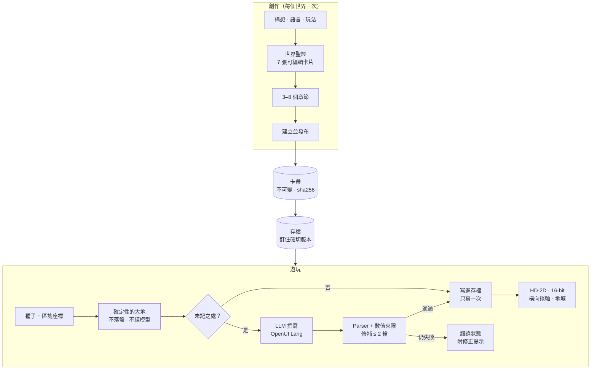

<div align="center">


<h3>一片沒有邊界的開放世界：你走到哪裡，語言模型就在那裡把它寫出來，並存成你自己擁有的檔案。</h3>

<p><a href="README.md">English</a> · <b>繁體中文</b></p>

<p>
<a href="LICENSE"></a>


</p>

<p>
<a href="#快速開始">快速開始</a> ·
<a href="#畫面">畫面</a> ·
<a href="#運作方式">運作方式</a> ·
<a href="#目前狀態">目前狀態</a> ·
<a href="#路線圖">路線圖</a> ·
<a href="#參與貢獻">參與貢獻</a>
</p>

</div>

---

**《無界之地》**（UNMAPPED）是一款開源的桌面遊戲。它的地圖沒有邊界，而且在有人走到之前，地圖上什麼都還沒被寫下。
地形由種子（seed）即時算出。玩家第一次走進還沒被記下的地方時，大型語言模型會**見證**那裡：替它取名，寫下
居民、當地的習俗、委託和敵人。模型寫的是一套小型的宣告式遊戲 DSL，每一行都要通過 parser 檢查。一個地方
只寫一次，寫完就存進存檔，之後不再需要模型。世界、存檔和已發布的版本都是你磁碟上的一般檔案。朋友的世界
可以透過點對點 WebRTC 併成同一片**大陸**。

《無界之地》可以接任何 OpenAI 相容的端點：本機的 llama.cpp 或 Ollama、Apple 裝置端模型、vLLM，或雲端 API。
介面和遊戲內容支援 English、繁體中文、日本語。目前只有雲端路線做過完整的端到端驗證，驗證過哪些項目請看
[狀態表](#目前狀態)。

> *Esse est percipi*，存在即是被感知。已知之外的土地是真的，但在見證人走到那裡之前，它沒有名字、沒有人，
> 也沒有故事。

## 特色

- **走路永遠不等模型的無限大地。** 地面是 32 × 32 格的區塊，由「種子 + 區塊座標」算出，不靠模型生成，也不
  寫進磁碟。所以就算沒有接模型，也永遠能走。
- **見證一次，之後就固定下來。** 新地點由模型起草，驗證通過後寫進存檔。和居民說話時不會呼叫模型，因為對話
  和選項在見證時就寫好了。
- **模型寫的是 DSL，不是程式碼。** 模型用 Scene、Dialogue、Item、Chapter 等幾種小型遊戲方言撰寫
  [OpenUI Lang](https://github.com/thesysdev) 程式，由 `@openuidev/lang-core` 解析。解析失敗時，錯誤會交回
  給模型修補，最多兩輪，而且每個數值都會夾在引擎的上下限內。修補後還是無法解析，畫面就顯示錯誤，絕不換成
  預設場景。
- **四步驟創作遊戲。** 從一個構想開始，模型寫出七張世界聖經卡片（世界前提、氛圍、日常規則、不會出現的事物、
  命名方式、人物語氣、外觀風格），再寫 3–8 個章節，然後建立並遊玩。每張卡片和每個章節都能手改，也能單獨
  重寫；章節還可以鎖定、插入和調換順序。草稿會自動儲存，重開 app 也還在。
- **一片大地，兩種畫面。** HD-2D 立體透視模型（three.js，移軸、光暈、會投影的立牌角色）和平面的 16-bit
  畫布，按 <kbd>V</kbd> 切換。大地有白天、黃昏和夜晚的光線。
- **章節與地點都在地圖上。** 故事的門立在大地上。章節要等每個人都見過、每個寶箱都打開、每個敵人都打倒，才算
  完成，這由主機判定，不由模型判定。橫向捲軸關卡與格狀地城則從大地上各處的入口進入。
- **戰鬥可以不要。** 建立世界時可選「不戰鬥」、「槍」或「刀劍」。敵人會即時追擊。戰鬥公式屬於有版本的物理規則，
  所以世界會一直沿用當初建立時的規則。
- **多人大陸。** 每個世界都有一個門牌。分享門牌，你們的世界就透過 y-webrtc 併成一片大陸，不需要任何遊戲
  伺服器保管誰的世界。來訪的玩家會顯示名字、朝向和走路動作。你在朋友土地上留的言，會存進**他們**的手記。
  同伴送來的每一筆資料都要先通過驗證才會寫入。
- **資料是你的。** 發布的內容是不可變、帶 sha256 雜湊的卡帶，每個存檔都釘住其中一個確切的版本。
  `.cartridge` 用來搬內容，`.spire-backup` 用來搬進度。可攜資料以隨機的 AES-GCM Data Key 加密，這把
  金鑰再由通行金鑰（passkey PRF）或作業系統鑰匙圈包起來。
- **Mod 只有提示詞與工具，沒有程式碼。** 一個 `mod.yml` 可以加入提示詞段落、對應到固定 `GameEffect` 詞彙
  的宣告式工具，以及技能。底層是以 DeepSeek Harness 為範本、跑在 [Cordis](https://github.com/cordiverse/cordis)
  上的 harness。
- **沙箱裡的 AI 世界。** 這是模型唯一能寫 JavaScript 的地方。它做出的小型互動世界，只在全新來源、帶 nonce
  CSP 的 `sandbox="allow-scripts"` iframe 裡執行。
- **誠實的數字。** 每次模型呼叫都記進本機的用量帳本：token、快取 token 和毫秒數，絕不記錄提示詞或金鑰。
  HUD 會顯示每個世界的累計。畫面上沒有任何假資料；缺了什麼，畫面就直接說，並告訴你怎麼補上。
- **可選的鏈上出處。** 已發布的卡帶可以在 Sepolia 上擁有 ENSv2 名稱。內容永遠不上鏈，沒有設定任何鏈，
  每個畫面也都照常運作。

## 畫面

<table>
  <tr>
    <td width="50%"></td>
    <td width="50%"></td>
  </tr>
  <tr>
    <td><sub><b>大陸。</b>另一位玩家的世界經由 WebRTC 併入，畫面上會顯示對方的名字、朝向和走路動作。</sub></td>
    <td><sub><b>戰鬥。</b>敵人即時追擊。左側卡片追蹤下一章。</sub></td>
  </tr>
  <tr>
    <td></td>
    <td></td>
  </tr>
  <tr>
    <td><sub><b>16-bit 畫面。</b>同一片大地的平面版本，按 <kbd>V</kbd> 切換。</sub></td>
    <td><sub><b>夜晚。</b>白天、黃昏、夜晚的光線照在模型與角色上。</sub></td>
  </tr>
  <tr>
    <td></td>
    <td></td>
  </tr>
  <tr>
    <td><sub><b>創作・世界。</b>每張卡片都能手改，也能只請模型重寫那一張。</sub></td>
    <td><sub><b>創作・故事。</b>章節邊寫邊出現；按取消會中斷進行中的請求。</sub></td>
  </tr>
  <tr>
    <td></td>
    <td></td>
  </tr>
  <tr>
    <td><sub><b>地點。</b>橫向捲軸與地城從大地上各處的入口進入。</sub></td>
    <td><sub><b>AI 世界。</b>用一句話描述一個小遊戲，玩玩看，再用另一句話改它。</sub></td>
  </tr>
</table>

<p align="center">
  <br>
  <sub>居民與怪物：每種職業、每種怪物各一張由影像模型繪製的角色圖，只在建置時畫一次。來源紀錄在 <code>src/assets/generated/actors.json</code>。</sub>
</p>

## 快速開始

**需求。** Apple Silicon 的 macOS（目前唯一驗證過的平台）、[Bun](https://bun.sh)、Node.js，以及 Xcode
Command Line Tools（測試環境為 Bun 1.3.6、Node.js 22.14）。在 macOS 上，`bun run dev` 也會編譯連接 Apple
裝置端模型的 Swift 橋接程式。

```bash
git clone https://github.com/p2p-solidarity/unmapped.git
cd unmapped
bun install        # 同時下載 Electron 執行檔
bun run dev        # main + preload + renderer，支援 HMR
```

接著打開 **標題畫面 → 設定 → 模型**，選擇文字要由哪個模型產生。

### 選擇模型

| 提供者 | 預設端點 | 金鑰 | 端到端驗證 |
| --- | --- | --- | --- |
| OpenAI | `https://api.openai.com/v1` · `gpt-5.4-mini` | 設定 → 模型，或 `.env` 的 `OPENAI_API_KEY` | ✅ 創作、見證、章節、地點 |
| llama.cpp | `http://127.0.0.1:8080/v1` | 不需要 | 尚未 |
| Ollama | `http://127.0.0.1:11434/v1` · `qwen3.5:4b` | 不需要 | 尚未（僅驗證偵測） |
| Apple Foundation Models | `fm serve`，位於 `127.0.0.1:11535` | 不需要（需先執行一次 `sudo fm license`） | 尚未（僅驗證偵測） |
| vLLM 搭配 [`thesysdev/OUI-1`](https://huggingface.co/thesysdev) | `http://127.0.0.1:8000/v1` | 不需要 | 尚未 |
| OpenUI Gateway | `https://api.thesys.dev/v1/embed` | `THESYS_API_KEY` | 尚未 |
| 任何 OpenAI 相容伺服器 | 你的網址 | 選填 | — |

在「設定 → 模型」輸入的金鑰會用作業系統鑰匙圈加密，只有 Electron 主程序讀得到，永遠不會送到 renderer。
主程序也會讀 `.env` 裡的金鑰當作備援，格式見 [`.env.example`](.env.example)。

<details>
<summary><b>用 llama.cpp 跑本機模型</b>（16 GB 的 Apple Silicon Mac 建議用這個）</summary>

```bash
brew install llama.cpp
scripts/download-model.sh qwen   # Qwen3.5-4B Q4_K_M，2.74 GB，Apache-2.0 → ~/models
llama-server -m ~/models/Qwen3.5-4B-Q4_K_M.gguf --port 8080 -c 16384 --jinja -ngl 99
```

改用 `scripts/download-model.sh gemma` 會下載 Gemma 4 E4B（4.98 GB，Gemma 授權）。設定 `MODEL_DIR` 可以把
模型存到別的地方。

</details>

### 操作

| 場合 | 按鍵 |
| --- | --- |
| 大地 | <kbd>W</kbd><kbd>A</kbd><kbd>S</kbd><kbd>D</kbd> 或點擊移動 · <kbd>Shift</kbd> 衝刺 · <kbd>E</kbd> 互動 · <kbd>N</kbd> 留言 · <kbd>V</kbd> 切換畫面 · <kbd>F12</kbd> 主控台 |
| 有槍的世界 | <kbd>Space</kbd> / <kbd>F</kbd> 開火 · 點擊敵人射擊 |
| 橫向捲軸 | <kbd>A</kbd><kbd>D</kbd> 移動 · <kbd>Space</kbd> 跳躍 · <kbd>E</kbd> 互動 |
| 地城（第一人稱） | <kbd>W</kbd><kbd>A</kbd><kbd>S</kbd><kbd>D</kbd> 移動 · 左鍵開火 · <kbd>R</kbd> 結束回合 · <kbd>F</kbd> 手電筒 · <kbd>E</kbd> 互動 |

HUD 永遠會顯示你所在地點的按鍵。

## 運作方式



**模型是客人，DSL 才是真相。** 每次的提示詞都由 Cordis harness 上依序排好的段落組成：角色設定、世界規則、
DSL 規格、mod 的 lore、帶有 lore 熱區的世界快照、範例，以及輸出格式。模型的回覆要依該方言的 schema 解析；
錯誤會以 `OpenUIError[]` 交回，模型只需修補失敗的那幾行。模型亂寫出來的 `x=9000` 會被夾回範圍內，引擎不會
照單全收。

下面是一個場景的樣子，摘自手寫的示範卡帶
[`cartridges-examples/demo-onsen-letters`](cartridges-examples/demo-onsen-letters/scenes/onsen_street.oui)。
元件都用位置參數：

```text
root = Scene("湯屋街", "onsen_town", [contract, floor, sky, ambient, lanterns, stone_path, well, chiyo, koharu, letter_one, exit, letters])
floor = Floor(23, 23, "wood")
sky = Sky("#1c1520", "#2a1f28", 0.06)
lanterns = Light("point", "#ffd0a8", 1.7, 11, 11)
stone_path = Patch(10, 3, 3, 18, "stone")
well = Prop("well", 15, 13)
chiyo = NPC("chiyo", "千代", 12, 9, "merchant", "calm", "#b0426a", "tall", "ribbon", "fan")
koharu = NPC("koharu", "小春", 7, 13, "child", "joyful", "#f2b84b")
letter_one = Treasure("letter_one", 4, 17, ["褪色的信"])
exit = Exit(11, 3, "湯屋閣樓")
letters = Quest("letters", "向街上的人打聽，誰寄了那三封沒有署名的信。")
```

### 引擎絕不打破的規則

1. **走路永遠不等模型。** 地形只由種子決定。沒有模型時大地照樣能走，只是各處會誠實地保持「未記」。
2. **互動當下不呼叫模型。** 對話和選項在見證時就寫好，選項走確定性的動作。
3. **模型只能提案。** 模型的輸出要通過 parser 和規則檢查，才會寫進歷史。
4. **內容不可變，進度釘住版本。** 遊玩時絕不寫入卡帶；存檔精確記下卡帶的 id、版本和雜湊。
5. **物理規則有版本。** 只要改到世界的長相或戰鬥方式（地面、野生生物、戰鬥公式），就要升級
   `PHYSICS_VERSION`。物理版本不同的世界永遠不會併成同一片大陸。
6. **沒有假資料。** 每個由資料驅動的畫面只會是 `idle | loading | ready | error` 其中之一，絕不顯示範例世界、
   罐頭 NPC 台詞或虛構的同伴。
7. **鏈可以整個關掉**，每個畫面照常運作。

完整的工程規範（模組匯出、狀態歸屬、安全規則）見 [`CLAUDE.md`](CLAUDE.md)。

## 世界就是檔案

所有資料都放在 Electron 的 userData 資料夾。macOS 上是 `~/Library/Application Support/Unwritten Land/`。
這是改名前的產品 id，保留下來是為了讓既有的存檔和鑰匙圈項目繼續有效。

```text
cartridges/<id>/<version>/        不可變的發布內容：manifest、規則、場景、聖經、故事（有雜湊）
instances/<id>/saves/<save>/      釘住確切版本的進度：save.json、因果、lore、手記、見證過的區塊
workspaces/create.<draft>/        創作草稿（自動儲存）
mods/<name>/                      已安裝的 mod：mod.yml + prompt/*.md + skills/
usage.jsonl                       每次模型呼叫一行：用途、模型、token、毫秒、結果
```

| 檔案 | 內容 | 還原條件 |
| --- | --- | --- |
| `.cartridge` | 只有內容：一個已發布的版本 | 任何機器都可以；兩邊的雜湊相同 |
| `.spire-backup` | 一段遊玩與其存檔：大地、lore、手記 | 機器上要有完全相同的卡帶版本 |

## 一起玩：大陸

每個世界都有一個固定的**門牌**，它同時也是這個世界開啟的大陸代碼。在標題畫面選「加入大陸」，或在遊戲裡打開
自己的門，把門牌分享出去。每個世界都保有自己的原點、種子和存檔。加入大陸時世界會分到一個錨點，每塊領土屬於
離它最近的錨點。

- **會傳過去的：** 每個世界的描述、見證過的區塊、手記，以及即時位置（只放在 awareness，永不存檔）。
- **永遠不會傳的：** 卡帶本體、規則、故事、委託和敵人。
- **信任：** 同伴的 hello 必須符合大陸代碼、協定版本和物理版本，雙方才開始交換資料。之後每一筆資料抵達時
  都會檢查：同伴只能寫自己的世界和區塊，可以在任何人的土地上留言，但永遠不能覆蓋已有的區塊或留言。
- **信令：** 預設使用公開的 y-webrtc 伺服器。你也可以自己架一台
  （`PORT=4444 node node_modules/y-webrtc/bin/server.js`），加到 **設定 → 信令伺服器**，那裡可以先測試再儲存。

## Mod

一個 mod 就是一個資料夾，裡面有 YAML 設定檔、markdown 提示詞段落，以及選用的技能，完全沒有 JavaScript。
它的工具是套在固定效果詞彙上的樣板；模型給的參數和最後產生的效果，harness 都會驗證。下面摘自範例 mod：

```yaml
name: onsen-festival
version: 0.1.0
description: Every floor carries a hot-spring town undercurrent, and the lanterns can be lit.
prompt:
  - { name: onsen-lore, order: 420, file: prompt/lore.md }
tools:
  - name: light_lanterns
    description: Light the festival lanterns when the player has actually done something that would light them.
    parameters:
      color: { type: string, description: "Lantern colour as #rrggbb", required: true }
    effect: { kind: mutate_world, skyColor: "{{color}}", fogDensity: 0.012, biome: onsen_town }
skills: [skills]
```

完整範例在 [`mods-examples/onsen-festival`](mods-examples/onsen-festival)，設計說明在
[`docs/harness.md`](docs/harness.md)。

## 選用：鏈上出處

玩遊戲完全不需要這些。什麼都沒設定時，每個畫面都會直接說明尚未設定帳本。

- **卡帶與存檔的 ENSv2 名稱（Sepolia）。** 全部掛在 `unmapped.eth` 底下的同一棵樹：卡帶版本是
  `<cartridge>.unmapped.eth`，改編作品掛在母卡帶的名稱底下，存檔是 `<save>.<cartridge>.unmapped.eth`，由玩家
  自己的 passkey 帳戶持有。在 **世界 → 卡帶** 可以替版本登記名稱（或把自己的名稱指到新版本），**用 ENS
  名稱開啟** 能從名稱找回確切的版本，或存檔的進度；在 **世界 → 存檔 → 這個存檔的 ENS 名稱** 可以記錄這趟
  旅程，玩下去再更新。紀錄只有 id、版本和內容雜湊（存檔則是它的 sha256、釘住的版本和一行進度）；備份在
  另一台機器還原後，會用雜湊自己找到名稱。
- **出處帳本。** [`contracts/src/UnwrittenLedger.sol`](contracts/src/UnwrittenLedger.sol) 記錄誰發布了哪個
  雜湊、它是從哪裡改編來的，以及玩家的短評。內容永遠不上鏈。
- **血統市場（實驗中，Sepolia）。** 登記了名稱的卡帶可以發行：它的代幣透過 Uniswap 連續清算拍賣（CCA）
  以母世界的代幣計價發售，之後由 v4 hook 把 1% 權利金沿著家族往上分配（世界、上一代、再上一代各
  50／30／20），付給當下持有 ENS 名稱的人。第一個世界 `aether-land.unmapped.eth` 已經拍賣、結算並開始交易。
  在 **世界 → 市場** 裡，玩家用 passkey 出價、結算、買入、發放分潤：不用錢包、不用 ETH，app 裡也沒有私鑰——
  passkey 擁有一個小型帳戶合約，由代付站（Cloudflare Worker，`src/relay`）只替市場自己的動作付 gas。發行新
  世界目前仍是操作者指令（`bun run lineage:demo launch`）。唯讀的拍賣頁面在 https://unmapped-auction.gimmychang.workers.dev。詳見
  [`docs/demo/lineage-market.md`](docs/demo/lineage-market.md)、
  [`docs/plans/lineage-market.md`](docs/plans/lineage-market.md) 與 [`contracts/README.md`](contracts/README.md)。

鏈相關的金鑰（`UNWRITTEN_*`）只有主程序讀得到。部署與發行的腳本一律由人手動執行；app 不為市場保管任何私鑰，
只把玩家用 passkey 簽過的動作交給 `UNWRITTEN_LINEAGE_RELAY` 的代付站送出。

## 目前狀態

《無界之地》目前是 `0.1.0` 版，一個早期但能用的研究版本。功能要在真正的 app 裡跑過，才會列為「已驗證」。
每次實跑都在 [`docs/e2e/`](docs/e2e) 留下可重播的紀錄：確切的 `run.json` 操作、寫著實測數字的
`result.md`，以及截圖。

| 項目 | 狀態 | 證據 |
| --- | --- | --- |
| 創作：四步驟、串流、單張卡片重寫、章節編輯／鎖定／調換、重開後保留 | ✅ 已驗證 | [create-four-step](docs/e2e/milestone-create-four-step/result.md) · [rev6-create](docs/e2e/milestone-rev6-create/result.md) |
| HD-2D 與 16-bit 的大地、白天／黃昏／夜晚 | ✅ 已驗證 | [e2e-first](docs/e2e/milestone-e2e-first/result.md) · [land-lighting](docs/e2e/milestone-land-lighting/result.md) |
| 見證、手記、lore 寫進存檔 | ✅ 已驗證 | [rev6-land](docs/e2e/milestone-rev6-land/result.md) |
| 即時戰鬥、倒下與復活 | ✅ 已驗證；HD-2D 敵人只驗了靜止時，移動中尚未 | [integration](docs/e2e/milestone-integration/result.md) |
| 地點：橫向捲軸與地城，進出後回到入口 | ✅ 已驗證 | [play-loop](docs/e2e/milestone-play-loop/result.md) · [rename-unmapped](docs/e2e/milestone-rename-unmapped/result.md) |
| 兩個 app 程序之間的大陸 | ✅ 已驗證（本機信令） | [rev6-land](docs/e2e/milestone-rev6-land/result.md) · [visitor-position](docs/e2e/milestone-rev6-followup-visitor-position/result.md) · [signaling](docs/e2e/milestone-rev6-followup-signaling/result.md) |
| `.cartridge` 匯出／匯入、`.spire-backup` 還原 | ✅ 已驗證，雜湊相同 | [rev6-land](docs/e2e/milestone-rev6-land/result.md) |
| 雲端模型（OpenAI `gpt-5.4-mini`）與用量帳本 | ✅ 已驗證 | [model-switch](docs/e2e/milestone-model-switch/result.md) · [rev6-create](docs/e2e/milestone-rev6-create/result.md) |
| 本機模型生成（llama.cpp、Ollama、Apple） | ⏳ 已驗證偵測，生成尚未 | [model-switch](docs/e2e/milestone-model-switch/result.md) |
| AI 世界（沙箱互動世界） | ✅ 已驗證 | [acceptance](docs/experiments/interactive-works-acceptance.md) |
| Sepolia 上的 ENSv2 卡帶名稱（舊的 `ens:setup` 上層名稱） | ✅ 已驗證 | [ensv2-cartridge-names](docs/e2e/milestone-ensv2-cartridge-names/result.md) |
| 名稱樹裡的 ENS 名稱：改編卡帶、玩家存檔、更新、還原後用雜湊找到名稱 | ✅ 已在 Sepolia 驗證 | [lineage-names](docs/e2e/milestone-lineage-names/result.md) |
| 代付站：app 裡沒有私鑰 | ✅ 已驗證（代付站在本機執行）；部署的 Worker 還在等私鑰 | [lineage-relay](docs/e2e/milestone-lineage-relay/result.md) |
| 血統市場：在 app 裡用 passkey 出價、結算、買入、發放分潤 | ✅ 已在 Sepolia 驗證（Touch ID 由虛擬驗證器代替）；三代只跑過 dry run | [lineage-demo](docs/e2e/milestone-lineage-demo/result.md) · [lineage-market](docs/e2e/milestone-lineage-market/result.md) |
| 同伴 | 🚧 規則裡有，但大地上還不會畫出來、也不會跟隨 | — |
| Windows / Linux | ❔ 未測試；打包目前只支援 macOS | — |

各階段的交付內容與實測數字，見
[`docs/architecture/afm3-dsl-architecture.html`](docs/architecture/afm3-dsl-architecture.html) 第 03 頁。

## 路線圖

目前的方向是 **Revision 6**（[工程說明](docs/rev6-engineering.html) · [第二階段計畫](docs/plans/rev6-phase2.md)）：

- **共同歷史。** 見證的內容屬於世界、由大家共享。先走到的人寫下的版本會留下來，後來的人同步它，不重新生成。
- **痕跡為底，同在為峰。** 世界不依賴任何人在線。同一套同步在大家同時在線時即時進行，分開時晚點補上。
- **遺忘。** 很久沒人去的地方會回到霧裡，等人重新見證。歷史不刪除，舊的樣子會變成傳說。
- **照顧先於戰鬥。** 預設玩法是探索，戰鬥要自己選，而且一定有安全的家和城鎮。
- **收斂成一套 2D 引擎。** 地點改用 `engine2d`，AI 世界變成大地上的「異界」地點。
- **世界的節拍與傳聞。** 定期合併、換季和照顧。傳聞只轉述世界歷史裡真的發生過的事。
- **為手機準備的架構。** 素材依雜湊按需下載，離線優先，輸入改用動作表。

## 開發

| 指令 | 用途 |
| --- | --- |
| `bun run dev` | Electron + Vite，支援 HMR |
| `bun run check` | typecheck、Biome、600 行上限與 Vitest；一個改動要全綠才算完成 |
| `bun run build` / `bun run dist` | 正式建置／用 electron-builder 產生 macOS `.dmg` |
| `bun run demo:cartridges` | 建置 `cartridges-examples/` 裡的示範卡帶 |
| `bun run contracts:build` | 重新編譯 Solidity 產物（已提交進 repo） |
| `bun run lineage:market --dry-run` | 在 Sepolia 上模擬部署 → 三代發行 → 拍賣 → 交易 → 權利金 |
| `bun run lineage:demo status\|launch\|seed-bids\|settle` | 市場的現場操作工具（launch 與 seed-bids 會花 Sepolia gas） |
| `bun run web:deploy` | 把唯讀的拍賣頁面部署到 Cloudflare |
| `bun run relay:key` / `relay:dev` / `relay:deploy` | 代付站：產生它的私鑰、在本機執行、部署到 Cloudflare |

**端到端測試** 透過 Chrome DevTools Protocol 操作真正的 app，而且一律使用拋棄式的 userData：

```bash
mkdir -p "$TMPDIR/ud"
AETHER_TEST_USER_DATA="$TMPDIR/ud" bun run dev --remoteDebuggingPort 9333   # 在背景執行
bun scripts/cdp-drive.ts "$(cat docs/e2e/<run>/run.json)"
```

<details>
<summary><b>專案結構</b></summary>

```text
src/
├── shared/      共用契約：Result、世界詞彙、區塊、物理、大陸、LLM 設定、IPC
├── dsl/         OpenUI Lang 遊戲方言：schema、提示詞、解析、修補、GBNF 文法、數值上下限
├── harness/     Cordis 提示詞段落、工具、技能、GameEffect 介面、mod 載入
├── main/        Electron 主程序：卡帶、instance、workspace、金鑰庫、推論、用量、AI 世界、鏈
├── preload/     contextBridge → window.seed
└── renderer/
    ├── app/        畫面與 HUD：標題、創作、遊玩、大地、主控台
    ├── engine2d/   大地：移動、碰撞、目標、故事之門（16-bit 畫布）
    ├── hd2d/       three.js HD-2D 渲染器與標題背景
    ├── engine/     地點用的 R3F 場景、戰鬥迴圈、調色盤
    ├── narrative/  見證／章節／地點生成：提示詞 → 對話 → 解析 → 修補
    ├── net/        大陸：y-webrtc 房間、閘道、信令
    ├── identity/   passkey PRF、鑰匙圈備援、AES-GCM、ENS 解析
    ├── works/      AI 世界的沙箱播放器
    ├── i18n/       en · zh-TW · ja 字串表
    └── ui/         UI 基本元件與設計 token
contracts/       UnwrittenLedger 與血統市場（Solidity）
native/          連接 Apple Foundation Models 的 Swift 橋接程式
docs/            架構、計畫、研究、E2E 紀錄
```

</details>

<details>
<summary><b>為什麼有些識別名稱還是 “Unwritten” 或 “Aether”？</b></summary>

專案改過名。現在玩家看得到的名稱都是《無界之地》／UNMAPPED，但有幾個識別名稱保留了舊名，因為改掉它們需要
做資料遷移：`productName`／`appId`（決定 userData 資料夾，以及包住已存金鑰的鑰匙圈項目）、`unwritten.*`／
`aether.*` 儲存鍵、`UNWRITTEN_*` 環境變數、已凍結的 ENS 文字紀錄鍵，以及內建卡帶 id `aether-land`。

</details>

## 參與貢獻

歡迎開 issue 和 pull request。開 PR 之前：

1. **先讀 [`CLAUDE.md`](CLAUDE.md)。** 裡面每一條工程規則，都是因為之前的程式出過 bug 才訂的。簡單說：檔案
   不超過 600 行、不放假資料、錯誤以值回傳（`Result<T>`）、顏色只來自 token、玩家看得到的每個字串都要有
   en、zh-TW、ja 三種語言。
2. **執行 `bun run check`**，確定全綠。
3. **在真正的 app 裡驗證。** 端到端測試是主要的測試方式。改到哪個流程，就新增一份
   `docs/e2e/milestone-<flow>/` 紀錄（`run.json`、`result.md`、截圖），讓別人可以重播。
4. **失敗照實回報。** 紅燈或失敗的步驟都是有用的資訊。

## 安全性

因為有 mod 和同伴，renderer 一律視為不可信。`contextIsolation`、`sandbox` 永遠開啟，`nodeIntegration`
永遠關閉。每個 IPC 資料都在主程序用 zod 驗證，API 金鑰和鏈的金鑰絕不離開主程序。AI 生成的世界只在全新
`ulwork://` 來源、只開 `allow-scripts` 的 iframe 裡執行：絕不給它 `allow-same-origin`、`window.seed`、檔案
路徑或任何秘密，它送出的每則訊息都要檢查。

發現漏洞時，請透過 [GitHub Security Advisories](https://github.com/p2p-solidarity/unmapped/security/advisories/new)
私下回報，不要開公開的 issue。

## 致謝

- [OpenUI](https://github.com/thesysdev)（`@openuidev/lang-core`），它的 parser 是一切的真相來源
- [Cordis](https://github.com/cordiverse/cordis) 與 [DeepSeek Harness](https://github.com/deepseek-ai/deepseek-harness)，提示詞、工具和 mod 背後的外掛模型
- [three.js](https://threejs.org)、[React Three Fiber](https://github.com/pmndrs/react-three-fiber)、[Rapier](https://rapier.rs)、[Yjs](https://github.com/yjs/yjs) + [y-webrtc](https://github.com/yjs/y-webrtc)、[viem](https://viem.sh)、[zod](https://zod.dev)、[electron-vite](https://electron-vite.org)
- 本機推論：[llama.cpp](https://github.com/ggml-org/llama.cpp)、[Ollama](https://ollama.com)、[Qwen](https://huggingface.co/Qwen)
- Pixel-boy／Pixel Archipel 的 [Ninja Adventure](https://pixel-boy.itch.io/ninja-adventure-asset-pack)（CC0），用於地圖圖塊與角色
- 兩篇文章：[Large Lore Models](https://aw.network/posts/large-lore-models) 與 [Moving Castles: Zero](https://movingcastles.world/posts/zero)，形塑了「lore 是累積出來的」與「模型要被錨住」這兩個想法

## 授權

程式碼以 [Apache License 2.0](LICENSE) 授權。第三方素材沿用各自的授權：Ninja Adventure 美術為 CC0
（[詳情](docs/licenses/ninja-adventure-cc0.md)），你下載的模型權重則依其發布者的授權。
