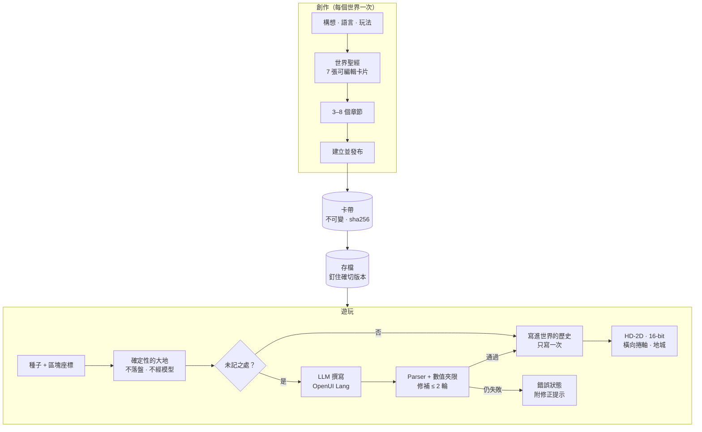

<div align="center">


<h3>一片沒有邊界的開放世界：你走到哪裡，語言模型就在那裡把它寫出來，並存成你自己擁有的檔案。</h3>

<p><a href="README.md">English</a> · <b>繁體中文</b> · <a href="README.ja.md">日本語</a></p>

<p>
<a href="LICENSE"></a>


</p>

<p>
<a href="#快速開始">快速開始</a> ·
<a href="#畫面">畫面</a> ·
<a href="#運作方式">運作方式</a> ·
<a href="#目前狀態">目前狀態</a> ·
<a href="#路線圖">路線圖</a> ·
<a href="#參與貢獻">參與貢獻</a>
</p>

</div>

---

**《無界之地》**（UNMAPPED）是一款開源的桌面遊戲。它的地圖沒有邊界，而且在有人走到之前，地圖上什麼都還沒被寫下。
地形由種子（seed）即時算出。玩家第一次走進還沒被記下的地方時，大型語言模型會**見證**那裡：替它取名，寫下
居民、當地的習俗、委託和敵人。模型寫的是一套小型的宣告式遊戲 DSL，每一行都要通過 parser 檢查。一個地方
只寫一次，寫完就存進存檔，之後不再需要模型。世界、存檔和已發布的版本都是你磁碟上的一般檔案。世界裡的一切
是一份有簽名、只增不改的**歷史**：你邀請的朋友透過一個小型的世界服務共享它，走過你見證的地方也不必呼叫
模型。只放在一台裝置上的世界，也能透過點對點 WebRTC 和朋友的世界連在一起：把加入碼或 ENS 名稱告訴朋友
就行。

《無界之地》可以接任何 OpenAI 相容的端點：本機的 llama.cpp 或 Ollama、Apple 裝置端模型、vLLM，或雲端 API。
介面和遊戲內容支援 English、繁體中文、日本語。目前只有雲端路線做過完整的端到端驗證，驗證過哪些項目請看
[狀態表](#目前狀態)。

> *Esse est percipi*，存在即是被感知。已知之外的土地是真的，但在見證人走到那裡之前，它沒有名字、沒有人，
> 也沒有故事。

## 特色

- **簡單上手。** 標題畫面只有四個選項：繼續 · 世界 · 創造世界 · 設定。**世界 → 我的世界** 是一份清單：
  **開始新的冒險**、玩過的每個世界都有**繼續**、裝好但還沒玩過的世界有**開始**；其他的都收在每一列的**更多**
  裡。遊玩時，玩家卡片寫著世界的名稱（有 ENS 名稱就先顯示它）和一行白話的**目標**。第一次玩會打開**怎麼玩**
  的說明卡，工具列的**說明**按鈕可以再打開。2026-09-26 做好，還沒在 app 裡實跑（見[狀態表](#目前狀態)）。
- **走路永遠不等模型的無限大地。** 地面是 32 × 32 格的區塊，由「種子 + 區塊座標」算出，不靠模型生成，也不
  寫進磁碟。所以就算沒有接模型，也永遠能走。
- **見證一次，之後就固定下來。** 新地點由模型起草，驗證通過後寫進世界的歷史。和居民說話時不會呼叫模型，因為對話
  和選項在見證時就寫好了。
- **模型寫的是 DSL，不是程式碼。** 模型用 Scene、Dialogue、Item、Chapter 等幾種小型遊戲方言撰寫
  [OpenUI Lang](https://github.com/thesysdev) 程式，由 `@openuidev/lang-core` 解析。解析失敗時，錯誤會交回
  給模型修補，最多兩輪，而且每個數值都會夾在引擎的上下限內。修補後還是無法解析，畫面就顯示錯誤，絕不換成
  預設場景。
- **四步驟創作遊戲。** 從一個構想開始，模型寫出七張世界聖經卡片（世界前提、氛圍、日常規則、不會出現的事物、
  命名方式、人物語氣、外觀風格），再寫 3–8 個章節，然後建立並遊玩。每張卡片和每個章節都能手改，也能單獨
  重寫；章節還可以鎖定、插入和調換順序。草稿會自動儲存，重開 app 也還在。
- **一片大地，兩種畫面。** HD-2D 立體透視模型（three.js，移軸、光暈、會投影的立牌角色）和平面的 16-bit
  畫布，按 <kbd>V</kbd> 切換。大地有白天、黃昏和夜晚的光線。
- **章節與地點都在地圖上。** 故事的門立在大地上。章節要等每個人都見過、每個寶箱都打開、每個敵人都打倒，才算
  完成，這由主機判定，不由模型判定。橫向捲軸關卡與格狀地城則從大地上各處的入口進入。
- **戰鬥可以不要。** 建立世界時可選「探索」（沒有戰鬥）、「冒險・槍」或「冒險・刀劍」。敵人會即時追擊。戰鬥公式屬於有版本的物理規則，
  所以世界會一直沿用當初建立時的規則。
- **共享世界。** 世界是一份有簽名、只增不改的歷史，離線優先。把它共享到世界服務後，你邀請的朋友即使在你
  離線時，也能走過你見證的地方，不必呼叫模型。兩個人同時走到還沒寫下的地方時，一人撰寫，另一人即時看到
  同一段文字出現。沒人去的地方會淡入霧中、成為傳說；居民會把朋友真的做過的事當成傳聞說出去。朋友可以留下
  禮物和路標，看到彼此走動和表情動作。服務只負責排序、檢查與轉送簽過名的紀錄，永遠不呼叫模型。
- **邀請朋友，或加入世界。** 一個欄位就能輸入朋友的 ENS 名稱或 6 碼的加入碼。只放在一台裝置上的世界，會點對點
  地向朋友開放：你們的世界透過 y-webrtc 連成一片大地，不需要任何遊戲伺服器保管誰的世界。朋友會顯示名字、朝向
  和走路動作；F12 → 朋友 會列出每個人站在哪裡、離你多遠，按 <kbd>Enter</kbd> 可以聊天。對方送來的每一筆資料
  都要先通過驗證才會寫入。
- **每次模型呼叫只走一條路。** 本機模型、你自己的金鑰，或 UNMAPPED 生成閘道上帳號的免費額度。「設定 →
  模型」會顯示下一次呼叫送往哪裡；呼叫失敗時絕不改走另一條路。
- **每張圖都記著授權。** 「設定 → 進階設定 → 圖片」決定由誰畫圖。每張圖都記下它的授權；商業模式會拒絕
  不能商用的提供者和新圖片。
- **伺服器不在，世界也還在。** `.world` 檔裝著一個世界完整的歷史和各種包。任何人都能離線驗證它，再把它帶到
  另一台裝置或另一個世界服務。
- **手機也能加入。** 一個手機大小的瀏覽器網頁可以用邀請加入世界、畫出大地、用觸控走動，離線時也能留言。
  它是一份證明，不是手機 app。
- **資料是你的。** 發布的內容是不可變、帶 sha256 雜湊的卡帶，每個存檔都釘住其中一個確切的版本。
  `.cartridge` 用來搬內容，`.spire-backup` 用來搬進度，`.world` 用來搬一個共享世界。加密的種子匯出
  （`.seed.enc`，在 F12 → 世界）以隨機的 AES-GCM Data Key 封存，這把金鑰再由通行金鑰（passkey PRF）或作業系統
  鑰匙圈包起來。
- **Mod 只有提示詞與工具，沒有程式碼。** 一個 `mod.yml` 可以加入提示詞段落、對應到固定 `GameEffect` 詞彙
  的宣告式工具，以及技能。底層是以 DeepSeek Harness 為範本、跑在 [Cordis](https://github.com/cordiverse/cordis)
  上的 harness。
- **沙箱裡的 AI 世界。** 這是模型唯一能寫 JavaScript 的地方。它做出的小型互動世界，只在全新來源、帶 nonce
  CSP 的 `sandbox="allow-scripts"` iframe 裡執行。
- **誠實的數字。** 每次模型呼叫都記進本機的用量帳本：token、快取 token 和毫秒數，絕不記錄提示詞或金鑰。
  F12 → 推論 會顯示每個世界的累計。畫面上沒有任何假資料；缺了什麼，畫面就直接說，並告訴你怎麼補上。
- **可選的鏈上出處。** 世界、改編、存檔和玩家可以在 Sepolia 上擁有 ENSv2 名稱，而且名稱就在遊戲裡：玩家卡片、
  過章、用名稱加入朋友的世界。一把 passkey（設定 → 你的 passkey）持有這些名稱，也用來確認市場上的動作。共享
  世界的服務也能把每個節拍的指紋記錄到鏈上（已部署在 Sepolia）。內容永遠不上鏈，沒有設定任何鏈，每個畫面也都
  照常運作。

## 畫面

<table>
  <tr>
    <td width="50%"></td>
    <td width="50%"></td>
  </tr>
  <tr>
    <td><sub><b>朋友的世界。</b>朋友的世界經由 WebRTC 連進來，畫面上會顯示對方的名字、朝向和走路動作。</sub></td>
    <td><sub><b>戰鬥。</b>敵人即時追擊。左側卡片追蹤下一章。</sub></td>
  </tr>
  <tr>
    <td></td>
    <td></td>
  </tr>
  <tr>
    <td><sub><b>16-bit 畫面。</b>同一片大地的平面版本，按 <kbd>V</kbd> 切換。</sub></td>
    <td><sub><b>夜晚。</b>白天、黃昏、夜晚的光線照在模型與角色上。</sub></td>
  </tr>
  <tr>
    <td></td>
    <td></td>
  </tr>
  <tr>
    <td><sub><b>創作・世界。</b>每張卡片都能手改，也能只請模型重寫那一張。</sub></td>
    <td><sub><b>創作・故事。</b>章節邊寫邊出現；按取消會中斷進行中的請求。</sub></td>
  </tr>
  <tr>
    <td></td>
    <td></td>
  </tr>
  <tr>
    <td><sub><b>地點。</b>橫向捲軸與地城從大地上各處的入口進入。</sub></td>
    <td><sub><b>AI 世界。</b>用一句話描述一個小遊戲，玩玩看，再用另一句話改它。</sub></td>
  </tr>
  <tr>
    <td></td>
    <td></td>
  </tr>
  <tr>
    <td><sub><b>一起見證。</b>一人撰寫新的地方，另一人即時讀到同一段文字，兩邊得到同一筆紀錄。章節卡上的 <code>world-loading</code> 錯誤是這個階段找到並修掉的 bug。</sub></td>
    <td><sub><b>門。</b>誰可以進來、邀請連結與共同主人，現在都收在門的<b>進階</b>裡（這張圖拍於門簡化之前）。</sub></td>
  </tr>
</table>

<p align="center">
  <br>
  <sub><b>手機。</b>瀏覽器證明用邀請加入共享世界並畫出大地，用搖桿走動。</sub>
</p>

<p align="center">
  <br>
  <sub>居民與怪物：每種職業、每種怪物各一張由影像模型繪製的角色圖，只在建置時畫一次。來源紀錄在 <code>src/assets/generated/actors.json</code>。</sub>
</p>

## 快速開始

**需求。** Apple Silicon 的 macOS（目前唯一驗證過的平台）、[Bun](https://bun.sh)、Node.js，以及 Xcode
Command Line Tools（測試環境為 Bun 1.3.6、Node.js 22.14）。在 macOS 上，`bun run dev` 也會編譯連接 Apple
裝置端模型的 Swift 橋接程式。

```bash
git clone https://github.com/p2p-solidarity/unmapped.git
cd unmapped
bun install        # 同時下載 Electron 執行檔
bun run dev        # main + preload + renderer，支援 HMR
```

接著打開 **標題畫面 → 設定 → 模型**，選擇文字要由哪個模型產生。然後從 **世界 → 我的世界 → 開始新的冒險**
開始玩，或用 **創造世界** 做一個自己的。

### 選擇模型

| 提供者 | 預設端點 | 金鑰 | 端到端驗證 |
| --- | --- | --- | --- |
| OpenAI | `https://api.openai.com/v1` · `gpt-5.4-mini` | 設定 → 模型，或 `.env` 的 `OPENAI_API_KEY` | ✅ 創作、見證、章節、地點 |
| llama.cpp | `http://127.0.0.1:8080/v1` | 不需要 | Qwen 3.5 4B 跑在 app 自己的 llama-server：「創造世界」建得出來（3 次成功 2 次）、章節 ✅；見證 4 次成 1 次（[no-servers](docs/e2e/milestone-rev6-p4-no-servers/result.md)） |
| Ollama | `http://127.0.0.1:11434/v1` · `qwen3.5:4b` | 不需要 | 尚未（僅驗證偵測） |
| Apple Foundation Models | 在應用程式內（它的 Swift 橋接；沒有伺服器） | 不需要 | 對話、工具、取消、「創造世界」、見證與章節 ✅，都在 4K 上下文內以結構化引導完成（[apple-in-app](docs/e2e/milestone-apple-in-app/result.md) · [apple-create](docs/e2e/milestone-apple-create/result.md) · [witness-4k](docs/e2e/milestone-rev6-witness-names-4k/result.md) · [chapter-apple](docs/e2e/milestone-rev6-chapter-apple/result.md)） |
| vLLM 搭配 [`thesysdev/OUI-1`](https://huggingface.co/thesysdev) | `http://127.0.0.1:8000/v1` | 不需要 | 尚未 |
| OpenUI Gateway | `https://api.thesys.dev/v1/embed` | `THESYS_API_KEY` | 尚未 |
| 免費額度（UNMAPPED 生成閘道） | `UNMAPPED_GATEWAY_URL`（開發版沒有） | 設定 → 進階設定 → 帳號，或 `.env` 的 `UNMAPPED_GATEWAY_KEY` | 路線、計量、取消與圖片 ✅，只以測試上游驗證（[p4-quota](docs/e2e/milestone-rev6-p4-quota/result.md)） |
| 任何 OpenAI 相容伺服器 | 你的網址 | 選填 | — |

每次呼叫只走一條路，由主程序決定，並在「設定 → 模型」顯示為「下一次呼叫：…」。本機模型在這台電腦上執行；
OpenAI 與 OpenUI Gateway 用你的金鑰（先用已儲存的，否則用 `.env`），自訂端點用它已儲存的金鑰。只有在你沒有
自己的金鑰、而且設定了閘道時，呼叫才會用你帳號的**免費額度**。呼叫失敗時絕不改走另一條路重試，因為那會改變
由誰付費、由哪個模型寫這個世界。

在「設定 → 模型」輸入的金鑰會用作業系統鑰匙圈加密，只有 Electron 主程序讀得到，永遠不會送到 renderer。
主程序也會讀 `.env` 裡的金鑰當作備援，格式見 [`.env.example`](.env.example)。

<details>
<summary><b>用 llama.cpp 跑本機模型</b>（16 GB 的 Apple Silicon Mac 建議用這個）</summary>

```bash
brew install llama.cpp
scripts/download-model.sh qwen   # Qwen3.5-4B Q4_K_M，2.74 GB，Apache-2.0 → ~/models
llama-server -m ~/models/Qwen3.5-4B-Q4_K_M.gguf --port 8080 -c 16384 --jinja -ngl 99
```

改用 `scripts/download-model.sh gemma` 會下載 Gemma 4 E4B（4.98 GB，Gemma 授權）。設定 `MODEL_DIR` 可以把
模型存到別的地方。

</details>

### 操作

| 場合 | 按鍵 |
| --- | --- |
| 大地 | <kbd>W</kbd><kbd>A</kbd><kbd>S</kbd><kbd>D</kbd> 或點擊移動 · <kbd>Shift</kbd> 衝刺 · <kbd>E</kbd> 說話／打開 · <kbd>N</kbd> 留言 · <kbd>V</kbd> 切換畫面 · <kbd>F12</kbd> 朋友・更多（主控台，一打開就是「朋友」） |
| 有槍的世界 | <kbd>Space</kbd> / <kbd>F</kbd> 開火 · 點擊敵人射擊 |
| 橫向捲軸 | <kbd>A</kbd><kbd>D</kbd> 移動 · <kbd>Space</kbd> 跳躍 · <kbd>E</kbd> 互動 |
| 地城（第一人稱） | <kbd>W</kbd><kbd>A</kbd><kbd>S</kbd><kbd>D</kbd> 移動 · 左鍵開火 · <kbd>R</kbd> 結束回合 · <kbd>F</kbd> 手電筒 · <kbd>E</kbd> 互動 |
| 和朋友一起（連起來的世界） | <kbd>Enter</kbd> 說話 · <kbd>Enter</kbd> 送出 · <kbd>Esc</kbd> 關閉 |
| 共享世界（連線中） | <kbd>T</kbd> 表情動作（手把 <kbd>LB</kbd>）· <kbd>1</kbd>–<kbd>6</kbd> 直接選一個 |
| 手機（瀏覽器證明） | 搖桿：走動 · Y：這個世界和它的留言 |

HUD 只顯示你所在地點需要的按鍵；<kbd>N</kbd>、<kbd>V</kbd>、<kbd>F12</kbd> 在工具列的按鈕上。第一次玩時會
出現**怎麼玩**的說明卡，工具列的**說明**按鈕可以再打開它。

## 運作方式



**模型是客人，DSL 才是真相。** 每次的提示詞都由 Cordis harness 上依序排好的段落組成：角色設定、世界規則、
DSL 規格、mod 的 lore、帶有 lore 熱區的世界快照、範例，以及輸出格式。模型的回覆要依該方言的 schema 解析；
錯誤會以 `OpenUIError[]` 交回，模型只需修補失敗的那幾行。模型亂寫出來的 `x=9000` 會被夾回範圍內，引擎不會
照單全收。

下面是一個場景的樣子，摘自手寫的示範卡帶
[`cartridges-examples/demo-onsen-letters`](cartridges-examples/demo-onsen-letters/scenes/onsen_street.oui)。
元件都用位置參數：

```text
root = Scene("湯屋街", "onsen_town", [contract, floor, sky, ambient, lanterns, stone_path, well, chiyo, koharu, letter_one, exit, letters])
floor = Floor(23, 23, "wood")
sky = Sky("#1c1520", "#2a1f28", 0.06)
lanterns = Light("point", "#ffd0a8", 1.7, 11, 11)
stone_path = Patch(10, 3, 3, 18, "stone")
well = Prop("well", 15, 13)
chiyo = NPC("chiyo", "千代", 12, 9, "merchant", "calm", "#b0426a", "tall", "ribbon", "fan")
koharu = NPC("koharu", "小春", 7, 13, "child", "joyful", "#f2b84b")
letter_one = Treasure("letter_one", 4, 17, ["褪色的信"])
exit = Exit(11, 3, "湯屋閣樓")
letters = Quest("letters", "向街上的人打聽，誰寄了那三封沒有署名的信。")
```

### 引擎絕不打破的規則

1. **走路永遠不等模型。** 地形只由種子決定。沒有模型時大地照樣能走，只是各處會誠實地保持「未記」。
2. **互動當下不呼叫模型。** 對話和選項在見證時就寫好，選項走確定性的動作。
3. **模型只能提案。** 模型的輸出要通過 parser 和規則檢查，才會寫進歷史。
4. **內容不可變，進度釘住版本。** 遊玩時絕不寫入卡帶；存檔精確記下卡帶的 id、版本和雜湊。
5. **物理規則有版本。** 只要改到世界的長相或戰鬥方式（地面、野生生物、戰鬥公式），就要升級
   `PHYSICS_VERSION`。物理版本不同的世界永遠不會併成同一片大陸。
6. **沒有假資料。** 每個由資料驅動的畫面只會是 `idle | loading | ready | error` 其中之一，絕不顯示範例世界、
   罐頭 NPC 台詞或虛構的同伴。
7. **鏈可以整個關掉**，每個畫面照常運作。

完整的工程規範（模組匯出、狀態歸屬、安全規則）見 [`CLAUDE.md`](CLAUDE.md)。

## 世界就是檔案

所有資料都放在 Electron 的 userData 資料夾。macOS 上是 `~/Library/Application Support/Unwritten Land/`。
這是改名前的產品 id，保留下來是為了讓既有的存檔和鑰匙圈項目繼續有效。

```text
cartridges/<id>/<version>/        不可變的發布內容：manifest、規則、場景、聖經、故事、圖片與它們的授權（有雜湊）
instances/<id>/saves/<save>/      釘住確切版本的進度：save.json、因果；在世界裡的存檔另有
                                  world.json（它的釘選）與 progress.json（委託、章節、地點）；
                                  較舊的存檔在這裡保留 lore、手記與見證過的區塊，遷移後就凍結
histories/<worldId>/              世界的共享歷史：log.jsonl（只增不改）、待送、被拒、link.json（服務與它的金鑰）
blobs/<sha256>                    卡帶包與 AI 世界的作品包，每次讀取都對照雜湊檢查
identity/device.key               這台裝置的 Ed25519 金鑰，以作業系統鑰匙圈加密；絕不重新產生
provider-keys/<provider>.key      已儲存的金鑰；hosted.key 是閘道帳號的權杖
images.json                       由哪個提供者畫圖（只記 id）
workspaces/create.<draft>/        創作草稿（自動儲存），looks/ 裡有每張草圖的授權紀錄
mods/<name>/                      已安裝的 mod：mod.yml + prompt/*.md + skills/
usage.jsonl                       每次模型呼叫一行：用途、模型、token、毫秒、結果
```

| 檔案 | 內容 | 還原條件 |
| --- | --- | --- |
| `.cartridge` | 只有內容：一個已發布的版本 | 任何機器都可以；兩邊的雜湊相同 |
| `.spire-backup` | 一段遊玩與其存檔：大地、lore、手記；在世界裡的存檔另含它的釘選、進度與歷史 | 機器上要有完全相同的卡帶版本；已分歧的歷史會另外保留、絕不合併；從未共享過的世界還原到別的裝置上，會成為那台裝置自己的世界 |
| `.world` | 一個共享世界：有簽名的歷史與各種包，不含你自己的進度 | 任何裝置或世界服務，先離線驗證（`bun run verify-world`） |

在 app 裡，**世界 → 我的世界** 裡每個世界的**更多**可以匯出 `.world` 與 `.cartridge` 檔、做備份；清單本身的
**更多**可以還原備份或匯入 `.cartridge`；**世界 → 加入世界 → 更多：從 .world 檔加入** 則把 `.world` 帶進來。

兩個選用的伺服器各有自己的資料夾，不在 userData 裡：世界服務的 `--data`（`service-key.json`，以及每個世界的
`log.jsonl`、blob 與快照），和閘道的 `--data`（它的金鑰、帳號、只增不改的 `ledger.jsonl`，以及營運者的
`upstreams.json` 與 `costs.json`）。

## 一起玩

和朋友一起玩，只要兩個按鈕——**邀請朋友**和**加入世界**——再把一樣東西告訴對方：世界有 ENS 名稱就說它的
**ENS 名稱**，沒有就說 6 碼的**加入碼**。這些畫面在 2026-09-26 重新整理過，還沒在 app 裡實跑（見
[狀態表](#目前狀態)）；底下的機制則跑過。

- **邀請朋友。** 回到家，走到門前按 <kbd>E</kbd>（**開門**）。最上面就是**邀請朋友**：按下後，把畫面上出現的
  名稱或加入碼告訴朋友（按**複製**可以複製）。開放期間會顯示**已開放 · N 位朋友在這裡**，按**關閉**就關上。
  同一塊也是 <kbd>F12</kbd> → **朋友** 的第一項（**拉朋友進來**）；**世界 → 我的世界** 裡玩過的世界的
  **更多**也有**邀請朋友**（會先打開那個世界）。
- **加入世界。** 朋友把那個名稱或加入碼輸入**加入世界**：在他自己的門前、在 F12 → 朋友，或開始玩之前在
  **世界 → 加入世界**；後者的欄位也收邀請連結（`unmapped://join?…`）或搬家連結。ENS 名稱會先查：存檔的名稱
  會帶到它的加入碼，世界的名稱則提供**開始玩這個世界**。用加入碼加入時，你會帶著自己的一個世界過去
  （**帶著：…** · **更換**；還沒有世界的話，會先在內建世界開始一場新的冒險）。你的世界會走到朋友的世界旁邊，
  你的大地和進度都保留。
- **在線的朋友。** F12 一打開就是**朋友**：邀請、加入，以及**在線的朋友**——這片大地上畫出來的每一位其他玩家，
  附上位置（`x, z`）、他站在誰的土地上、離你幾步，每秒更新四次。
- **聊天。** 在和朋友連起來的世界裡，**按 Enter 說話**：<kbd>Enter</kbd> 打開輸入列，<kbd>Enter</kbd> 送出，
  <kbd>Esc</kbd> 關閉。一句最多 200 個字，只送給驗證過的朋友；每位朋友每 5 秒最多 5 句。聊天只存在記憶體裡：
  不存檔，也不進任何歷史。
- **門的其他部分。** 加入世界下面是**朋友的世界**（**前往他們的門**）、四格**快速移動**（去過的地方，或朋友的
  加入碼）、你帶回家的紀念品，以及訪客留在你大地上的留言（**收下**）。收起來的**進階**裡有：世界放在哪裡、
  **邀請連結**、**誰可以進來**、**一起玩的人**、**記錄在公開的區塊鏈上**，以及**這個世界的紀錄**。除了設定以外，
  任何地方都不會顯示服務的位址。

### 連起來的世界：底層（大陸）

只放在一台裝置上的世界，會點對點地和朋友相連。它的加入碼（程式裡和舊版本稱為門牌，`plateOf`）固定不變，
同時也是它開啟的**大陸**代碼——大陸是技術上的名稱，指透過 y-webrtc 連成一片大地的幾個世界。已共享到世界服務
的世界不能加入大陸（`continent-world-attached`），它的**邀請朋友**會改指向邀請連結。每個世界都保有自己的原點、
種子和存檔。加入時世界會分到一個錨點，每塊領土屬於離它最近的錨點。存檔的 ENS 名稱記著它的加入碼，名稱就是
這樣帶到加入碼的。

- **會傳過去的：** 每個世界的描述、見證過的區塊、手記、即時位置（只放在 awareness，永不存檔），以及聊天。
  訪客留在你大地上的留言會在門邊等著，你按**收下**之後，才成為你世界歷史裡由你簽名的一則留言。
- **永遠不會傳的：** 卡帶本體、規則、故事、委託和敵人。
- **信任：** 對方（peer）的 hello 必須符合大陸代碼、協定版本和物理版本，雙方才開始交換資料。之後每一筆資料
  抵達時都會檢查：對方只能寫自己的世界和區塊，可以在任何人的土地上留言，但永遠不能覆蓋已有的區塊或留言。
  聊天在兩端都會清理並限制長度，說話的人名來自對方自己的同在狀態，絕不取自訊息本身。
- **信令：** 預設使用公開的 y-webrtc 伺服器。你也可以自己架一台
  （`PORT=4444 node node_modules/y-webrtc/bin/server.js`），加到 **設定 → 進階設定 → 信令伺服器**，那裡可以先
  測試再儲存。
- **跨網路的中繼：** 路由器允許時，朋友會直接連上（STUN）。在 VPN、嚴格的 NAT 或防火牆後面沒有直接的
  路，就改由 TURN 中繼傳資料：中繼服務（`src/turn`，一個 Cloudflare Worker）產生短效的 Cloudflare
  Realtime TURN 憑證，TURN 金鑰只留在它那裡；app 從 `UNMAPPED_TURN_URL` 向它要（本機 `bun run turn:dev`，
  正式 `bun run turn:deploy`；金鑰放在 `.cache/turn/dev.env` 或用 `wrangler secret put`）。只要一方有中繼
  就能連。兩方都沒有時，找到了卻連不上的朋友會在 20 秒後顯示「找到朋友了，但連不上」。

### 共享世界：底層（世界服務）

世界的大地是一份有簽名、只增不改的歷史。每一個見證過的地方、留言、章節、禮物與節拍都是一筆紀錄，由寫下它的
裝置簽名；每台裝置都有自己的 Ed25519 金鑰。新的世界只放在你的裝置上，離線也能玩。要透過世界服務共享它，先在
**設定 → 進階設定 → 共享世界** 列出一個世界服務，再打開門的**進階**，選**建立邀請連結**。只在這台裝置上的世界
會先共享到清單上的第一個服務；門上從不顯示它的名稱，清單是空的就不提供邀請連結。服務負責替紀錄排序、用和 app
相同的方式逐筆檢查、轉送，並在你不在時保管它們。它永遠不呼叫模型，也不持有模型的金鑰。你可以用
`bun run service` 自己架一台（見[開發](#開發)）。

- **邀請連結。** 在**邀請連結**底下按**建立邀請連結**，會產生一條限定人數（1–20）與天數（1–30）的連結
  （`unmapped://join?…`），只會顯示這一次。朋友在 **世界 → 加入世界** 貼上連結，先按**看看這個世界**，再按
  **加入並開始玩**。已用完、已過期或已撤回的邀請都會被拒絕。
- **誰可以進來。** **只有我**、**朋友**（預設：你和你邀請的朋友）或**所有人**（任何知道世界 id 的人都能來訪並
  留下留言、路標和禮物；只有受邀的朋友能寫下地方）。在**一起玩的人**底下，主人可以**移除**一位朋友，之後對方
  不能再讀寫這個世界，但寫過的內容會留下。**設為共同主人**會把主人的所有權限交給另一台裝置，這樣少了一台裝置，
  世界也還在。
- **見證一次，大家共用。** 已經有人見證過的地方，會直接從歷史畫出來，不必呼叫模型。兩個人走進同一個還沒寫下
  的地方時，服務只讓其中一人撰寫；另一人即時看到同一段文字出現，兩邊得到同一筆紀錄。
- **異聞。** 兩個人在連不到服務時寫下同一個地方，先送達服務的那份成為現行，另一份以異聞的形式留在歷史裡，
  可以閱讀。
- **節拍：霧、傳說與季節。** 每 6 小時一個節拍，季節每 7 天換一次。城鎮一圈以外、連續 28 天沒人照顧的地方會
  淡入霧中；它舊的樣子以傳說的形式留在歷史裡，這個地方可以重新被見證。家、章節與地點永遠不會起霧。只放在一台
  裝置上的世界，會在打開時補上節拍。
- **傳聞。** 節拍會挑出真的發生過的事，例如某位朋友通關了一個章節，再由居民傳述出去（「聽說……」）。一則傳聞
  只能說出它引用的那件事；說了別的，app 和服務都會拒絕。裝置用自己的模型寫一個節拍的傳聞，最多一次呼叫，
  而且要 **設定 → 進階設定 → 共享世界 → 在背景寫下傳聞** 允許：預設只替你擁有的世界寫，也絕不用免費額度。
- **禮物、同在與表情動作。** 替第一個走到的人留下一份禮物。兩個人同時拿時，只有一人拿到，另一人會看到
  「有人先拿走了。」在線的朋友看得到彼此走動，按 <kbd>T</kbd> 打開**表情動作**。同在的狀態永遠不存檔。
- **舊存檔一起帶過來。** 這個版本第一次打開舊存檔時，會把存檔的土地、lore、手記、地點、章節與功績寫成一份
  世界的歷史。它絕不修改或刪除原本的檔案，重跑不會多加任何東西，放不進去的會留在這台裝置上並列出來。舊版本
  仍能打開同一個資料夾，之後這個版本會補上它寫下的東西。
- **伺服器不在，世界也還在。** **世界 → 我的世界** 裡世界的**更多**有**匯出 .world**；
  **世界 → 加入世界 → 更多：從 .world 檔加入** 會先離線檢查檔案，再把它**帶進來**。如果世界的服務不在了，把它的
  檔匯入另一個世界服務（`bun run service -- import`）。主人用來把世界搬到那個服務的表單現在不再顯示（功能還留在
  程式裡）；拿到搬家連結的朋友，把它貼進**加入世界**，選**跟著世界搬過去**。用較新物理版本做成的世界或檔案
  一律拒絕。

## 帳號、額度與圖片

用本機模型或自己的金鑰玩，完全不需要這些。這些設定都在 **設定 → 進階設定** 底下。沒有設定閘道時，那裡的
**帳號**與**方案**會直接說明（`gateway-not-configured`），「設定 → 模型」也不會出現免費額度。這個帳號只管這台
裝置在閘道上的額度，和你的 passkey 無關。

- **生成閘道**（`bun run gateway`）是一個會計量的 OpenAI 相容端點。它和世界服務分開，也永遠不知道一次呼叫是
  為了哪個世界。帳號由一組裝置金鑰組成：**用這台裝置登入** 會用這台裝置的金鑰簽署閘道的挑戰。第二台裝置選
  **取得配對碼**；在已加入帳號的裝置上按**查詢這組配對碼**，先看到新裝置的指紋，再按**核准這台裝置**。被移除
  的裝置在下一次呼叫時就會被登出。營運者產生的權杖放進 `.env` 的 `UNMAPPED_GATEWAY_KEY`，也能讓裝置登入。
- **額度。** 呼叫先保留點數，結束後依實際用掉的 token 結算；取消的呼叫會釋放保留的點數。app 以比例、點數，
  以及這台電腦的呼叫次數與 token 顯示額度，絕不換算成金額。用完時呼叫會被拒絕（`quota-exhausted`），並告訴你
  可以怎麼做：用自己的金鑰、本機模型、訂閱方案，或等每月重置。**設定 → 進階設定 → 方案** 列出閘道付費服務
  （Stripe）的方案；沒有設定付費服務的閘道什麼都不賣（`billing-not-configured`）。
- **圖片。** **設定 → 進階設定 → 圖片** 決定由誰畫圖：OpenAI、架在你指定伺服器上的 Qwen-Image-2512 或 Qwen-Image-2.1
  （`QWEN_IMAGE_BASE_URL`），或在你沒有圖片金鑰時經由閘道。每張圖片都留有授權紀錄，發布的版本在
  `assets/licences.json` 列出所有圖片的授權。**商業模式**（`UNMAPPED_COMMERCIAL=1`，或閘道回報為商用）會拒絕
  授權不允許商用的提供者，也拒絕發布授權為非商用或未知的新圖片；原封不動沿用上一版的圖片只會列出，不會被拒。

## 在手機上：瀏覽器證明

`bun run browser:dev` 會在 5190 埠提供一個手機大小的網頁。它是共享世界最小的用戶端，不是手機 app。在
**加入一個世界** 貼上邀請：網頁用自己的裝置金鑰（無法匯出的 WebCrypto Ed25519 金鑰）加入，檢查整份歷史，依
雜湊取回世界的卡帶包，用 16-bit 畫面畫出大地。螢幕上的搖桿透過和鍵盤、手把同一張動作表走動。**世界**
（<kbd>Y</kbd>）打開這個世界的地方、留言與路標，留言會留在你腳下那一格。所有東西都存在瀏覽器的 IndexedDB，
所以沒有網路、也沒有網頁伺服器時，網頁照樣能重開、能走動，離線寫的留言會在服務回應後送出。網頁裡沒有模型、
創作、對話、章節、地點、匯出或鏈。世界服務要加上 `--browser-origin <網頁的 origin>` 才會把包提供給它。從內建
卡帶開始的世界，在主人分享時（或下次打開先前分享的世界時）會宣告卡帶包，手機也畫得出來。

## Mod

一個 mod 就是一個資料夾，裡面有 YAML 設定檔、markdown 提示詞段落，以及選用的技能，完全沒有 JavaScript。
它的工具是套在固定效果詞彙上的樣板；模型給的參數和最後產生的效果，harness 都會驗證。下面摘自範例 mod：

```yaml
name: onsen-festival
version: 0.1.0
description: Every floor carries a hot-spring town undercurrent, and the lanterns can be lit.
prompt:
  - { name: onsen-lore, order: 420, file: prompt/lore.md }
tools:
  - name: light_lanterns
    description: Light the festival lanterns when the player has actually done something that would light them.
    parameters:
      color: { type: string, description: "Lantern colour as #rrggbb", required: true }
    effect: { kind: mutate_world, skyColor: "{{color}}", fogDensity: 0.012, biome: onsen_town }
skills: [skills]
```

完整範例在 [`mods-examples/onsen-festival`](mods-examples/onsen-festival)，設計說明在
[`docs/harness.md`](docs/harness.md)。

## 選用：鏈上出處

玩遊戲完全不需要這些。什麼都沒設定時，每個畫面都會直接說明尚未設定帳本。

- **世界、存檔與玩家的 ENSv2 名稱（Sepolia）。** 全部掛在 `unmapped.eth` 底下的同一棵樹：世界是
  `<label>.unmapped.eth`，改編作品掛在母世界的名稱底下，存檔是 `<save>.<cartridge>.unmapped.eth`，玩家是
  `<you>.players.unmapped.eth`；存檔和玩家名稱由玩家自己的 passkey 帳戶持有，也就是 **設定 → 你的 passkey**
  裡的那一把：按一個按鈕（**設定我的 passkey**）就連上，你的玩家名稱就在它底下。名稱就在遊戲裡，不只在選單裡：
  按下 **建立並開始玩** 後可以馬上替世界登記名稱（標籤由你挑，所以「霧之港」可以叫 `misty-harbor.unmapped.eth`）
  並上架到市場；玩家卡片最上面是世界的名稱，有 ENS 名稱就先顯示它；過一章就會提示用一次 passkey 簽名記錄這趟
  旅程，或把名稱移到新進度；朋友在**加入世界**輸入你存檔的名稱，就能加入你的世界。在 **世界 → 我的世界** 裡世界
  的**更多**可以替版本登記名稱、改指向、上架，以及記錄旅程的名稱；**加入世界** 能從世界的名稱找回確切的版本
  （**開始玩這個世界**），從存檔的名稱找到它的加入碼。紀錄只有 id、版本和內容雜湊（存檔則是它的 sha256、釘住的
  版本、一行進度和加入碼）；備份在另一台機器還原後，會用雜湊自己找到名稱。
- **出處帳本。** [`contracts/src/UnwrittenLedger.sol`](contracts/src/UnwrittenLedger.sol) 記錄誰發布了哪個
  雜湊、它是從哪裡改編來的，以及玩家的短評。內容永遠不上鏈。
- **共享世界的輕量鏈（Sepolia）。** 主人可以在門的**進階**裡，於**記錄在公開的區塊鏈上**選**記錄**。之後世界服務
  會把每個節拍的指紋（世界的 id、紀錄編號與雜湊值）寫進
  [`WorldProvenance`](contracts/src/provenance/WorldProvenance.sol) 並支付費用；沒有人需要錢包，app 只讀取
  鏈上的紀錄，拿來和自己的副本比對。合約已部署在 Sepolia 的 [`0xF625…Ef02`](https://sepolia.etherscan.io/address/0xF625ec3c228e3BCE34977C0b7e97BD591291Ef02)；設定 `UNMAPPED_PROVENANCE_*`（見
  `.env.example`）後門就會比對。`bun run provenance --dry-run` 以真實服務的節拍模擬它。
- **血統市場（實驗中，Sepolia）。** 登記了名稱的卡帶可以發行：它的代幣透過 Uniswap 連續清算拍賣（CCA）
  以母世界的代幣計價發售，之後由 v4 hook 把 1% 權利金沿著家族往上分配（世界、上一代、再上一代各
  50／30／20），付給當下持有 ENS 名稱的人。第一個世界 `aether-land.unmapped.eth` 已經拍賣、結算並開始交易。
  在 **世界 → 市場** 裡，玩家用 passkey 出價、結算、買入、發放分潤：不用錢包、不用 ETH，app 裡也沒有私鑰——
  passkey 擁有一個小型帳戶合約，由代付站（Cloudflare Worker，`src/relay`）只替市場自己的動作付 gas。世界名稱
  的持有人可以在 app 裡把它上架（**世界 → 我的世界** 裡世界的**更多**，或建完世界當下）；改編要等母世界先上架，並以母世界的代幣
  計價。唯讀的拍賣頁面在 https://unmapped-auction.gimmychang.workers.dev。詳見
  [`docs/demo/lineage-market.md`](docs/demo/lineage-market.md)、
  [`docs/plans/lineage-market.md`](docs/plans/lineage-market.md) 與 [`contracts/README.md`](contracts/README.md)。

鏈相關的金鑰（`UNWRITTEN_*`）只有主程序讀得到。部署與發行的腳本一律由人手動執行；app 不為市場保管任何私鑰，
只把玩家用 passkey 簽過的動作交給 `UNWRITTEN_LINEAGE_RELAY` 的代付站送出。

## 目前狀態

《無界之地》目前是 `0.1.0` 版，一個早期但能用的研究版本。功能要在真正的 app 裡跑過，才會列為「已驗證」。
每次實跑都在 [`docs/e2e/`](docs/e2e) 留下可重播的紀錄：確切的 `run.json` 操作、寫著實測數字的
`result.md`，以及截圖。

| 項目 | 狀態 | 證據 |
| --- | --- | --- |
| 創作：四步驟、串流、單張卡片重寫、章節編輯／鎖定／調換、重開後保留 | ✅ 已驗證 | [create-four-step](docs/e2e/milestone-create-four-step/result.md) · [rev6-create](docs/e2e/milestone-rev6-create/result.md) |
| HD-2D 與 16-bit 的大地、白天／黃昏／夜晚 | ✅ 已驗證 | [e2e-first](docs/e2e/milestone-e2e-first/result.md) · [land-lighting](docs/e2e/milestone-land-lighting/result.md) |
| 見證、手記、lore 寫進存檔 | ✅ 已驗證 | [rev6-land](docs/e2e/milestone-rev6-land/result.md) |
| 即時戰鬥、倒下與復活 | ✅ 已驗證；HD-2D 敵人只驗了靜止時，移動中尚未 | [integration](docs/e2e/milestone-integration/result.md) |
| 地點：橫向捲軸與地城，進出後回到入口 | ✅ 已驗證 | [play-loop](docs/e2e/milestone-play-loop/result.md) · [rename-unmapped](docs/e2e/milestone-rename-unmapped/result.md) |
| 兩個 app 程序之間的大陸 | ✅ 已驗證（本機信令） | [rev6-land](docs/e2e/milestone-rev6-land/result.md) · [visitor-position](docs/e2e/milestone-rev6-followup-visitor-position/result.md) · [signaling](docs/e2e/milestone-rev6-followup-signaling/result.md) |
| `.cartridge` 匯出／匯入、`.spire-backup` 還原 | ✅ 已驗證，雜湊相同 | [rev6-land](docs/e2e/milestone-rev6-land/result.md) |
| 雲端模型（OpenAI `gpt-5.4-mini`）與用量帳本 | ✅ 已驗證 | [model-switch](docs/e2e/milestone-model-switch/result.md) · [rev6-create](docs/e2e/milestone-rev6-create/result.md) |
| 本機模型生成（llama.cpp、Ollama、Apple） | ✅ Apple 在 4K 上下文內寫得出「創造世界」、見證與章節（結構化引導）；llama.cpp 上的 Qwen 3.5 4B 建得出世界（3 次成功 2 次）並寫出章節，見證 4 次成 1 次；Ollama 未跑 | [model-switch](docs/e2e/milestone-model-switch/result.md) · [apple-in-app](docs/e2e/milestone-apple-in-app/result.md) · [apple-create](docs/e2e/milestone-apple-create/result.md) · [witness-4k](docs/e2e/milestone-rev6-witness-names-4k/result.md) · [chapter-apple](docs/e2e/milestone-rev6-chapter-apple/result.md) · [no-servers](docs/e2e/milestone-rev6-p4-no-servers/result.md) |
| AI 世界（沙箱互動世界） | ✅ 已驗證 | [acceptance](docs/experiments/interactive-works-acceptance.md) |
| Sepolia 上的 ENSv2 卡帶名稱（舊的 `ens:setup` 上層名稱，已移除） | ✅ 已驗證 | [ensv2-cartridge-names](docs/e2e/milestone-ensv2-cartridge-names/result.md) |
| 名稱樹裡的 ENS 名稱：改編卡帶、玩家存檔、更新、還原後用雜湊找到名稱 | ✅ 已在 Sepolia 驗證 | [lineage-names](docs/e2e/milestone-lineage-names/result.md) |
| 代付站：app 裡沒有私鑰 | ✅ 已驗證（app 流程對本機執行的代付站；部署的 Worker 已實際送出一筆領 USDC 交易） | [lineage-relay](docs/e2e/milestone-lineage-relay/result.md) |
| 遊戲裡的 ENS：建完世界當下登記名稱（中文名自選標籤）、在 app 裡上架、玩家卡片上的名稱、過章後記錄與更新這趟旅程的名稱（帶門牌）、從「改編」按鈕做出的改編掛在母名稱下並以母代幣上架、朋友用存檔名稱加入大陸 | ✅ 已在 Sepolia 驗證（Touch ID 由虛擬驗證器代替；代付站用這一版在本機執行）；過章卡片的「更新」按鈕沒按到（同一個更新從存檔頁送出）（選單之後已改名，見上文） | [ens-in-game](docs/e2e/milestone-ens-in-game/result.md) |
| 玩家名稱（`<you>.players.unmapped.eth`）：用 passkey 認領、取代 `0x…` 顯示、在大陸上被看到；過章卡片的記錄與更新 | ✅ 已在 Sepolia 透過部署的代付站驗證 | [ens-players](docs/e2e/milestone-ens-players/result.md) |
| 血統市場：在 app 裡用 passkey 出價、結算、買入、發放分潤 | ✅ 已在 Sepolia 驗證（Touch ID 由虛擬驗證器代替）；三代只跑過 dry run | [lineage-demo](docs/e2e/milestone-lineage-demo/result.md) · [lineage-market](docs/e2e/milestone-lineage-market/result.md) |
| 共享世界：朋友用邀請加入，走過你見證的地方 0 次模型呼叫；重開後你不必呼叫就看到對方的地方 | ✅ 已驗證（本機世界服務） | [p3-offline-visit](docs/e2e/milestone-rev6-p3-offline-visit/result.md) |
| 舊存檔遷移成世界的歷史：各類數量相符、原本的檔案不變、重跑新增 0 筆、0 次模型呼叫；第二段的舊版本仍能打開同一個資料夾，這個版本再補上它寫的東西 | ✅ 已驗證；遷移花費的時間未量 | [p3-migrate](docs/e2e/milestone-rev6-p3-migrate/result.md) · [p3-older-build](docs/e2e/milestone-rev6-p3-older-build/result.md) |
| 遷移後的世界共享出去：加入的人看到舊的地方、留言與異界（作品包取回、驗證、在沙箱裡開啟），0 次呼叫 | ✅ 已驗證 | [p3-migrated-share](docs/e2e/milestone-rev6-p3-migrated-share/result.md) |
| 兩人同時到一個還沒寫下的地方：一人撰寫、另一人看同一條串流；1 次模型呼叫，兩邊同一筆紀錄 | ✅ 已驗證；串流面板開著時觀看的人會停下腳步（設計如此） | [p3-together](docs/e2e/milestone-rev6-p3-together/result.md) |
| 異聞：同一個地方的兩份離線寫法，一份成為現行、一份保留 | ✅ 已驗證 | [p3-variant](docs/e2e/milestone-rev6-p3-variant/result.md) |
| 節拍：霧、傳說與季節，在世界服務上與只放在一台裝置上的世界都跑過；服務與兩個 app 的指紋相同；起霧的地方重新見證 | ✅ 已驗證（測試時鐘 92 天）；修正後城鎮一圈不再顯示「正漸漸隱入霧中」 | [p3-fog](docs/e2e/milestone-rev6-p3-fog/result.md) · [p3-local-beat](docs/e2e/milestone-rev6-p3-local-beat/result.md) |
| 綁著真實事件的傳聞；沒有引用或說錯名字的會被服務與 app 拒絕 | ✅ 已驗證；「聽說……」只在主人的裝置上讀過 | [p3-rumors](docs/e2e/milestone-rev6-p3-rumors/result.md) |
| 門：私人、夥伴與公開；一次性的邀請（用完、過期、撤回都被拒）；移除成員（選單之後已改名，見上文） | ✅ 已驗證；修正後主程序也會在簽名前拒絕被移除成員的寫入，已在待送的紀錄改列為被拒 | [p3-door](docs/e2e/milestone-rev6-p3-door/result.md) |
| 禮物：兩人同時拿一份禮物，只有一人拿到，另一人的包包不變並顯示「有人先拿走了。」 | ✅ 已驗證（禮物面板開著時）；面板關著時的提示未看到 | [p3-gift-race](docs/e2e/milestone-rev6-p3-gift-race/result.md) |
| 兩台機器上的同在與表情動作，兩種畫面都有 | ✅ 已驗證；60 Hz 下每幀最多移動 0.13 格；16-bit 畫面上的名字改畫在名牌上（跑完後修正） | [p3-presence](docs/e2e/milestone-rev6-p3-presence/result.md) |
| 在世界裡的存檔的備份：還原、已分歧的歷史另外保留、在另一台裝置上成為它自己的世界 | ✅ 已驗證；收養後的世界沒有接模型試見證 | [p3-backup](docs/e2e/milestone-rev6-p3-backup/result.md) |
| 較新的物理版本會被世界服務、備份匯入與 `.world` 匯入拒絕 | ✅ 已驗證 | [p3-physics](docs/e2e/milestone-rev6-p3-physics/result.md) · [p4-import-physics](docs/e2e/milestone-rev6-p4-import-physics/result.md) |
| 只放在一台裝置上的世界的大陸：訪客的留言由主人收下、已共享的世界被拒 | ✅ 已驗證（本機信令） | [p3-continent](docs/e2e/milestone-rev6-p3-continent/result.md) |
| `.world` 檔：匯出、離線驗證、鏡像、共同主人把世界搬到新服務、成員跟上；全新裝置進入異界 0 次呼叫 | ✅ 已驗證（三個本機服務）；鏡像拒絕送入是由探針送的，不是 app | [p4-rehost](docs/e2e/milestone-rev6-p4-rehost/result.md) |
| 在另一台裝置匯入 `.world`：收養成新的世界，釘在它的版本與物理版本上 | ✅ 已驗證 | [p4-import-physics](docs/e2e/milestone-rev6-p4-import-physics/result.md) |
| 閘道帳號：用裝置金鑰登入、用配對碼配對、移除裝置、`.env` 裡營運者的權杖 | ✅ 已驗證（測試上游，沒有真的模型） | [p4-account](docs/e2e/milestone-rev6-p4-account/result.md) |
| 每次呼叫只走一條路與額度：用完、核發、取消釋放保留；本機與 `.env` 路線不留閘道紀錄 | ✅ 已驗證（測試上游）；觀看別人串流的費用、免費額度下的傳聞開關未跑 | [p4-quota](docs/e2e/milestone-rev6-p4-quota/result.md) |
| 沒有閘道或沒有付費服務：帳號、方案與模型都照實說明；創作仍會找本機模型 | ✅ 已驗證 | [p4-billing-off](docs/e2e/milestone-rev6-p4-billing-off/result.md) |
| 經由閘道畫圖，每張都有授權紀錄 | ✅ 已驗證（測試用圖片模型）；AI 世界的素材與參考圖未跑 | [p4-images-hosted](docs/e2e/milestone-rev6-p4-images-hosted/result.md) |
| 商業模式：不能選非商用的提供者、授權未知的新圖片會擋下發布、商業模式的閘道遇到非商用模型時拒絕啟動 | ✅ 已驗證；發布是透過 app 的發布呼叫驅動，不是畫面 | [p4-licence](docs/e2e/milestone-rev6-p4-licence/result.md) |
| 輕量鏈：把真實服務的節拍指紋記錄在 Sepolia 上，門邊拿來比對 | ✅ 實際上鏈驗證：合約已部署，服務開串流並記錄 3 個節拍，門邊顯示「The chain matches your copy at entry 6」；改過的副本（經 main 的讀取）判為不同 | [p4-chain](docs/e2e/milestone-rev6-p4-chain/result.md) · [p4-chain-live](docs/e2e/milestone-rev6-p4-chain-live/result.md) |
| 手機大小的瀏覽器證明：用邀請加入、畫出大地、觸控走動、離線與重開後留言、看到桌面版的玩家 | ✅ 已驗證（無頭瀏覽器 375 × 812，開發版網頁），包含從內建卡帶開始的世界；沒有在真的手機上跑 | [p4-mobile-proof](docs/e2e/milestone-rev6-p4-mobile-proof/result.md) |
| 完全沒有伺服器：沒有任何畫面要求帳號；走動、留言、沒有世界服務時的門，以及 `.world` 匯出、離線驗證與在第二台裝置匯入 | ✅ 已驗證；之後 Apple 裝置端模型（在應用程式內）寫出了「創造世界」的世界卡片，但它 4K 的上下文會拒絕見證（`model-context-too-small`）；這台沒有安裝 llama.cpp 與 Ollama | [p4-no-servers](docs/e2e/milestone-rev6-p4-no-servers/result.md) · [integrated-journey](docs/e2e/milestone-rev6-integrated-journey/result.md) |
| 一個世界走完全程：創造世界 → 遊玩 → 分享 → 兩人一起看一個地方被寫出來 → 共同擁有者 → 手機加入並走動 → `.world` 帶到另一台裝置 → Apple 裝置端模型 → 關閉後繼續 | ✅ 一次跑完並驗證；六個用戶端的前端 0 個錯誤；服務與每台裝置上是同一份 21 筆的歷史；付費呼叫 12 次 | [integrated-journey](docs/e2e/milestone-rev6-integrated-journey/result.md) |
| **世界 → 我的世界** 變成一份清單：最上面是開始新的冒險，每個存檔都是繼續，裝好但還沒玩過的世界是開始；邀請朋友（從玩過的世界）、ENS 名稱、匯出 `.world`、備份、升級、舊版本、草稿、改編、匯出 `.cartridge` 與上架都收在每一列的更多裡；還原備份與匯入世界在清單的更多裡 | ✅ 已驗證：清單、開始新的冒險（2.7 秒進入遊戲）與繼續；「更多」裡的動作這次沒按 | [simplify-one-world](docs/e2e/milestone-simplify-one-world/result.md) |
| **世界 → 加入世界** 的單一欄位：先查 ENS 名稱（存檔的名稱 → 它的加入碼，世界的名稱 → 開始玩這個世界），否則是加入碼（帶著你的一個世界過去）、邀請連結或搬家連結；`.world` 檔在更多裡 | ✅ 已用加入碼驗證（開著 VPN，經中繼 2.2 秒連上）；ENS 名稱、邀請連結與搬家連結這次沒跑 | [simplify-play-together](docs/e2e/milestone-simplify-play-together/result.md) |
| **F12 → 朋友**（主控台的第一個分頁，家門上也是同樣的區塊）：邀請朋友、加入世界，以及在線的朋友：每個人的位置、站在誰的土地上、離你幾步；房間面板已拿掉 | ✅ 已驗證：邀請、加入，以及在線的朋友與會跟著走動更新的位置 | [simplify-play-together](docs/e2e/milestone-simplify-play-together/result.md) · [simplify-one-world](docs/e2e/milestone-simplify-one-world/result.md) |
| 在和朋友連起來的世界裡聊天：按 Enter 說話，只送給驗證過的朋友，一句 200 個字，每位朋友每 5 秒最多 5 句，只存在記憶體 | ✅ 已驗證雙向（開著 VPN、經中繼）：一句話 0.65 秒內到，打字時不會走動 | [simplify-play-together](docs/e2e/milestone-simplify-play-together/result.md) |
| 只有一把 passkey 的設定：語言、模型、你的 passkey（一個按鈕，玩家名稱在它底下）；帳號、方案、圖片、信令伺服器、共享世界與版本資訊收在進階設定裡；Data Key 解鎖移到 F12 → 世界 | ✅ 已驗證：畫面與收合；建立 passkey 這次沒跑 | [simplify-one-world](docs/e2e/milestone-simplify-one-world/result.md) |
| 遊玩：玩家卡片上的世界名稱（ENS 優先）與一行白話的目標；供應商、模型、token、FPS 與種子移到 F12；第一次玩的怎麼玩說明卡與工具列的說明按鈕 | ✅ 已驗證：目標那一行、怎麼玩說明卡與說明按鈕，畫面上沒有機制數字 | [simplify-one-world](docs/e2e/milestone-simplify-one-world/result.md) |
| 朋友的世界能跨網路連上：TURN 中繼（中繼服務 `src/turn` 產生短效的 Cloudflare Realtime TURN 憑證；`UNMAPPED_TURN_URL`），兩邊都沒有中繼時直接說「找到朋友了，但連不上」 | ✅ 在開著 NordVPN 的同一台機器上驗證：只有 STUN 一直連不上；經中繼 2.2 秒連上（`relay/udp turn.cloudflare.com`，來回 77–141 毫秒）；只要一方有中繼就能連；兩方都沒有時 22.4 秒後顯示提示。兩個真實網路與已部署的 Worker 還沒跑 | [simplify-play-together](docs/e2e/milestone-simplify-play-together/result.md) |
| Stripe 結帳（測試模式與正式）、在你自己的 GPU 端點上跑 Qwen-Image | ⏳ 未跑；每一項都需要人來做 | — |
| 同伴 | 🚧 規則裡有，但大地上還不會畫出來、也不會跟隨 | — |
| Windows / Linux | ❔ 未測試；打包目前只支援 macOS | — |

各階段的交付內容與實測數字，見
[`docs/architecture/afm3-dsl-architecture.html`](docs/architecture/afm3-dsl-architecture.html) 第 03 頁。

## 路線圖

目前的方向是 **Revision 6**（[工程說明](docs/rev6-engineering.html) · 計畫：[第二階段](docs/plans/rev6-phase2.md)、
[第三階段](docs/plans/rev6-phase3.md)、[第四階段](docs/plans/rev6-phase4.md)）。第三、四階段做出了共同歷史、遺忘、
節拍與傳聞、帳號與授權、`.world` 檔和手機證明；實際跑過哪些，請看[狀態表](#目前狀態)。方向如下：

- **共同歷史。** 見證的內容屬於世界、由大家共享。先走到的人寫下的版本會留下來，後來的人同步它，不重新生成。
- **痕跡為底，同在為峰。** 世界不依賴任何人在線。同一套同步在大家同時在線時即時進行，分開時晚點補上。
- **遺忘。** 很久沒人去的地方會回到霧裡，等人重新見證。歷史不刪除，舊的樣子會變成傳說。
- **照顧先於戰鬥。** 預設玩法是探索，戰鬥要自己選，而且一定有安全的家和城鎮。
- **收斂成一套 2D 引擎。** 地點改用 `engine2d`，AI 世界變成大地上的「異界」地點。
- **世界的節拍與傳聞。** 定期合併、換季和照顧。傳聞只轉述世界歷史裡真的發生過的事。
- **為手機準備的架構。** 素材依雜湊按需下載，離線優先，輸入改用動作表。

接下來：

- **需要人來做的步驟。** 替大家架設閘道與世界服務（主機、TLS、備份），以及設定 Stripe。
- **手機。** 還沒決定要不要做完整的手機用戶端；瀏覽器證明是最小的那一個。
- **之後。** 每個世界自己的角色圖、影片與音樂、分支，以及一起戰鬥。

## 開發

| 指令 | 用途 |
| --- | --- |
| `bun run dev` | Electron + Vite，支援 HMR |
| `bun run check` | typecheck、Biome、600 行上限與 Vitest；一個改動要全綠才算完成 |
| `bun run build` / `bun run dist` | 正式建置／用 electron-builder 產生 macOS `.dmg` |
| `bun run demo:cartridges` | 建置 `cartridges-examples/` 裡的示範卡帶 |
| `bun run contracts:build` | 重新編譯 Solidity 產物（已提交進 repo） |
| `bun run lineage:market --dry-run` | 在 Sepolia 上模擬部署 → 三代發行 → 拍賣 → 交易 → 權利金 |
| `bun run lineage:demo status\|launch\|seed-bids\|settle\|players` | 市場的現場操作工具（launch、seed-bids 與只需一次的 `players` 目錄會花 Sepolia gas） |
| `bun run web:deploy` | 把唯讀的拍賣頁面部署到 Cloudflare |
| `bun run relay:key` / `relay:dev` / `relay:deploy` | 代付站：產生它的私鑰、在本機執行、部署到 Cloudflare |
| `bun run service -- --port 8787 --data <dir>` | 世界服務；`import <file.world>` 以鏡像提供一個世界、`export <worldId>` 寫出一個檔、`--browser-origin <origin>` 讓網頁取得它的包；`UNMAPPED_SERVICE_TEST=1` 讓測試能調動它的時鐘 |
| `bun run gateway -- --port 8788 --data <dir>` | 生成閘道；`grant <accountId> <credits>`、`token <accountId>`、`revoke <tokenId>` 與 `set-key <name>`（金鑰從 stdin 讀）是營運者的指令 |
| `bun run world:probe -- --service <ws url> <scenario>` | 用拋棄式金鑰攻擊執行中的世界服務：`physics`、`protocol`、`frames`、`door`、`rumors` 或 `all` |
| `bun run verify-world -- <file.world> [--json]` | 離線驗證一個 `.world` 檔；結束碼 0 代表每項檢查都通過 |
| `bun run provenance --dry-run [--from <service data dir>]` | 以服務的節拍在 Sepolia 上模擬輕量鏈；什麼都不送出 |
| `bun run browser:dev` / `browser:build` | 手機大小的瀏覽器證明（5190 埠）／建置到 `out/browser` |

**端到端測試** 透過 Chrome DevTools Protocol 操作真正的 app，而且一律使用拋棄式的 userData：

```bash
mkdir -p "$TMPDIR/ud"
AETHER_TEST_USER_DATA="$TMPDIR/ud" bun run dev --remoteDebuggingPort 9333   # 在背景執行
bun scripts/cdp-drive.ts "$(cat docs/e2e/<run>/run.json)"
```

共享世界的測試還會以測試模式、在拋棄式的 `--data` 資料夾上啟動一個世界服務，並用另一個 userData 與除錯埠
開第二個 app。閘道的測試使用本機的上游，不花錢。

<details>
<summary><b>專案結構</b></summary>

```text
src/
├── shared/      共用契約：Result、世界詞彙、區塊、物理、大陸、LLM 設定、IPC、
│                世界的歷史與它的協定、.world 格式
├── dsl/         OpenUI Lang 遊戲方言：schema、提示詞、解析、修補、GBNF 文法、數值上下限
├── harness/     Cordis 提示詞段落、工具、技能、GameEffect 介面、mod 載入
├── main/        Electron 主程序：卡帶、instance、workspace、金鑰庫、推論、用量、AI 世界、鏈、
│                世界歷史、裝置金鑰、blob、圖片、閘道帳號與付費、.world 檔
├── preload/     contextBridge → window.seed
├── service/     世界服務（Bun）：替歷史排序並檢查、節拍、撰寫租約、blob、鏡像
├── gateway/     生成閘道（Bun）：裝置金鑰組成的帳號、額度帳本、上游、付費
├── browser/     手機大小的瀏覽器證明：自己的 window.seed、WebCrypto 金鑰、IndexedDB、sw.js
└── renderer/
    ├── app/        畫面與 HUD：標題、世界清單、創作、遊玩、大地、朋友、主控台
    ├── engine2d/   大地：移動、碰撞、目標、故事之門（16-bit 畫布）
    ├── hd2d/       three.js HD-2D 渲染器與標題背景
    ├── engine/     地點用的 R3F 場景、戰鬥迴圈、調色盤
    ├── narrative/  見證／章節／地點生成：提示詞 → 對話 → 解析 → 修補
    ├── history/    這台裝置上的世界歷史：fold、由它畫出的大地、把寫入交給主程序
    ├── mobile/     瀏覽器證明掛上的手機殼：大地畫面、觸控搖桿、留言
    ├── net/        大陸（和朋友連起來的世界）：y-webrtc 房間、閘門、信令、聊天；世界服務；同在
    ├── identity/   passkey PRF、鑰匙圈備援、AES-GCM、ENS 名稱查詢
    ├── works/      AI 世界的沙箱播放器
    ├── i18n/       en · zh-TW · ja 字串表
    └── ui/         UI 基本元件與設計 token
contracts/       UnwrittenLedger 與血統市場（Solidity）
native/          連接 Apple Foundation Models 的 Swift 橋接程式
docs/            架構、計畫、研究、E2E 紀錄
```

</details>

<details>
<summary><b>為什麼有些識別名稱還是 “Unwritten” 或 “Aether”？</b></summary>

專案改過名。現在玩家看得到的名稱都是《無界之地》／UNMAPPED，但有幾個識別名稱保留了舊名，因為改掉它們需要
做資料遷移：`productName`／`appId`（決定 userData 資料夾，以及包住已存金鑰的鑰匙圈項目）、`unwritten.*`／
`aether.*` 儲存鍵、`UNWRITTEN_*` 環境變數、已凍結的 ENS 文字紀錄鍵，以及內建卡帶 id `aether-land`。

</details>

## 參與貢獻

歡迎開 issue 和 pull request。開 PR 之前：

1. **先讀 [`CLAUDE.md`](CLAUDE.md)。** 裡面每一條工程規則，都是因為之前的程式出過 bug 才訂的。簡單說：檔案
   不超過 600 行、不放假資料、錯誤以值回傳（`Result<T>`）、顏色只來自 token、玩家看得到的每個字串都要有
   en、zh-TW、ja 三種語言。
2. **執行 `bun run check`**，確定全綠。
3. **在真正的 app 裡驗證。** 端到端測試是主要的測試方式。改到哪個流程，就新增一份
   `docs/e2e/milestone-<flow>/` 紀錄（`run.json`、`result.md`、截圖），讓別人可以重播。
4. **失敗照實回報。** 紅燈或失敗的步驟都是有用的資訊。

## 安全性

因為有 mod 和同伴，renderer 一律視為不可信。`contextIsolation`、`sandbox` 永遠開啟，`nodeIntegration`
永遠關閉。每個 IPC 資料都在主程序用 zod 驗證，API 金鑰、鏈的金鑰、裝置金鑰和閘道帳號的權杖絕不離開主程序。世界歷史
的每一筆紀錄，都要先通過主程序的檢查才會被簽名或保存；世界服務永遠不呼叫模型，也不持有模型的金鑰。AI 生成的世界只在全新
`ulwork://` 來源、只開 `allow-scripts` 的 iframe 裡執行：絕不給它 `allow-same-origin`、`window.seed`、檔案
路徑或任何秘密，它送出的每則訊息都要檢查。

發現漏洞時，請透過 [GitHub Security Advisories](https://github.com/p2p-solidarity/unmapped/security/advisories/new)
私下回報，不要開公開的 issue。

## 致謝

- [OpenUI](https://github.com/thesysdev)（`@openuidev/lang-core`），它的 parser 是一切的真相來源
- [Cordis](https://github.com/cordiverse/cordis) 與 [DeepSeek Harness](https://github.com/deepseek-ai/deepseek-harness)，提示詞、工具和 mod 背後的外掛模型
- [three.js](https://threejs.org)、[React Three Fiber](https://github.com/pmndrs/react-three-fiber)、[Rapier](https://rapier.rs)、[Yjs](https://github.com/yjs/yjs) + [y-webrtc](https://github.com/yjs/y-webrtc)、[viem](https://viem.sh)、[zod](https://zod.dev)、[electron-vite](https://electron-vite.org)
- 本機推論：[llama.cpp](https://github.com/ggml-org/llama.cpp)、[Ollama](https://ollama.com)、[Qwen](https://huggingface.co/Qwen)
- Pixel-boy／Pixel Archipel 的 [Ninja Adventure](https://pixel-boy.itch.io/ninja-adventure-asset-pack)（CC0），用於地圖圖塊與角色
- 兩篇文章：[Large Lore Models](https://aw.network/posts/large-lore-models) 與 [Moving Castles: Zero](https://movingcastles.world/posts/zero)，形塑了「lore 是累積出來的」與「模型要被錨住」這兩個想法

## 授權

程式碼以 [Apache License 2.0](LICENSE) 授權。第三方素材沿用各自的授權：Ninja Adventure 美術為 CC0
（[詳情](docs/licenses/ninja-adventure-cc0.md)），你下載的模型權重則依其發布者的授權。
